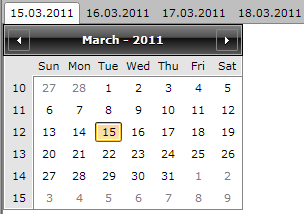
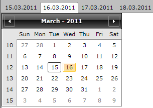
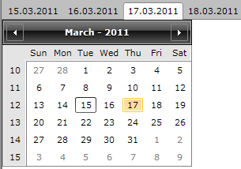

# How to Keep the Content State

For performance optimization the __ControlTemplate__ of the __RadTabControl__ defines a single __ContentPresenter__ which holds only the currently selected __RadTabItem__'s __Content__. Therefore each time the selection is changed the content of the last active item is unloaded in order to load the content of the newly selected item. Since the load/unload operations involve add/remove actions in the visual tree, the content does not keep its state.
        

However, if you need to keep each __RadTabItem__'s content you can set the __IsContentPreserved__ property to __True__.

```XAML
    <telerik:RadTabControl x:Name="tabControl" 
                           IsContentPreserved="True"
                           ItemsSource="{Binding Tabs}">
        <telerik:RadTabControl.ItemTemplate>
            <DataTemplate>
                <TextBlock Text="{Binding Header}" />
            </DataTemplate>
        </telerik:RadTabControl.ItemTemplate>
        <telerik:RadTabControl.ContentTemplate>
            <DataTemplate>
                <telerik:RadCalendar HorizontalAlignment="Left" VerticalAlignment="Top" />
            </DataTemplate>
        </telerik:RadTabControl.ContentTemplate>
    </telerik:RadTabControl>
```




