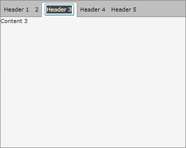

# How to Make the Tab Headers Editable

## 

The goal of this tutorial is to create a tab control with editable headers of the tab items. The idea is to allow runtime change of the tab item's header text as shown on the snapshot below.

For the purpose of this example, you will need to create an empty WPF Application project and open it in Visual Studio.

>If you copy and paste the source code directly from this XAML examples, don't forget to change __xmlns:example__ alias to import the namespace used in your project.
          

First add references to the assemblies __Telerik.Windows.Controls__, __Telerik.Windows.Controls.Navigation__ and __Telerik.Windows.Data.__

Then create a new class __EditableTabHeaderControl__ that derives from __ContentControl__ and leave it empty for now.

<snippet id='radtabcontrol-howto-how-to-make-the-tab-headers-editable-wpf-block_1-cs' />
<snippet id='radtabcontrol-howto-how-to-make-the-tab-headers-editable-wpf-block_2-vb' />

Create a __new style__for the __EditableTabHeader__ control.

<snippet id='radtabcontrol-howto-how-to-make-the-tab-headers-editable-wpf-block_3-xaml' />

In the XAML code above a new style is created for the __EditableTabHeaderControl__ and this style will be the default template for that control. The template is made of __ContentPresenter__, __TextBox__ and a trigger for __EditMode__. When the control is in __EditMode__ the content presenter control is hidden and the text box is made visible, while in the __ViewMode__ the control will have its default appearance.

Add the following implementation to the code behind of the __EditableTabHeaderControl__ class.

<snippet id='radtabcontrol-howto-how-to-make-the-tab-headers-editable-wpf-block_4-cs' />
<snippet id='radtabcontrol-howto-how-to-make-the-tab-headers-editable-wpf-block_5-vb' />

The major changes in the implementation of the __EditableTabHeaderControl__ are:

* An attribute of type __TemplatePart__ placed right above the class definition. With this attribute you identify the types of the named parts that are used for templating.

* New dependency property __IsInEditMode__ of __Boolean__ type was added.

* One text box field declaration. The text box field is initialized with the reference from the text box defined in the template when the base method __OnApplyTemplate()__ is invoked.

* An event handler for the __MouseDoubleClick__ event is added. When the user makes a double click with his left mouse button, then the control is in __edit mode__. That automatically triggers the states of the content presenter and the text box.

* An event handler for the __LostFocus__ event of the text box is added. When the user presses the "tab" keyboard and the text box lost its focus, the control restore its initial appearance.

Add a new __RadTabControl__ declaration.

<snippet id='radtabcontrol-howto-how-to-make-the-tab-headers-editable-wpf-block_6-xaml' />

[Populate]() the RadTabControl with some data (tabs):

<snippet id='radtabcontrol-howto-how-to-make-the-tab-headers-editable-wpf-block_7-cs' />
<snippet id='radtabcontrol-howto-how-to-make-the-tab-headers-editable-wpf-block_8-vb' />

Define the __RadTabControl__ __ItemTemplate__ and __ContentTemplate__ properties:

<snippet id='radtabcontrol-howto-how-to-make-the-tab-headers-editable-wpf-block_9-xaml' />

Run your demo. Double click on the Tab's __Header__ will switch them in __Edit__ __Mode__. Loosing the focus (pressing the "tab" key) will switch the Tab's Header in its default (__ViewMode__) appearance.