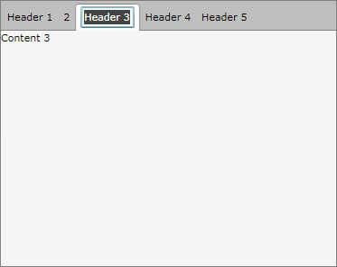

# How to Make the Tab Headers Editable

## 

The goal of this tutorial is to create a tab control with editable headers of the tab items. The idea is to allow runtime change of the tab item's header text as shown on the snapshot below.

For the purpose of this example, you will need to create an empty Silverlight Application project and open it in Visual Studio.
        

>If you copy and paste the source code directly from this XAML examples, don't forget to change __xmlns:example__ alias to import the namespace used in your project.
          

First add references to the assemblies __Telerik.Windows.Controls__ and __Telerik.Windows.Controls.Navigation.__

Then create a new Silverlight Templated Control - __EditableTabHeader__ that derives from __ContentControl__ and leave it empty for now.

#### __C#__

{{region radtabcontrol-how-to-make-the-tab-headers-editable_0}}
	public class EditableTabHeader : ContentControl
	{
	    public EditableTabHeader()
	    {
	       this.DefaultStyleKey = typeof(EditableTabHeader);
	    }
	}
	{{endregion}}

#### __VB.NET__

{{region radtabcontrol-how-to-make-the-tab-headers-editable_1}}
	Public Class EditableTabHeader
	    Inherits ContentControl
	    Public Sub New() 
	      Me.DefaultStyleKey = GetType(EditableTabHeader)
	    End Sub
	End Class
	{{endregion}}

Create a __new style__ for the __EditableTabHeader__ control.

#### __XAML__

{{region radtabcontrol-how-to-make-the-tab-headers-editable_2}}
	
	{{endregion}}

In the XAML code above we create new style for the EditableTabHeader control and this style will be the default template for that control. The template is made of __ContentPresenter__, __TextBox__ and a state group __EditStates__ with two new states __EditMode__ and __ViewMode__. The "EditMode" state contains a storyboard that hides the content presenter control and makes the text box visible, while the __ViewMode__ state does nothing, which means that when the control is in this state it will have its default appearance. 

Add the following implementation to the code behind of the __EditableTabHeader__ class.

#### __C#__

{{region radtabcontrol-how-to-make-the-tab-headers-editable_3}}
	[TemplateVisualState(GroupName = "EditStates", Name = "EditMode")]
	[TemplateVisualState(GroupName = "EditStates", Name = "ViewMode")]
	public class EditableTabHeader : ContentControl
	{
	    private TextBox textBox;
	    private DateTime previosLeftClickTime = DateTime.Now;
	    private Point previosLeftClickPoint;
	    private TimeSpan doubleClickSpan = TimeSpan.FromSeconds(0.4);
	    public static readonly DependencyProperty IsInEditModeProperty = DependencyProperty.Register(
	        "IsInEditMode", 
	        typeof(bool), 
	        typeof(EditableTabHeader), 
	        new PropertyMetadata(OnIsInEditModeChanged));
	
	    public EditableTabHeader()
	    {
	        DefaultStyleKey = typeof(EditableTabHeader);
	    }
	    public override void OnApplyTemplate()
	    {
	        base.OnApplyTemplate();
	        this.textBox = this.GetTemplateChild("TextBox") as TextBox;
	        this.textBox.LostFocus += new RoutedEventHandler(textBox_LostFocus);
	    }
	    private void textBox_LostFocus(object sender, RoutedEventArgs e)
	    {
	        this.IsInEditMode = false;
	    }
	    protected override void OnMouseLeftButtonDown(MouseButtonEventArgs e)
	    {
	        base.OnMouseLeftButtonDown(e);
	        var currentTime = DateTime.Now;
	        var currentPoint = e.GetPosition(this);
	        var durationBetweenClicks = currentTime - previosLeftClickTime;
	        if (currentPoint == previosLeftClickPoint && durationBetweenClicks < this.doubleClickSpan)
	        {
	            e.Handled = true;
	            this.IsInEditMode = !this.IsInEditMode;
	        }
	        this.previosLeftClickTime = DateTime.Now;
	        this.previosLeftClickPoint = e.GetPosition(this);
	    }
	    public bool IsInEditMode
	    {
	        get { return (bool)GetValue(IsInEditModeProperty); }
	        set { SetValue(IsInEditModeProperty, value); }
	    }
	    private static void OnIsInEditModeChanged(DependencyObject sender, DependencyPropertyChangedEventArgs e)
	    {
	        var editableContentControl = sender as EditableTabHeader;
	        var newValue = (bool)e.NewValue;
	        if (!newValue)
	        {
	            editableContentControl.Content = editableContentControl.textBox.Text;
	        }
	        editableContentControl.ChangeVisualStates();
	    }
	    public void ChangeVisualStates()
	    {
	        if (this.IsInEditMode)
	        {
	            VisualStateManager.GoToState(this, "EditMode", true);
	        }
	        else
	        {
	            VisualStateManager.GoToState(this, "ViewMode", true);
	        }
	    }
	}
	{{endregion}}

#### __VB.NET__

{{region radtabcontrol-how-to-make-the-tab-headers-editable_4}}
		<TemplateVisualState(GroupName:="EditStates", Name:="EditMode")>
		<TemplateVisualState(GroupName:="EditStates", Name:="ViewMode")>
		Public Class EditableTabHeader
			Inherits ContentControl
			Private textBox As TextBox
			Private previosLeftClickTime As DateTime = DateTime.Now
			Private previosLeftClickPoint As Point
			Private doubleClickSpan As TimeSpan = TimeSpan.FromSeconds(0.4)
	
			Public Shared ReadOnly IsInEditModeProperty As DependencyProperty = DependencyProperty.Register("IsInEditMode", GetType(Boolean), GetType(EditableTabHeader), New PropertyMetadata(AddressOf OnIsInEditModeChanged))
	
			Public Sub New()
				DefaultStyleKey = GetType(EditableTabHeader)
			End Sub
	
			Public Overloads Overrides Sub OnApplyTemplate()
				MyBase.OnApplyTemplate()
	
				Me.textBox = TryCast(Me.GetTemplateChild("TextBox"), TextBox)
	
				AddHandler Me.textBox.LostFocus, AddressOf textBox_LostFocus
			End Sub
	
			Private Sub textBox_LostFocus(ByVal sender As Object, ByVal e As RoutedEventArgs)
				Me.IsInEditMode = False
			End Sub
	
			Protected Overloads Overrides Sub OnMouseLeftButtonDown(ByVal e As MouseButtonEventArgs)
				MyBase.OnMouseLeftButtonDown(e)
	
				Dim currentTime = DateTime.Now
				Dim currentPoint = e.GetPosition(Me)
				Dim durationBetweenClicks = currentTime - previosLeftClickTime
	
				If currentPoint = previosLeftClickPoint AndAlso durationBetweenClicks < Me.doubleClickSpan Then
					e.Handled = True
					Me.IsInEditMode = Not Me.IsInEditMode
				End If
	
				Me.previosLeftClickTime = DateTime.Now
				Me.previosLeftClickPoint = e.GetPosition(Me)
			End Sub
	
			Public Property IsInEditMode() As Boolean
				Get
					Return CBool(GetValue(IsInEditModeProperty))
				End Get
				Set(ByVal value As Boolean)
					SetValue(IsInEditModeProperty, value)
				End Set
			End Property
	
			Private Shared Sub OnIsInEditModeChanged(ByVal sender As DependencyObject, ByVal e As DependencyPropertyChangedEventArgs)
				Dim editableContentControl = TryCast(sender, EditableTabHeader)
				Dim newValue = CBool(e.NewValue)
	
				If Not newValue Then
					editableContentControl.Content = editableContentControl.textBox.Text
				End If
	
				editableContentControl.ChangeVisualStates()
			End Sub
	
			Public Sub ChangeVisualStates()
				If Me.IsInEditMode Then
					VisualStateManager.GoToState(Me, "EditMode", True)
				Else
					VisualStateManager.GoToState(Me, "ViewMode", True)
				End If
			End Sub
		End Class
	{{endregion}}

The major changes in the implementation of the __EditableTabHeader__ control are:

* The control contract definition is done using two attributes of type "TemplateVisualState" placed right above the class definition. With this contract we declare all of the existing states and parts for that control.

* New dependency property __IsInEditMode__ of __Boolean__ type was added.

* One text box field declaration plus three additional fields related to the editing. The text box field is initialized with the reference from the text box defined in the template when the base method __OnApplyTemplate__ is invoked.
          

* Call back method __OnIsInEditModeChanged__ invoked every time the value of the dependency property __IsInEditMode__ is changed. This method changes the state of the control depending on the value of the __IsInEditMode__ property.

* The method __OnMouseLeftButtonDown__ was overridden to move the control from View to EditMode state and vice versa depending on some internal logic for edit.

Now you can add a RadTabControl to the MainPage.xaml and __EditableTabHeader__ control to define the __TabItems__ Header:

#### __XAML__

{{region radtabcontrol-how-to-make-the-tab-headers-editable_5}}
	<UserControl x:Class="CSharp.RadTabControl.HowTo_EditableTabHeader.MainPage"
	    xmlns="http://schemas.microsoft.com/winfx/2006/xaml/presentation" 
	    xmlns:x="http://schemas.microsoft.com/winfx/2006/xaml"
	    xmlns:telerik="http://schemas.telerik.com/2008/xaml/presentation"   
	    xmlns:example="clr-namespace:CSharp.RadTabControl.HowTo_EditableTabHeader"
	    Width="400" Height="300">
	    <Grid x:Name="LayoutRoot" Background="White">
	
	        <telerik:RadTabControl x:Name="radTabControl">
	            <telerik:RadTabControl.ContentTemplate>
	                <!--The Content Template:-->
	                <DataTemplate>
	                    <Grid Background="WhiteSmoke">
	                        <TextBlock Text="{Binding Content}" />
	                    </Grid>
	                </DataTemplate>
	            </telerik:RadTabControl.ContentTemplate>
	            <telerik:RadTabControl.ItemTemplate>
	                <!--The Header Template:-->
	                <DataTemplate>
	                    <example:EditableTabHeader Content="{Binding Name, Mode=TwoWay}" />
	                </DataTemplate>
	            </telerik:RadTabControl.ItemTemplate>
	        </telerik:RadTabControl>
	    </Grid>
	</UserControl>
	{{endregion}}

In the XAML code above we create new rad tab control and predefine its __ItemTempalte__ and __ItemContainerStyle__. In the __ItemContainerStyle__ definition we set the __HeaderTemplate__ of the control to the __EditableTabHeader__ control. __EditableTabHeader__ control will use automatically the default template defined in the __Themes\Generic.xaml__ file.

Open the appropriate __MainPage.xaml__ code behind class and paste the following content to bind and populate the tab control to a collection of the custom object __TabItemModel__:

#### __C#__

{{region radtabcontrol-how-to-make-the-tab-headers-editable_6}}
	public partial class MainPage: UserControl
	{
	    public MainPage()
	    {
	        InitializeComponent();
	        radTabControl.ItemsSource = Enumerable.Range(1, 5).Select(num =>
	            new TabItemModel()
	            {
	                Name = String.Format("Header {0}", num),
	                Content = String.Format("Content {0}", num)
	            });
	    }
	}
	public class TabItemModel : ViewModelBase
	{
	 private String name; 
	 private String content;
	 public String Name
	 {
	  get
	  {
	   return this.name;
	  }
	  set
	  {
	   if (this.name != value)
	   {
	    this.name = value;
	    OnPropertyChanged("Name");
	   }
	  }
	 }
	
	 public String Content
	 {
	  get
	  {
	   return this.content;
	  }
	  set
	  {
	   if (this.content != value)
	   {
	    this.content = value;
	    OnPropertyChanged("Content");
	   }
	  }
	 }
	
	}
	{{endregion}}

#### __VB.NET__

{{region radtabcontrol-how-to-make-the-tab-headers-editable_7}}
	Imports Telerik.Windows.Controls
	
		Partial Public Class MainPage
			Inherits UserControl
	
			Public Sub New()
				InitializeComponent()
	
				radTabControl.ItemsSource = Enumerable.Range(1, 5).[Select](Function(num) New TabItemModel() With
				  {
				 .Name = [String].Format("Header {0}", num),
				 .Content = [String].Format("Content {0}", num)
				})
			End Sub
		End Class
		Public Class TabItemModel
			Inherits ViewModelBase
			Private _name As [String]
			Private _content As [String]
	
			Public Property Name() As [String]
				Get
					Return Me._name
				End Get
				Set(value As [String])
					If Me._name <> value Then
						Me._name = value
						OnPropertyChanged("Name")
					End If
				End Set
			End Property
	
			Public Property Content() As [String]
				Get
					Return Me._content
				End Get
				Set(value As [String])
					If Me._content <> value Then
						Me._content = value
						OnPropertyChanged("Content")
					End If
				End Set
			End Property
		End Class
	{{endregion}}

## See Also  
 * [How to Take Advantage of the Tag Property]()
 * [How to Change the Tab Items Orientation]()
