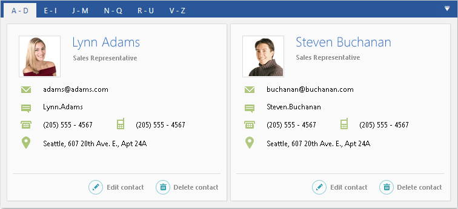

# Overview








Thank you for choosing __RadTabControl__!				

__RadTabControl__ is a flexible navigation component, used to build tabbed interfaces in {{ site.framework_name }} applications. Thanks to the related __RadTabItem__ control, you can organize your controls into different content pages, thus improving the overall user experience (UX) of your applications.				

RabTabControl is part of the powerful UI for WPF navigation controls framework, which includes components as [RadToolBar](), [RadTreeView](), [RadPanelBar](), [RadWindow](), [RadMenu]() and more.				

As every control from UI for {{ site.framework_name }},  RadTabControl comes with a set of pre-defined themes or you can design your own templates for a completely custom look using Expression Blend.

## Key Features

* __Templates and Template Selectors__:  The control allows you advanced customizations of the look and feel of its items. Read more about this in the [Templating]() section of the documentation.

* __Powerful Data Binding__: You can bind the control and its components to different sources as Objects, Collections, XML and WCF services. Read more about this in the [Data Binding]() section of the documentation.

* __Flexible Header Content__: Customize your headers any way you want using direct content or data templates.

* __Styling and Appearance__: RadTabControl comes with a variety of themes and properties that allows you customizing the control's appearance.

* __Group tab items__: You can group items in multiple lines for better user experience. Read more about this in the [Create Multi-line Tabs]() article.

* __Two possible tab orientations__: Horizontal and vertical. Read more about this in the [Getting Started](#setting-the-tabs-orientation) article.

* __Multiple tab strip placement__: Left, Top, Right and Bottom. Read more about this in the [Change Position of the Tab Strip]() article.

* __UI Automation Support__: Check the [UI Automation Support]() common article.

* __Enhanced Routed Events Framework__: The events system of the control will help your code become even more elegant and concise.

A complete list with all key features can be found in the [Key Features]() help article.

>tip Get started with the control with its [Getting Started]() help article that shows how to use it in a basic scenario.

> Check out the online demo at [demos.telerik.com](https://demos.telerik.com/silverlight/#TabControl/FirstLook)[demos.telerik.com](https://demos.telerik.com/wpf/)

## See Also
 * [Key Features]()
 * [Visual Structure]()
