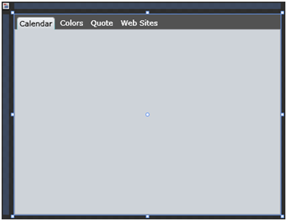
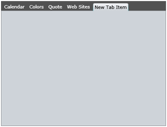

# Add and Remove Tabs

This tutorial will walk you through the common tasks of __adding__ and __removing__ __RadTabItem__ to __RadTabControl__ programmatically and declaratively.			

## Adding And Removing Tabs Programmatically

* __Add Tabs__ In order to add new tab item to a tab control, first you have to create instance of the class __Telerik.Windows.Controls.RadTabItem__, set its properties like __Header__, __Content__, __ToolTip__ etc, and then add it to the tab control items collection.
					
```C#
	private void AddTab()
	{
	    RadTabItem itemToAdd = new RadTabItem()
	    {
	        Header = "New Tab"
	    };
	    radTabControl.Items.Add(itemToAdd);
	}
```
```VB.NET
	Private Sub AddTab()
	    Dim itemToAdd As New RadTabItem()
	    itemToAdd.Header = "New Tab"
	    radTabControl.Items.Add(itemToAdd)
	End Sub
```

* __Remove Tabs__ In order to remove a tab item you have to remove it from the tab control items collection.

```C#
	private void RemoveTab( RadTabItem tabItemToRemove )
	{
	    radTabControl.Items.Remove( tabItemToRemove );
	}
```
```VB.NET
	Private Sub RemoveTab( ByVal tabItemToRemove As RadTabItem )
	    radTabControl.Items.Remove( tabItemToRemove )
	End Sub
```

## Adding And Removing Tabs Declaratively

This is snapshot of a regular __RadTabControl__ with four tab items.


And here is its XAML declaration:

```XAML
	<telerik:RadTabControl x:Name="radTabControl">
	    <telerik:RadTabItem Header="Calendar"/>
	    <telerik:RadTabItem Header="Colors"/>
	    <telerik:RadTabItem Header="Quote"/>
	    <telerik:RadTabItem Header="Web Sites"/>
	</telerik:RadTabControl>
```

Each one of the __RadTabItem__ nodes in the example above represents declaration of a single tab item that will be created and added to your tab control at run time. Just insert or delete __RadTabItem__ child nodes to/from your tab control declaration and see how the tab structure changes.
				

For example insert the following line __<telerik:RadTabItem Header="New Tab Item"/>__ after the "Web Sites" tab item and new tab item will be added to the tab control.


>tip Consider declaring tabs in XAML instead of adding them by code whenever it’s possible. This includes situations when you know what tabs you need at design time.Declaring tabs in XAML is also a preferable choice when you are working with a designer that will style the control using Expression Blend.

## See Also

 * [Getting Started]()

 * [Populating RadTabControl with Data]()
