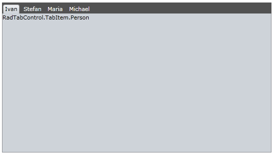

# Binding To Collection

## 

The purpose of this tutorial is to show you how to bind a __RadTabControl__ to a collection of business objects.
				

When you want the tabs of the __RadTabControl__ to be automatically generated on the basis of a collection, use the __ItemsSource__ property.
				

* 
						Create a new class named __Person__. The class' structure is shown on the next code-snippet.
						

#### __C#__

{{region radtabcontrol-populating-binding-to-collection_0}}
	public class Person
	{
	    public Person( string name, int age )
	    {
	        this.Name = name;
	        this.Age = age;
	    }
	    public string Name
	    {
	        get;
	        set;
	    }
	    public int Age
	    {
	        get;
	        set;
	    }
	}
	{{endregion}}

#### __VB.NET__

{{region radtabcontrol-populating-binding-to-collection_1}}
	Public Class Person
	    Public Sub New(ByVal name As String, ByVal age As Integer)
	        Me.Name = name
	        Me.Age = age
	    End Sub
	
	Private _Name As String
	    Public Property Name() As String
	        Get
	            Return _Name
	        End Get
	        Set(ByVal value As String)
	            _Name = value
	        End Set
	    End Property
	
	Private _Age As Integer
	    Public Property Age() As Integer
	        Get
	            Return _Age
	        End Get
	        Set(ByVal value As Integer)
	            _Age = value
	        End Set
	    End Property
	End Class
	{{endregion}}

* 
						Create a new class named __ViewModel__, like the example below:
						

#### __C#__

{{region radtabcontrol-populating-binding-to-collection_2}}
	public class ViewModel
	{
	    public ViewModel()
	    {
	        this.Persons = new ObservableCollection<Person>();
	        this.Persons.Add( new Person( "Ivan", 23 ) );
	        this.Persons.Add( new Person( "Stefan", 34 ) );
	        this.Persons.Add( new Person( "Maria", 16 ) );
	        this.Persons.Add( new Person( "Michael", 78 ) );
	    }
	    public ObservableCollection<Person> Persons
	    {
	        get;
	        set;
	    }
	}
	{{endregion}}

#### __VB.NET__

{{region radtabcontrol-populating-binding-to-collection_3}}
	Public Class ViewModel
	    Public Sub New()
	        Me.Persons = New ObservableCollection(Of Person)()
	        Me.Persons.Add(New Person("Ivan", 23))
	        Me.Persons.Add(New Person("Stefan", 34))
	        Me.Persons.Add(New Person("Maria", 16))
	        Me.Persons.Add(New Person("Michael", 78))
	    End Sub
	
	Private _Persons As ObservableCollection(Of Person)
	    Public Property Persons() As ObservableCollection(Of Person)
	        Get
	            Return _Persons
	        End Get
	        Set(ByVal value As ObservableCollection(Of Person))
	            _Persons = value
	        End Set
	    End Property
	End Class
	{{endregion}}

As you can see the __ViewModel__ class has a reference to an observable collection of __Person__ objects. In fact this will be set to the __ItemsSource__ property of the __RadTabControl__.
						Also that in the class' constructor the collection is initialized with some sample data.

* 
						Declare your __ViewModel__ as a resource.
						

#### __XAML__

{{region radtabcontrol-populating-binding-to-collection_4}}
	<UserControl.Resources>
	    <example:ViewModel x:Key="DataSource"/>
	</UserControl.Resources>
	{{endregion}}

* 
						Set the __ItemsSource__property of the __RadTabControl__.
						

#### __XAML__

{{region radtabcontrol-populating-binding-to-collection_5}}
	<telerik:RadTabControl x:Name="tabControl"
	    ItemsSource="{Binding Source={StaticResource DataSource}, Path=Persons}"/>
	{{endregion}}

Run your demo. The result should be similar to the next image.The reason for this result is that the __RadTabControl__ "still doesn't know" how to display these business objects. You need to "say" explicitly what to be displayed as a __Header__using either the __DisplayMemberPath__property or setting the __HeaderTemplate__ property. Additionally you need to set a __ContentTemplate__.
						

* 
						Set the __DisplayMemberPath__ property of the __RadTabControl__ to "Name".
						

#### __XAML__

{{region radtabcontrol-populating-binding-to-collection_6}}
	<telerik:RadTabControl x:Name="radTabControl"
	    ItemsSource="{Binding Source={StaticResource DataSource}, Path=Persons}"
	    DisplayMemberPath="Name"/>
	{{endregion}}

The result should look like the image below.

* 
						The final step is to create a __DataTemplate__ and set it as a __ContentTemplate__.
						

#### __XAML__

{{region radtabcontrol-populating-binding-to-collection_7}}
	<UserControl.Resources>
	    <example:ViewModel x:Key="DataSource"/>
	
	    <DataTemplate x:Key="ContentTemplate">
	        <Grid>
	            <TextBlock Text="{Binding Age}"/>
	        </Grid>
	    </DataTemplate>
	
	</UserControl.Resources>
	<Grid x:Name="LayoutRoot" Background="White">
	
	    <telerik:RadTabControl x:Name="radTabControl" Margin="8"
	        ItemsSource="{Binding Source={StaticResource DataSource}, Path=Persons}"
	        DisplayMemberPath="Name"
	        ContentTemplate="{StaticResource ContentTemplate}"/>
	
	</Grid>
	{{endregion}}

The final result is shown on the next image:When the __ItemsSource__ is specified, __RadTabItem__ containers are generated for each item in the collection. By using the template properties of the __RadTabControl__ and the __RadTabItem__ you can control the appearance and the visualization of the items in the collection. [Read more about templates here]().
						

# See Also

 * [Choose Header Template by Custom Logic]()

 * [Add and Remove Tabs]()

 * [Data Binding]()
