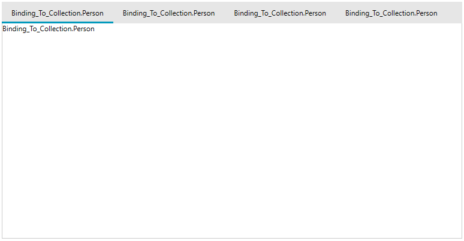
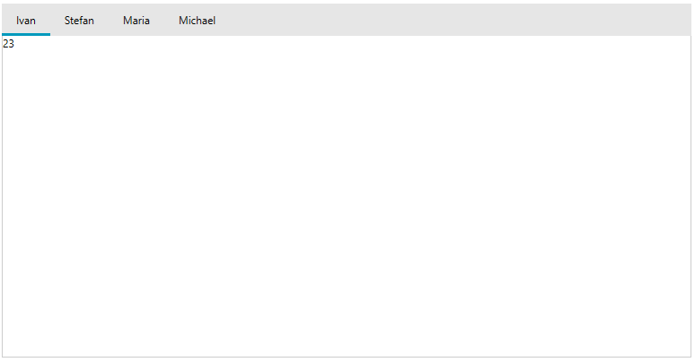

# Binding To Collection

The purpose of this tutorial is to show you how to bind a __RadTabControl__ to a collection of business objects.				

When you want the tabs of the __RadTabControl__ to be automatically generated on the basis of a collection, use the __ItemsSource__ property.				

* Create a new class named __Person__. The class' structure is shown on the next code-snippet.		
				
	__Example 1: Creating Person class__	
	<snippet id='radtabcontrol-populating-with-tabs-populating-binding-to-collection-block_1-cs' />
	<snippet id='radtabcontrol-populating-with-tabs-populating-binding-to-collection-block_2-vb' />

* Create a new class named __ViewModel__, like the example below:						

	__Example 2: Creating ViewModel class__
	<snippet id='radtabcontrol-populating-with-tabs-populating-binding-to-collection-block_3-cs' />
	<snippet id='radtabcontrol-populating-with-tabs-populating-binding-to-collection-block_4-vb' />

	As you can see the __ViewModel__ class has a reference to an observable collection of __Person__ objects. In fact this will be set to the __ItemsSource__ property of the __RadTabControl__. Also that in the class' constructor the collection is initialized with some sample data.

* Set the DataContext of the MainWindow.						
  
	__Example 2: Setting DataContext__ 
	<snippet id='radtabcontrol-populating-with-tabs-populating-binding-to-collection-block_5-cs' />

* Set the __ItemsSource__ property of the __RadTabControl__.						

	__Example 3: Binding the ItemsSource Property__ 
	<snippet id='radtabcontrol-populating-with-tabs-populating-binding-to-collection-block_6-xaml' />

	Now when you run the demo the result should be similar to the next image.
	
	
	The reason for this result is that the __RadTabControl__ "still doesn't know" how to display these business objects. You need to "say" explicitly what to be displayed as a __Header__ using either the __DisplayMemberPath__ property or setting the __HeaderTemplate__ property. Additionally you need to set a __ContentTemplate__.						

* Set the __DisplayMemberPath__ property of the __RadTabControl__ to "Name" and create custom __DataTemplate__ for the __ContentTemplate__ property.					

	__Example 4: Binding the ItemsSource Property__   
	<snippet id='radtabcontrol-populating-with-tabs-populating-binding-to-collection-block_7-xaml' />

	The final result is shown on the next image:
	

	When the __ItemsSource__ is specified, __RadTabItem__ containers are generated for each item in the collection. By using the template properties of the __RadTabControl__ and the __RadTabItem__ you can [control the appearance and the visualization]() of the items in the collection. 

## Suppress Selected Content Template Reapplying

By default, the __RadTabControl__ keeps one __ContentPresenter__ for all its Items and reapplies its __ContentPresenter.ContentTemplate__ on each selection change. In scenarios where the ItemsSource has changed runtime, it could lead to a performance hit. RadTabControl expose a __SupressSelectedContentTemplateReapplying__ property which can be used to avoid this. By default this property is set to __False__ along with the __IsContentPreserved__ property. If you set it to __True__, then the __RadTabControl__ will still have one __ContentPresenter__, but it won't reset its __ContentTemplate__ whenever the selection is changed, and this will increase the performance when ItemsSource is changed runtime.

>Please keep in mind that if you set the SupressSelectedContentTemplateReapplying property to True the same RadTabControl.ContentTemplate is applied to all RadTabItems. And if the ControlTemplate elements aren't databound, the same values will be displayed in all RadTabItems.	

## See Also  
 * [Customizing Appearance]()
 * [Add and Remove Tabs]()
 * [Data Binding]()