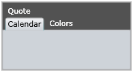
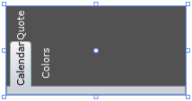
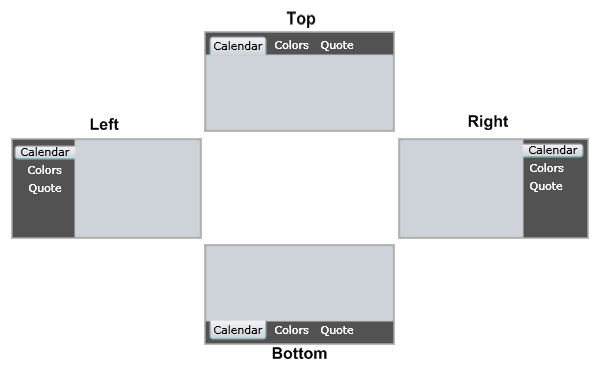
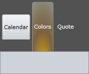

# Controlling Layout

## 

There are a number of ways you can control the layout of your __RadTabControl__ control.
				
* If you need to group your tab items in different rows, separating them by some specific criteria, just use the __Boolean__ property __IsBreak.__ This property belongs to the __RadTabItem__ class and once set, all tab items that are after this one will be placed on a new row. [Read more]()

* You can control the orientation of the tab items by using the property __TabOrientation.__ You can choose one of these  options: to display them horizontally (__Orientation.Horizontal__) or vertically (__Orientation.Vertical__). [Read more](#Set_Tab_Orientation)

* The default placement of the tab control items is on top, but sometimes this is not what we need. Here is when the __TabStripPlacement__ property comes. It allows you to define the exact position, the tab items should appear using the __Telerik.Windows.Controls.Dock__ enumeration. The four possible choices are: - __Dock.Bottom__, __Dock.Left__, __Dock.Right__, __Dock.Top.__[Read more]()

* Control the heights of your tab item headers using the Boolean property __AllTabsEqualHeight__. If you set this property to __True__, all of your tab items will be automatically resized to the same header hight, except for those, which height has not been explicitly defined. Note that the header area of the tab control will be as high as the highest header element.

* Control the vertical and horizontal alignments using the four properties __HorizontalAlignment__, __HorizontalContentAlignment__, __VerticalContentAlignment__ and __VerticalAlignment__ inherited from the base __FrameworkElement__ class.
							

* And last but not least, you can dramatically change the layout of your __RadTabControl__ using [templating]() and [styling]().
							

## See Also

 * [How to Change the Position of the Tab Strip of RadTabControl]()

 * [Getting Started]()

 * [How to Create Multi-line Tabs]()
