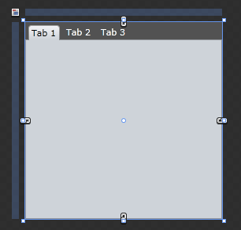
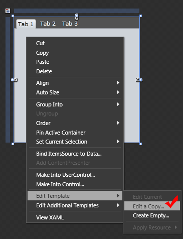
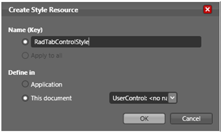
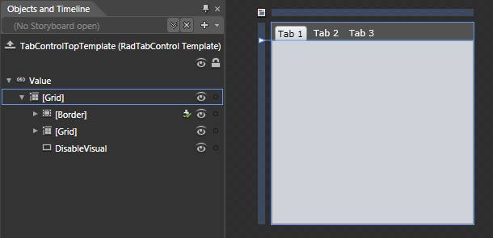
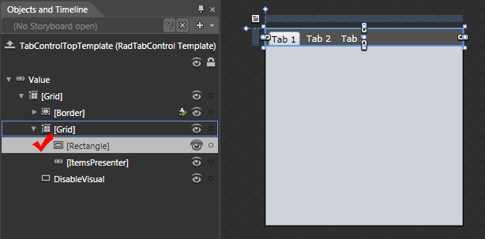
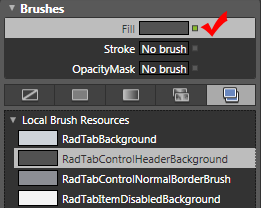
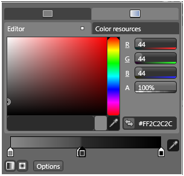
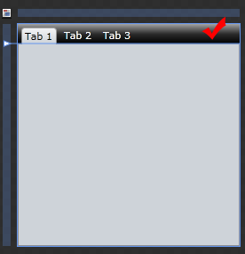

# Modifying Themes in Blend

Themes can be modified either by changing the properties of the __RadTabControl__ or by modifying its __ControlTemplate__ .
			

## Modifying the Theme via Style

Define a __Style__ that has the __RadTabControl__ for target type.

#### __XAML__

{{region radtabcontrol-modifying-themes-in-blend_0}}
	
	{{endregion}}

Set properties like __FontFamily__, __Foreground__, __Background__ in order to change the appearance of the control.
				

#### __XAML__

{{region radtabcontrol-modifying-themes-in-blend_1}}
	
	{{endregion}}

To apply the style just set the style property of the tab control in XAML pointing to the static resource.

#### __XAML__

{{region radtabcontrol-modifying-themes-in-blend_2}}
	<telerik:RadTabControl x:Name="radTabControl" Style="{StaticResource TabControlStyle}"/>
	{{endregion}}

>tipIt’s best for styles to be defined in the __UserControl’s__ resources or in the __Application’s__ resources.

## Modifying the Theme via the ControlTemplate

Via Expression Blend you are able to get the current template of the __RadTabControl__ and modify it. This way you are directly modifying the theme.
				

To modify the __ControlTemplate__ of the __RadTabControl__ in Expression Blend follow these steps:
				

Select the __RadTabControl__ you want to modify.

Right-click on the __RadTabControl__ and choose __Edit Control Parts -> Edit a Copy.__

Choose a name for the template and where to define it.

Modify the controls of the template or add additional if needed.

If you take a look at the XAML in Visual Studio you will see a lot of code. There are several __Brushes__ defined and several __ControlTemplates__, followed by a __Style__. These four templates are used by the __Top__-, __Right__-, __Bottom-__ and __LeftTemplate__ properties. As a default template is used the __TopTemplate__ value:
				

#### __XAML__

{{region radtabcontrol-modifying-themes-in-blend_3}}
	<ControlTemplate x:Key="TabControlTopTemplate" TargetType="telerik:RadTabControl">
	    <Grid>
	        <Grid.RowDefinitions>
	            <RowDefinition Height="auto"/>
	            <RowDefinition Height="*"/>
	        </Grid.RowDefinitions>
	        <vsm:VisualStateManager.VisualStateGroups>
	            <vsm:VisualStateGroup x:Name="CommonStates">
	                <vsm:VisualState x:Name="Disabled">
	                    <Storyboard/>
	                </vsm:VisualState>
	                <vsm:VisualState x:Name="Normal"/>
	            </vsm:VisualStateGroup>
	        </vsm:VisualStateManager.VisualStateGroups>
	        <Border Margin="0" Grid.Row="1" Background="{TemplateBinding Background}" BorderBrush="{TemplateBinding BorderBrush}" BorderThickness="{TemplateBinding BorderThickness}">
	            <ContentPresenter x:Name="ContentElement" Content="{TemplateBinding SelectedContent}" ContentTemplate="{TemplateBinding SelectedContentTemplate}"/>
	        </Border>
	        <Grid>
	            <Rectangle Visibility="{TemplateBinding BackgroundVisibility}" Fill="{StaticResource RadTabControlHeaderBackground}"/>
	            <ItemsPresenter Margin="2 4 0 0"/>
	        </Grid>
	        <Rectangle x:Name="DisableVisual" Visibility="Collapsed" Grid.RowSpan="2" Fill="{StaticResource RadTabItemDisabledBackground}"/>
	    </Grid>
	</ControlTemplate>
	{{endregion}}

## Modify the Background Behind the Headers 

Expand the Grid control in the “Object and Timeline” pane and select the rectangle.

Take a look at the “Properties” pane and you’ll see that the square right to the Fill property is green. 

In the Local Brush Resources section see which brush is used and modify it by clicking on the rectangle left of its’ name.

The result should look like the following snapshot.

The same way you can modify the __DisabledVisual__ rectangle. To modify the tab’s content and headers visual appearance you have to modify the template of the __RadTabItem__. [More about that here.]()

>If any of the __Telerik’s__ themes is set to the __RadTabControl,__ you will be modifying the __ControlTemplate__ for the __RadTabControl__ defined in them.
						

## See Also

 * [Tab Item Templates]()

 * [Using Themes]()
