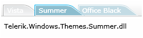
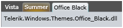
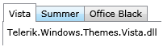

# Using Themes

__RadTabControl__ uses themes to control the overall look-and-feel of the control. The theme consists of a set of styles that are set to the Telerik __RadControls__ when the theme is applied. To apply a theme to the __RadTabControl,__ set its’ __StyleManager.Theme__ attached property or apply the theme for the entire application.
			

>A theme can be applied to a single control, which will affect only that control overall look, or can be applied to the entire application, which will affect the look and feel of all __RadControls__ in the application.
				

__RadTabControl__ comes with a number of predefined themes as part of the __RadControls__:
			

									 __Summer__

										 __Office Black__

								 __Vista__

## Using the Default Theme

When no theme is applied to the control, the default style and template of the __RadTabControl__ are used. You can create your own styles and templates and use them to change the overall look of the __RadTabControl__.
				

## Applying a Theme to a Single RadTabControl

>The predefined Telerik Themes are located in their own assemblies. You will be able to see the themes in the intellisense or create instances of them in the managed code without adding a reference to the desired theme assembly. But the theme will not apply until you refer the theme’s assembly.

>tipApplying a theme can be done declaratively in XAML or programmatically in managed code.

In XAML we can set the theme directly to the control:

#### __XAML__

{{region radtabcontrol-using-themes_0}}
	<UserControl x:Class="RadTabControlHelp.Page"
	             xmlns:telerik="http://schemas.telerik.com/2008/xaml/presentation">
	    ...
	        <telerik:RadTabControl x:Name="radTabControl" telerik:StyleManager.Theme="Office_Black"/>
	    ...
	</UserControl>
	{{endregion}}

or declare it as a static resource in the UserControl’s resources or the Application’s resources:

#### __XAML__

{{region radtabcontrol-using-themes_1}}
	<UserControl.Resources>
	    <telerik:Theme x:Key="VistaTheme" Source="/Telerik.Windows.Theme.Vista;component/themes/generic.xaml" />
	</UserControl.Resources>
	<Grid x:Name="LayoutRoot">
	    <telerik:RadTabControl x:Name="radTabControl" telerik:StyleManager.Theme="{StaticResource VistaTheme}" />
	</Grid>
	{{endregion}}

>As the Vista theme is contained in the __Telerik.Windows.Themes.Vista__ assembly, we first have to point the path to the assembly  and then using the *;component* syntax to point the way to the theme in the context of the assembly.
						

>tipDeclaring the theme in the Application’s resources (App.xaml) makes it reusable everywhere in the application, while the theme declared in the UserControl’s resources is only available for the particular UserControl.

In the managed code we apply themes to controls by using the static __SetTheme()__ method of the __Style manager -____StyleManager.SetTheme(DependencyObject element, Theme value)__;
				

#### __C#__

{{region radtabcontrol-using-themes_2}}
	VistaTheme theme = new VistaTheme();
	RadTabControl radTabControl= new RadTabControl();
	StyleManager.SetTheme( radTabControl, theme );
	{{endregion}}

#### __VB.NET__

{{region radtabcontrol-using-themes_3}}
	Dim theme As New VistaTheme()
	Dim radTabControlAs New RadTabControl()
	StyleManager.SetTheme(radTabControl, theme)
	{{endregion}}

>tip
					By using the same approaches you can apply Telerik themes to the standard controls as well. Custom themes can also be created and applied via the __StyleManager__.
				

## Applying a Theme to the Whole Application

A theme can be applied not only for a particular control, but also for all of the controls in the application. 

#### __C#__

{{region radtabcontrol-using-themes_4}}
	StyleManager.ApplicationTheme = new VistaTheme();
	{{endregion}}

#### __VB.NET__

{{region radtabcontrol-using-themes_5}}
	StyleManager.ApplicationTheme = New VistaTheme()
	{{endregion}}

or

#### __C#__

{{region radtabcontrol-using-themes_6}}
	new VistaTheme().IsApplicationTheme = true;
	{{endregion}}

#### __VB.NET__

{{region radtabcontrol-using-themes_7}}
	Dim theme As New VistaTheme()
	theme.IsApplicationTheme = True
	{{endregion}}

>Applying a theme to the whole application will only affect the RadControls. If you want to apply the theme to the standard controls, you will have to set it to each of them using the __StyleManager____attached property__ or the __StyleManager____class__ in code-behind.
					

>tipYou have to set the application theme as early as possible. The most suitable locations are the __Application.Startup__ event or in the __UserControl’s constructor__:
					

	
						private void Application_Startup( object sender, StartupEventArgs e )
						{
							new VistaTheme().IsApplicationTheme = true;
							this.RootVisual = new Page();
						}
					

	
						Private Sub Application_Startup(ByVal o As Object, ByVal e As StartupEventArgs) Handles Me.Startup
							Dim theme As New VistaTheme()
							theme.IsApplicationTheme = True
							Me.RootVisual = New MainPage()
						End Sub
					

## Applying a Custom Theme

The __StyleManager__ is not limited only when using the Telerik predefined themes. You are able to create your own themes and apply them to RadControls or the standard controls.
				

>The theme will affect only those controls, for which there are styles defined.

Applying the custom theme is done in the same way as applying a Telerik’s theme:

#### __XAML__

{{region radtabcontrol-using-themes_8}}
	<UserControl.Resources>
	    <telerik:Theme x:Key="CustomTheme" Source="/PathToTheCustomTheme.xaml" />
	</UserControl.Resources>
	<Grid x:Name="LayoutRoot">
	    <telerik:RadTabControl x:Name="radTabControl" telerik:StyleManager.Theme="{StaticResource CustomTheme}"/>
	</Grid>
	{{endregion}}

#### __C#__

{{region radtabcontrol-using-themes_9}}
	Theme theme = new Theme( new Uri( "PathToMyTheme.xaml", UriKind.RelativeOrAbsolute ) );
	RadTabControl radTabControl = new RadTabControl();
	StyleManager.SetTheme( radTabControl, theme );
	{{endregion}}

#### __VB.NET__

{{region radtabcontrol-using-themes_10}}
	Dim theme As New Theme(New Uri("PathToMyTheme.xaml", UriKind.RelativeOrAbsolute))
	Dim radTabControlAs New RadTabControl()
	StyleManager.SetTheme(radTabControl, theme)
	{{endregion}}

>If the theme is not found or is invalid, the default style of the control will be used.

>tipEach one of the Telerik’s themes contains a set of color resources that determine the overall look of the controls. By configuring just these resources you can change the visual appearance of the controls and create your own theme on the basis of the original ones.

# See Also

 * [Modifying Themes in Blend]()

 * [Controlling Appearance]()

 * [Templating]()
