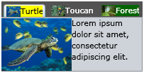

# Choose Header Template by Custom Logic

The Selectors allow us to apply a different __DataTemplate__ or __Style__ on an item, based on some custom logic. They are used whenever you need to visualize the same data in different way, depending on one or more conditions.
	  

## 

For example you have a several tabs, which contain data about different animals or plants. You want to display the animals in tabs with special header template (with a yellow background) and the plants in tabs with a header template with a green background.
		

Let's first define the __DataTemplates__ in the Application’s resources (__App.xaml__):
		  

#### __XAML__

{{region radtabcontrol-templating-custom-header-template_0}}
	<Application.Resources>
		<DataTemplate x:Key="AnimalDataTemplate">
			<Border Background="Yellow">
				<StackPanel Orientation="Horizontal">
					<Image Source="{Binding ImageSource}" Width="16" Height="16"/>
					<TextBlock Text="{Binding Name}" VerticalAlignment="Center"/>
				</StackPanel>
			</Border>
		</DataTemplate>
		<DataTemplate x:Key="PlantDataTemplate">
			<Border Background="Green">
				<StackPanel Orientation="Horizontal">
					<Image Source="{Binding ImageSource}" Width="16" Height="16"/>
					<TextBlock Text="{Binding Name}" VerticalAlignment="Center"/>
				</StackPanel>
			</Border>
		</DataTemplate>
	</Application.Resources>
	{{endregion}}

This will allow you to access them easily from the __HeaderSelector__ as shown below:

#### __C#__
    DataTemplate dataTemplate = (DataTemplate)Application.Current.Resources["DataTemplateKey"];
		  

#### __VB.NET__

    Dim dataTemplate As DataTemplate = DirectCast(Application.Current.Resources("DataTemplateKey"), DataTemplate)
		  

Next, create a class file and name it __HeaderSelector__. The __HeaderSelector__ class must derive from the __DataTemplateSelector__ class, which is located into the __Telerik.Windows.Controls__ assembly.
		

#### __C#__

{{region radtabcontrol-templating-custom-header-template_0}}
    public class HeaderSelector : Telerik.Windows.Controls.DataTemplateSelector
    {
    }
    {{endregion}}

#### __VB.NET__

{{region radtabcontrol-templating-custom-header-template_1}}
    Public Class HeaderSelector
        Inherits Telerik.Windows.Controls.DataTemplateSelector
    End Class
	{{endregion}}

Override the __SelectTemplate__ method and implement your custom logic in it. The method accepts as arguments an __object__ and a __DependencyObject__. The object argument is the actual object being bound and the __DependecyObject__ is the container for it.
		

#### __C#__

{{region radtabcontrol-templating-custom-header-template_2}}
    public class HeaderSelector : DataTemplateSelector
    {
        public override DataTemplate SelectTemplate(object item, DependencyObject container)
        {
            if (item is Animal)
            {
                return Application.Current.Resources["AnimalDataTemplate"] as DataTemplate;
            }
            else
            {
                return Application.Current.Resources["PlantDataTemplate"] as DataTemplate;
            }
        }
    }
	{{endregion}}

#### __VB.NET__

{{region radtabcontrol-templating-custom-header-template_3}}
    Public Class HeaderSelector
        Inherits Telerik.Windows.Controls.DataTemplateSelector
        Public Overrides Function SelectTemplate(item As Object, container As DependencyObject) As DataTemplate
            If TypeOf item Is Animal Then
                Return TryCast(Application.Current.Resources("AnimalDataTemplate"), DataTemplate)
            Else
                Return TryCast(Application.Current.Resources("PlantDataTemplate"), DataTemplate)
            End If
        End Function
    End Class
	{{endregion}}

Finally set the __HeaderTemplateSelector__ property of the __RadTabItem__:
		

#### __XAML__

{{region radtabcontrol-templating-custom-header-template_4}}
	<selectors:HeaderSelector x:Key="HeaderSelector" />
	...
	<telerik:RadTabControl x:Name="Tabs">
	    <telerik:RadTabControl.ItemContainerStyle>
	        
	    </telerik:RadTabControl.ItemContainerStyle>
	</telerik:RadTabControl>
	{{endregion}}

>Please note that __RadTabControl__ exposes an __ItemTemplateSelector__ that applies a __DataTemplateSelector__ as an __HeaderTemplateSelector__ to all __RadTabItems__.
		
		<telerik:RadTabControl x:Name="Tabs" ItemTemplateSelector="{StaticResource HeaderSelector}"/>	
		

# See Also

 * [Tab Items Overview]()
