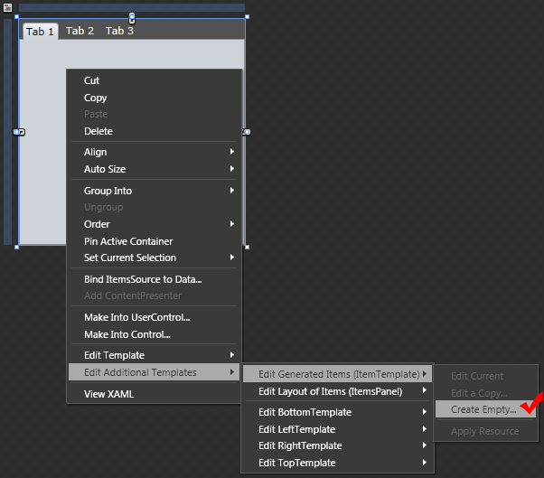
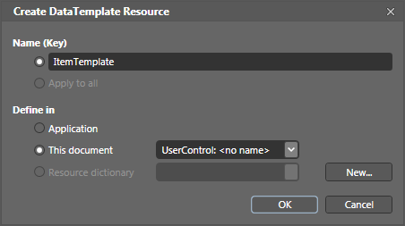
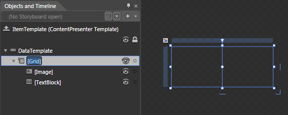
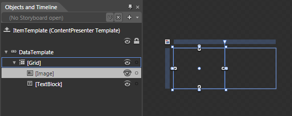
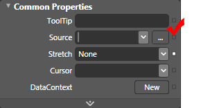
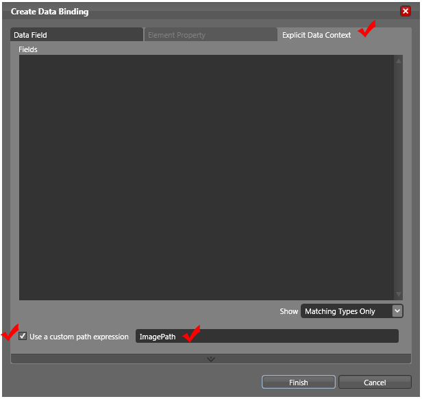
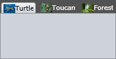
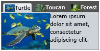

# Item Template and Template Selectors

When binding our __RadTabControl__ to a business collection, you can configure the visualization of the data and the appearance of the __RadTabItems__ via the __ItemTemplate, ContentTemplate__ and the __ItemTemplateSelector, ContentTemplateSelector__ properties.	  

## ItemTemplate Property 

The __ItemTemplate__ property is used to configure the template for the header of the tabs. It can be set in both Expression Blend and Visual Studio. To set it in Expression Blend you can follow these steps:		

Select the __RadTabControl__, which __ItemTemplate__ you want to set.

Right-click on it or right-click in the scene explorer and choose *Edit Additional Templates -> Edit Generated Items -> Create Empty*.

Choose a name for the data template and where to be defined in:

>tip Defining the template in the Application section makes it reusable from everywhere in the application.

Drag and drop the controls you need for the template and configure their properties. In the example are used an __Image__ and a __TextBlock__ controls:

#### __XAML__
{{region radtabcontrol-item-templates-and-selectors_0}}
	<DataTemplate x:Key="ItemTemplate">
	    <Grid>
	        <Grid.ColumnDefinitions>
	            <ColumnDefinition />
	            <ColumnDefinition />
	        </Grid.ColumnDefinitions>
	        <Image Stretch="None" Grid.Column="0" />
	        <TextBlock Grid.Column="1" TextWrapping="Wrap" />
	    </Grid>
	</DataTemplate>
{{endregion}}

To configure the binding for the __Source__ property of the __Image control__, select it in the “*Object and Timeline*” pane.

Go to the “*Properties*” pane and find the __Source__ property in the 'Common properties' section.

Click the empty square right of it to open the context menu for the property and choose __DataBinding__ to open the "*Create Data Binding*" dialog.

>tip If you are familiar with the binding syntax you can also choose __Custom Expression__ and manually write the binding.		  

In the "*Create Data Binding*" dialog choose the __Explicit DataContext__ tab and check the __Use custom path expression__ box. In the field write the name of the property you want to bind to. Click "*Finish*".

Do the same for the __Text__ property of the __TextBlock__.		

You can also define the bindings manually in XAML:

#### __XAML__

{{region radtabcontrol-item-templates-and-selectors_1}}
	<DataTemplate x:Key="ItemTemplate">
	    <Grid>
	        <Grid.ColumnDefinitions>
	            <ColumnDefinition />
	            <ColumnDefinition />
	        </Grid.ColumnDefinitions>
	        <Image Stretch="None"
	               Grid.Column="0"
	               Source="{Binding ImagePath}" />
	            <TextBlock Grid.Column="1"
	                       TextWrapping="Wrap"
	                       Text="{Binding Header}" />
	    </Grid>
	</DataTemplate>
	...
	<telerik:RadTabControl x:Name="Tabs" ItemTemplate="{StaticResource ItemTemplate}">
	</telerik:RadTabControl>
{{endregion}}

When you start the application with configured __ItemsSource__ ([read more here]()) you should see a similar result:

>tip Although it is clearer when defining the __DataTemplate__ in the control, it’s a good practice to place it within the resources, in case you want to reuse it later.		  

## ContentTemplate Property 

The __ContentTemplate__ property is used to configure the template for the content of the tabs. It can be set in both Expression Blend and Visual Studio. To set it in Expression Blend you can follow the above steps. If you decide to set it in Visual Studio, you can define the following XAML:		

#### __XAML__
{{region radtabcontrol-item-templates-and-selectors_2}}
	<DataTemplate x:Key="ItemTemplate">
	    <Grid>
	        <Grid.ColumnDefinitions>
	            <ColumnDefinition />
	            <ColumnDefinition />
	        </Grid.ColumnDefinitions>
	        <Image Stretch="None"
	               Grid.Column="0"
	               Source="{Binding ImagePath}" />
	            <TextBlock Grid.Column="1"
	                       TextWrapping="Wrap"
	                       Text="{Binding Header}" />
	    </Grid>
	</DataTemplate>
	
	<DataTemplate x:Key="ContentTemplate">
	    <Grid>
	        <Grid.ColumnDefinitions>
	            <ColumnDefinition />
	            <ColumnDefinition />
	        </Grid.ColumnDefinitions>
	        <Image Stretch="None"
	               Grid.Column="0"
	               Source="{Binding ImagePath}" />
	            <TextBlock Grid.Column="1"
	                       TextWrapping="Wrap"
	                       Text="{Binding Description}" />
	    </Grid>
	</DataTemplate>
	
	...
	<telerik:RadTabControl x:Name="Tabs"
	                       ItemTemplate="{StaticResource ItemTemplate}" 
	                       ContentTemplate="{StaticResource ContentTemplate}">
	</telerik:RadTabControl>
{{endregion}}

## ItemContainerStyle Property 

> You can use the __ItemContainerStyle__ property to control the appearance of the item’s container.		  

To set properties of the tab’s header, you can use the __ItemContainerStyle__ property. The container created by the __RadTabControl__ for each item in the collection is of type __RadTabItem__. The style defined for the __ItemContainerStyle__ property should have as __TargetType__ the __RadTabItem__ class.		

#### __XAML__ 
{{region radtabcontrol-item-templates-and-selectors_3}}
	<telerik:RadTabControl x:Name="Tabs">
	    <telerik:RadTabControl.ItemContainerStyle>
	        
	    </telerik:RadTabControl.ItemContainerStyle>
	</telerik:RadTabControl>
{{endregion}}

>tip Defining the style in the resources of the control or in the resources of the application, makes it reusable.

The property that needs to be set in order to define the header template for the __RadTabItem__ is the __HeaderTemplate__:		

#### __XAML__
{{region radtabcontrol-item-templates-and-selectors_4}}
	<telerik:RadTabControl x:Name="Tabs">
	    <telerik:RadTabControl.ItemContainerStyle>
	        
	    </telerik:RadTabControl.ItemContainerStyle>
	</telerik:RadTabControl>
{{endregion}}

## ContentTemplateSelector Property

The __ContentTemplateSelector__ allows you to apply different __Templates__ on an item, based on some custom logic. They are used whenever you need to visualize the same data in different way, depending on one or more conditions. For example you have a several tabs, which contain data about different animals and plants. You want to display the animals in a template with a yellow background and the plants in a different template with a green background. To create your own selector you can use Visual Studio.		

Create a __ContentSelector__ class deriving from the __DataTemplateSelector__ class, which is located into the __Telerik.Windows.Controls__ assembly.


#### __C#__ 
{{region radtabcontrol-item-templates-and-selectors_5}}
	public class ContentSelector : DataTemplateSelector
	{
	}
{{endregion}}


#### __C#__ 
{{region radtabcontrol-item-templates-and-selectors_5}}
	public class ContentSelector : Telerik.Windows.Controls.DataTemplateSelector
	{
	}
{{endregion}}



#### __VB.NET__
{{region radtabcontrol-item-templates-and-selectors_6}}
	Public Class ContentSelector 
	    Inherits DataTemplateSelector
	End Class
{{endregion}}


#### __VB.NET__
{{region radtabcontrol-item-templates-and-selectors_6}}
	Public Class ContentSelector 
	    Inherits Telerik.Windows.Controls.DataTemplateSelector
	End Class
{{endregion}}


Override the __SelectTemplate__ method and implement your custom logic in it. The method accepts as arguments an __object__ and a __DependencyObject__. The object argument is the actual object being bound and the __DependecyObject__ is the container for it.


#### __C#__
{{region radtabcontrol-item-templates-and-selectors_7}}
	public class ContentSelector : DataTemplateSelector
	{
	    public override DataTemplate SelectTemplate(object item, DependencyObject container)
	    {
	        if (((LifeForm)item).Type == LifeFormTypes.Animal)
	        {
	            return Application.Current.Resources["AnimalDataTemplate"] as DataTemplate;
	        }
	        else
	        {
	            return Application.Current.Resources["PlantDataTemplate"] as DataTemplate;
	        }
	    }
	}
{{endregion}}


#### __C#__
{{region radtabcontrol-item-templates-and-selectors_7}}
	public class ContentSelector : Telerik.Windows.Controls.DataTemplateSelector
	{
	    public override DataTemplate SelectTemplate(object item, DependencyObject container)
	    {
	        if (((LifeForm)item).Type == LifeFormTypes.Animal)
	        {
	            return Application.Current.Resources["AnimalDataTemplate"] as DataTemplate;
	        }
	        else
	        {
	            return Application.Current.Resources["PlantDataTemplate"] as DataTemplate;
	        }
	    }
	}
{{endregion}}



#### __VB.NET__
{{region radtabcontrol-item-templates-and-selectors_8}}
	Public Class ContentSelector Inherits DataTemplateSelector
	    Public Overloads Overrides Function SelectTemplate(ByVal item As Object, ByVal container As DependencyObject) As DataTemplate
	        If DirectCast(item, LifeForm).Type = LifeFormTypes.Animal Then
	            Return TryCast(Application.Current.Resources("AnimalDataTemplate"), DataTemplate)
	        Else
	            Return TryCast(Application.Current.Resources("PlantDataTemplate"), DataTemplate)
	        End If
	    End Function
	End Class
{{endregion}}



#### __VB.NET__
{{region radtabcontrol-item-templates-and-selectors_8}}
	Public Class ContentSelector Inherits Telerik.Windows.Controls.DataTemplateSelector
	    Public Overloads Overrides Function SelectTemplate(ByVal item As Object, ByVal container As DependencyObject) As DataTemplate
	        If DirectCast(item, LifeForm).Type = LifeFormTypes.Animal Then
	            Return TryCast(Application.Current.Resources("AnimalDataTemplate"), DataTemplate)
	        Else
	            Return TryCast(Application.Current.Resources("PlantDataTemplate"), DataTemplate)
	        End If
	    End Function
	End Class
{{endregion}}


>tip You can define your __DataTemplates__ in the Application’s resources (__App.xaml__), so you can easily access them  from the __ItemSelector:__

#### __C#__
{{region radtabcontrol-item-templates-and-selectors_10}}
    DataTemplate dataTemplate = ( DataTemplate )Application.Current.Resources["DataTemplateKey"];
{{endregion}}

#### __VB.NET__
{{region radtabcontrol-item-templates-and-selectors_11}}
    Dim dataTemplate As DataTemplate = DirectCast(Application.Current.Resources("DataTemplateKey"), DataTemplate)
{{endregion}}

Define the created selector as a resource in your XAML and set it to the __ItemTemplateSelector__ property.		

#### __XAML__
{{region radtabcontrol-item-templates-and-selectors_9}}
	<selectors:ContentSelector x:Key="ContentSelector" />
	    ...
	<telerik:RadTabControl x:Name="Tabs" ContentTemplateSelector="{StaticResource ContentSelector}" />
{{endregion}}

> The same approach is used when creating __StyleSelectors__ (for example for the __ItemContainerStyleSelector__ property); just derive your selector class from __StyleSelector__, instead of __DataTemplateSelector__.

## See Also
 * [Tab Item Templates]()
 * [Choose Header Template by Custom Logic]()
 * [Templating Overview]()
