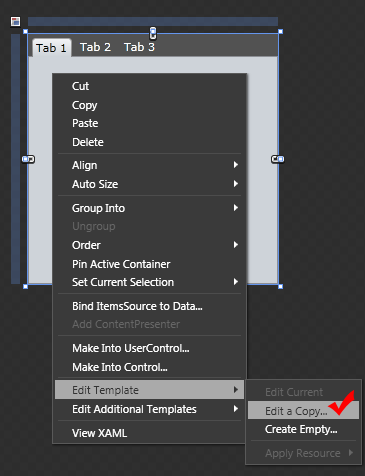

# Left/Top/Right/Bottom Templates

## 

The Left, Top, Right and Bottom templates are used to set the default __ControlTemplate__ of the __RadTabControl__ in dependency with the __TabStripPlacement__. This allows you to adjust your __RadTabControl’s__ look to the position of the tab strip. When the value of the __TabStripPlacement__ property is changed, the appropriate template is applied. The TopTemplate is used as default and the values of the other templates are the same.
				

Modifying the templates can be done in both Expression Blend and Visual Studio. Get the default templates via Expression Blend:

Select the __RadTabControl__ you want to modify.
				

Right-click on the __RadTabControl__ and choose __Edit Control Parts -> Edit a Copy.__

Choose a name for the template and where to place it.

If you take a look at the XAML in Visual Studio you will see a lot of code. There are several __Brushes__ defined and four __ControlTemplates__, followed by a __Style__. These four templates are used by the __Top__-, __Right__-, __Bottom-__ and __LeftTemplate__. 
						As they are all the same by default, here is an example with the __TopTemplate__:
					By default they are they are identical.

#### __XAML__

{{region radtabcontrol-left-top-right-bottom-templates_0}}
	        <ControlTemplate x:Key="TabControlTopTemplate" TargetType="telerik:RadTabControl">
	            <Grid>
	                <Grid.RowDefinitions>
	                    <RowDefinition Height="auto" />
	                    <RowDefinition Height="*" />
	                </Grid.RowDefinitions>
	                <VisualStateManager.VisualStateGroups>
	                    <VisualStateGroup x:Name="CommonStates">
	                        <VisualState x:Name="Disabled">
	                            <Storyboard />
	                        </VisualState>
	                        <VisualState x:Name="Normal" />
	                    </VisualStateGroup>
	                </VisualStateManager.VisualStateGroups>
	                <Border Grid.Row="1" 
	                        Margin="0"
	                        Background="{TemplateBinding Background}"
	                        BorderBrush="{TemplateBinding BorderBrush}"
	                        BorderThickness="{TemplateBinding BorderThickness}">
	                    <ContentPresenter x:Name="ContentElement" 
	                                      Content="{TemplateBinding SelectedContent}"
	                                      ContentTemplate="{TemplateBinding SelectedContentTemplate}" />
	                </Border>
	                <Grid>
	                    <Rectangle Fill="{StaticResource RadTabControlHeaderBackground}" Visibility="{TemplateBinding BackgroundVisibility}" />
	                    <ItemsPresenter Margin="2 4 0 0" />
	                </Grid>
	                <Rectangle x:Name="DisableVisual" 
	                           Grid.RowSpan="2"
	                           Fill="{StaticResource RadTabItemDisabledBackground}"
	                           Visibility="Collapsed" />
	            </Grid>
	        </ControlTemplate>
	{{endregion}}

You are now able to modify the desired templates to your liking.

>Modify the templates carefully because removing some of the controls may cause the control to malfunction!

# See Also

 * [Templating Overview]()

 * [Item Template and Template Selectors]()

 * [Tab Item Templates]()
