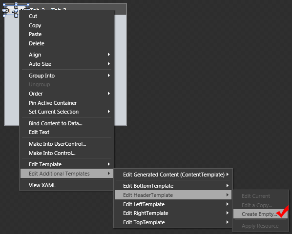
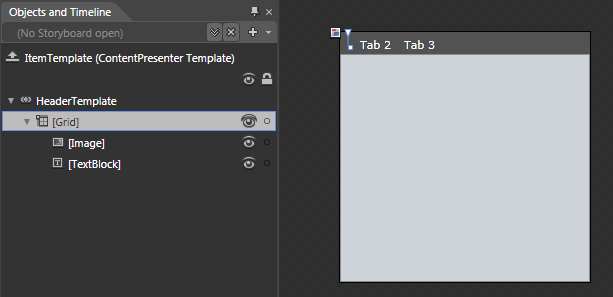
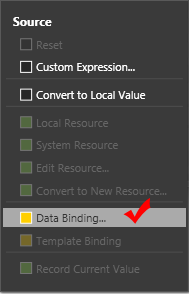
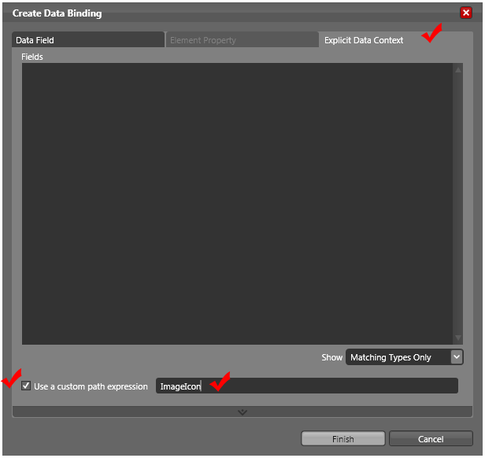
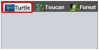
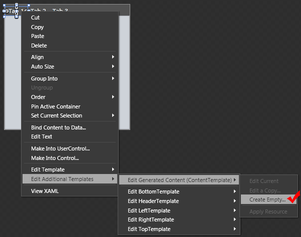
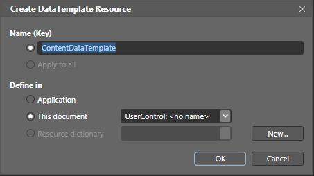
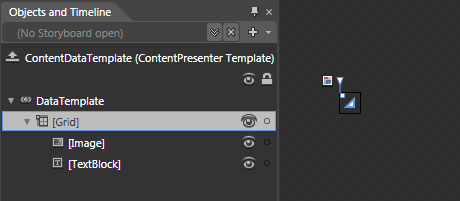
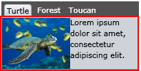

# Templates

The __RadTabItem__ provides a set of templates that allow you to control and modify its appearance and the data visualization within it.
	  

## Change the ControlTemplate

The __Template__ property allows you to change the default appearance of the control. It is of type  __ControlTamplate__. You can set it from both Expression Blend and Visual Studio.
		

To configure the __Template__ property in Expression Blend, follow these steps:
		

* Select the __RadTabControl__ which items you want to modify.
			

* Select one of the tab items and right-click it. Choose __Edit Control Parts -> Edit a Copy.__

* Choose a name for your style,where to define it and click “OK”.
			

* In the __“Object and Timeline”__ pane you can see the controls that are part of the template
			

* Change the desired properties.
			

>Removing default controls from the template may cause the control to malfunction.____

>tip__If you look at the XAML generated by the Expression Blend, you will see that besides the ControlTemplate, it has generated a whole style that has a setter for all default values of the RadTabControl’s properties. If you want to have only the ControlTemplate go in Visual Studio and remove the unneeded code.__

If you define the __ControlTemplate__ in Visual Studio, your XAML should look like this:
		

#### __XAML__

{{region radtabcontrol-templating-tabs-templates_0}}
	        <ControlTemplate x:Key="TabControlTemplate" TargetType="telerikNavigation:RadTabControl">
	            <Grid>
	                <VisualStateManager.VisualStateGroups>
	                    ...The visual states are not important here.
	                </VisualStateManager.VisualStateGroups>
	
	                <telerik:RadDockPanel LastChildFill="True">
	                    <telerikPrimitives:LayoutTransformControl x:Name="HeaderDockedElement"
							telerik:RadDockPanel.Dock="Top" SnapsToDevicePixels="True" >
	                            <!--Header Background-->
	                            <Border x:Name="HeaderBackground" 
									Background="{TemplateBinding HeaderBackground}"
									Visibility="{TemplateBinding BackgroundVisibility}"/>
	                            <!-- Header bottom border  -->
	                            <Border BorderThickness="0 0 0 1" 
									BorderBrush="{StaticResource TabControl_ContentBorderBrush}" SnapsToDevicePixels="True"/>
	                                <!--TabStrip-->
	                                <telerik:RadDockPanel Panel.ZIndex="10">
	
	                                    <ContentPresenter Content="{TemplateBinding AdditionalContent}"
										telerik:RadDockPanel.Dock="Right" Margin="0 4 0 2" />
	                                    <ToggleButton x:Name="DropDownButtonElement" Visibility="Collapsed"
										telerik:RadDockPanel.Dock="Right" Margin="2 4 4 2"
										Style="{TemplateBinding DropDownButtonStyle}" ClickMode="Press"
										IsChecked="{Binding IsDropDownOpen, Mode=TwoWay, RelativeSource={RelativeSource TemplatedParent}}">
	                                        <telerikNavigation:RadContextMenu.ContextMenu>
	                                            <telerikTabControl:DropDownMenu x:Name="DropDownMenuElement"
												
												StaysOpen="False" Placement="Bottom"
												Style="{TemplateBinding DropDownStyle}"
												ItemTemplate="{TemplateBinding ItemDropDownContentTemplate}"
												ItemTemplateSelector="{TemplateBinding ItemDropDownContentTemplateSelector}"
												DisplayMemberPath="{TemplateBinding DropDownDisplayMemberPath}">
	                                            </telerikTabControl:DropDownMenu>
	                                        </telerikNavigation:RadContextMenu.ContextMenu>
	                                    </ToggleButton>
	
	                                    <RepeatButton x:Name="LeftScrollButtonElement"
										Style="{StaticResource ScrollButtonStyle}" Margin="4 4 2 2" />
	                                    <RepeatButton x:Name="RightScrollButtonElement"
										Style="{StaticResource ScrollButtonStyle}"
										telerik:RadDockPanel.Dock="Right" Margin="2 4 2 2"
										RenderTransformOrigin="0.5,0.5">
	                                        <RepeatButton.RenderTransform>
	                                            <ScaleTransform ScaleX="-1" />
	                                        </RepeatButton.RenderTransform>
	                                    </RepeatButton>
	                                    <ScrollViewer x:Name="ScrollViewerElement"
	                                        Style="{StaticResource EmptyScrollViewerStyle}"
										Margin="2 4 2 0" VerticalScrollBarVisibility="Disabled"
										BorderThickness="0" IsTabStop="False"
										HorizontalScrollBarVisibility="{Binding (ScrollViewer.HorizontalScrollBarVisibility), RelativeSource={RelativeSource TemplatedParent}}">
	                                        <ItemsPresenter />
	                                    </ScrollViewer>
	
	                                </telerik:RadDockPanel>
	                        </Grid>
	                    </telerikPrimitives:LayoutTransformControl>
	                        
	                    <Border x:Name="ContentBorder" BorderBrush="{TemplateBinding BorderBrush}"
							BorderThickness="{Binding RelativeSource={RelativeSource TemplatedParent}, Path=BorderThickness, Mode=TwoWay}"
							Background="{TemplateBinding Background}"
							Padding="{TemplateBinding Padding}">
	                        <Grid>
	                            <ContentPresenter x:Name="ContentElement"
								Visibility="{Binding RelativeSource={RelativeSource TemplatedParent}, Path=IsContentPreserved,
											Converter={StaticResource InvertBoolToVisConverter}}"
								ContentTemplate="{TemplateBinding SelectedContentTemplate}"
	                                ContentTemplateSelector="{TemplateBinding SelectedContentTemplateSelector}"
	                                />
	                            <Grid x:Name="ContentElementsPanel"
								  Visibility="{Binding RelativeSource={RelativeSource TemplatedParent},
											Path=IsContentPreserved, Converter={StaticResource BoolToVisConverter}}"/>
	                        </Grid>
	                    </Border>
	
	                </telerik:RadDockPanel>
	            </Grid>
	            <ControlTemplate.Triggers>
	                ...Triggers are not important also
	            </ControlTemplate.Triggers>
	        </ControlTemplate>
	        
	{{endregion}}

Modify the desired controls or add additional where needed.

## Setting the HeaderTemplate

The __HeaderTemplate__ property allows us to define a __DataTemplate__ for the __RadTabItem’s header__. In the __DataTemplate__ we can arrange and configure how the bound data will be displayed.
		

Select the __RadTabControl__ which items you want to modify.
		

Select one of the tab items and right-click it. Choose __Edit Additional Templates -> Edit Header Template -> Edit HeaderTemplate -> CreateEmpty.__

Choose a name for the __DataTemplate__ and where to place it.
		

Drag and drop controls and configure their properties. The example shows how to define a header that has icon and text. 

#### __XAML__

{{region radtabcontrol-templating-tabs-templates_1}}
	        <DataTemplate x:Key="DataTemplate">
	            <Grid>
	                <Grid.ColumnDefinitions>
	                    <ColumnDefinition Width="Auto" />
	                    <ColumnDefinition Width="*" />
	                </Grid.ColumnDefinitions>
	                <Image Grid.Column="0" />
	                <TextBlock Grid.Column="1" />
	            </Grid>
	        </DataTemplate>
	{{endregion}}

To configure the binding for the __Source__ property of the __Image__ control, select it in the 'Object and Timeline' pane. Go to the 'Properties' pane and find the __Source__ property in the 'Common properties' section.
		

Click the empty square right of it to open the context menu for the property and choose __DataBinding__ to open the 'Create Data Binding' dialog.
		

>tipIf you are familiar with the binding syntax you can also choose __Custom Expression__ and manually write the binding.
		  

In the 'Create Data Binding' dialog choose the __Explicit DataContext__ tab and check the __Use custom path expression__ box. In the field write the name of the property you want to bind to. Click 'Finish'.
		

Do the same for the __Text__ property of the __TextBlock__.
		

>Because of some Expression Blend restrictions you have to use a static __RadTabItem__ to get to its __HeaderTemplate__. Consider using the __HeaderTemplate__ only when you bind to a collection. Used with static __RadTabItems__ the __HeaderTemplate__ overrides the __Header__ property, so you are not able to define different header content for each tab. If you want to change the look of the static __RadTabItems__ change their template.
		  

You can also define the __DataTemplate__ manually in XAML:
		

#### __XAML__

{{region radtabcontrol-templating-tabs-templates_2}}
	        <DataTemplate x:Key="DataTemplate">
	            <Grid>
	                <Grid.ColumnDefinitions>
	                    <ColumnDefinition Width="Auto" />
	                    <ColumnDefinition Width="*" />
	                </Grid.ColumnDefinitions>
	                <Image Grid.Column="0" Source="{Binding IconPath}" />
	                <TextBlock Grid.Column="1" Text="{Binding Title}" />
	            </Grid>
	        </DataTemplate>
	{{endregion}}

When you start the application with configured __ItemsSource__ ([read more here]()) you should see a similar result:
		

The __HeaderTemplate__ is mainly used when we bind the __RadTabControl__ to a collection. In this case in Visual Studio you set the __HeaderTemplate__ property via the __ItemContainerStyle__ property of the RadTabControl. [More about that here]().
		

## Setting the ContentTemplate

The __ContentTemplate__ property allows us to define a __DataTemplate__ for the __RadTabItem’s content__. In the __DataTemplate__ we can arrange and configure how the bound data will be displayed.
		

Select the __RadTabControl__ which items you want to modify.
		

Select one of the tab items and right-click it. Choose __Edit Additional Templates -> Edit Generated Content -> CreateEmpty.__

Choose a name for the __DataTemplate__ and where to place it.
		

Drag and drop controls and configure their properties. The example shows how to define a content that has image and text. 

Define the binding as shown in the __HeaderTemplate__ section.
		

>Because of some Expression Blend  restrictions you have to use a static __RadTabItem__ to get to its __ContentTemplate__. Consider using the __ContentTemplate__ only when you bind to a collection. Used with static __RadTabItems__ the __ContentTemplate__ overrides the __Content__ property, so you are not able to define different content for each tab. If you want to change the look of the static __RadTabItems__ change their template.
		  

You can also define the __DataTemplate__ manually in XAML:
		

#### __XAML__

{{region radtabcontrol-templating-tabs-templates_3}}
	        <DataTemplate x:Key="ContentDataTemplate">
	            <Grid>
	                <Grid.ColumnDefinitions>
	                    <ColumnDefinition />
	                    <ColumnDefinition />
	                </Grid.ColumnDefinitions>
	                <Image Grid.Column="0" Source="{Binding ImagePath}" />
	                <TextBlock Grid.Column="1" TextWrapping="Wrap" Text="{Binding Description}" />
	            </Grid>
	        </DataTemplate>
	{{endregion}}

When you start the application with configured __ItemsSource__ ([read more here]()) you should see a similar result:
		

The __ContentTemplate__ is mainly used when we bind the __RadTabControl__ to a
		  collection. In this case in Visual Studio you set the __ContentTemplate__ property via the
		  __ItemContainerStyle__ property of the __RadTabControl__. More about that here.
		

# See Also

 * [Templating Overview]()

 * [Choose Header Template by Custom Logic]()

 * [Binding To Collection]()
