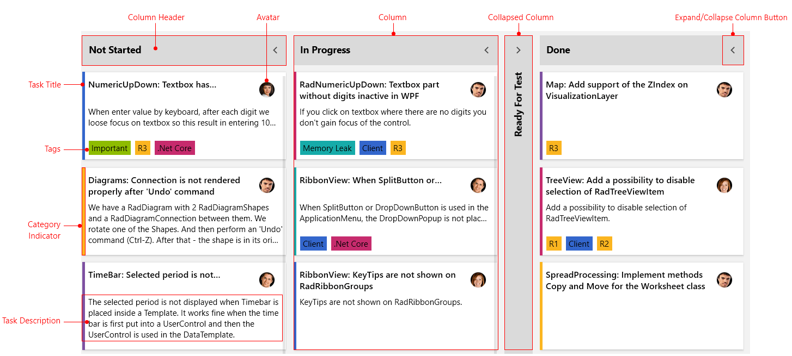

# Visual Structure

This section defines terms and concepts used in the scope of the __RadTaskBoard__ control with which you have to get familiar before you continue to read its documentation. They can also be helpful when contacting our support service in order to describe your issue better.

* **Column**: Essential building block, represented by the base class __TaskBoardColumn__. The columns inside the control can be collapsed, renamed or auto-generated based on the underlying data source.
* **Collapsed Column**: Represents the __TaskBoardColumn__ in a collapsed state. 
* **Column Header**: Represents the header columns inside the RadTaskBoard control.
* **Task Title**: Represents the title of the task item.
* **Avatar**: Represents the container for the icon image of the RadTaskBoard item.
* **Tags**: Displays a collection of highlight objects applied to a given item.
* **Category Indicator**: Represents the color container for a RadTaskBoard item.
* **Task Description**: Represents the description of the item.

## See Also

* [Getting Started]()