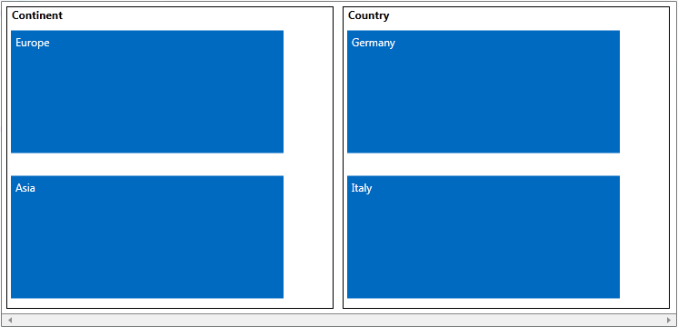
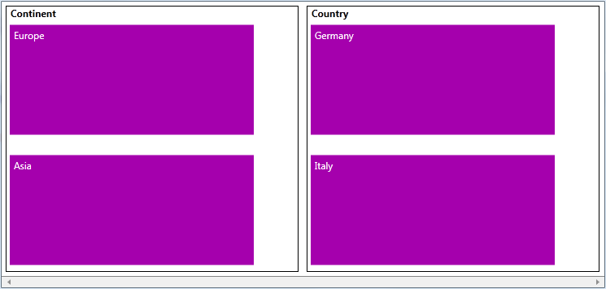

# Grouping

You can organize the Tiles into groups using Tile's property - Group. It is of type object. 

#### __XAML__

{{region radtilelist-grouping-0}}
	<Grid.Resources>
	     <telerik:TileGroup Header="Continent" x:Key="Group1" />
	</Grid.Resources>
	        
	  <telerik:Tile Group="{StaticResource Group1}">                
	       <TextBlock Text="Europe"/>                
	  </telerik:Tile>  
	{{endregion}}

#### __C#__

{{region radtilelist-grouping_3}}
	     TileGroup tileGroupA = new TileGroup() { Header = "Married" };
	     private void RadTileList_AutoGeneratingTile(object sender, AutoGeneratingTileEventArgs e)
	        {
	            Employee employee = e.Tile.Content as Employee;            
	            if (employee.FirstName == "Jane")
	                {
	                    e.Tile.Group = this.tileGroupA;
	                }
	        } 
	{{endregion}}

If you want to specify the look and feel of a group, you can use RadTileList's  GroupTemplate property:

#### __XAML__

{{region radtilelist-grouping-1}}
	 <telerik:RadTileList GroupTemplate="{StaticResource GroupTemplate}">
	{{endregion}}

Here is the full code:

#### __XAML__

{{region radtilelist-grouping-2}}
	<Grid>
	        <Grid.Resources>
	            <DataTemplate x:Key="GroupTemplate">                
	                <Border BorderThickness="1"
	                        BorderBrush="Black" 
	                        Margin="5">
	                    <TextBlock Text="{Binding}"
	                               Margin="5,0,0,5" 
	                               FontWeight="Bold"/>
	                </Border>
	            </DataTemplate>
	            
	             <telerik:TileGroup Header="Continent"
	                                x:Key="Group1" />
	             <telerik:TileGroup Header="Country"
	                                x:Key="Group2" />
	        </Grid.Resources>
	        <telerik:RadTileList x:Name="RadTileList"
	                             GroupTemplate="{StaticResource GroupTemplate}">
	            <telerik:Tile Group="{StaticResource Group1}"
	                          Background="Green" >                
	               <TextBlock Text="Europe"/>                
	            </telerik:Tile>            
	            <telerik:Tile Group="{StaticResource Group2}"
	                          Background="Blue">            
	               <TextBlock Text="Germany"/>                
	            </telerik:Tile>
	            <telerik:Tile Group="{StaticResource Group1}"
	                          Background="Green">               
	               <TextBlock Text="Asia"/>                
	            </telerik:Tile>
	            <telerik:Tile Group="{StaticResource Group2}" 
	                          Background="Blue">               
	               <TextBlock Text="Italy"/>                
	            </telerik:Tile>
	        </telerik:RadTileList>
	    </Grid>
	{{endregion}}

The result is shown on the next image:




