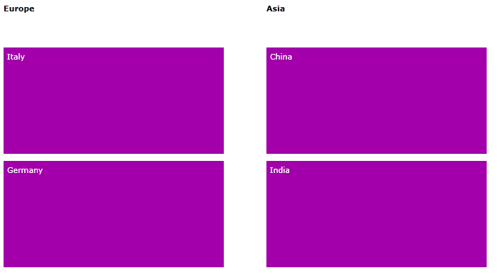

# Grouping

* [Manually Generated Tiles](#manually-generated-tiles)

* [Autogenerated Tiles](#autogenerated-tiles)

* [CollectionViewSource with GroupDescriptors](#collectionviewsource-with-groupdescriptors)

* [Custom Offset Between Groups](#custom-offset-between-groups)


__RadTileList__ can arrange tiles into separate sections depending on each user's requirements. Those groups can be modified through its __GroupTemplate__ property as follows: 

__Example 1: Defining GroupTemplate__

```XAML
	<Grid.Resources>
	  <DataTemplate x:Key="GroupTemplate">
		<TextBlock Text="{Binding}" FontWeight="Bold"/>
	  </DataTemplate>
	  <DataTemplate x:Key="ItemTemplate">
		<TextBlock Text="{Binding FirstName}"/>
	  </DataTemplate>
	</Grid.Resources>
	<telerik:RadTileList GroupTemplate="{StaticResource GroupTemplate}"/>
```


You can get all generated sections through TileList's __Groups__ property of type __ObservableCollection &lt;TileGroup&gt;__.

## Manually Generated Tiles

When working with manually generated tiles, you need to declare each group separately and place the tiles in its Items collection. Each one can have custom __Header__ and __DisplayIndex__.

The definition of __RadTileList__ in such scenario will look like:  

__Example 2: Manually generated tiles__

```XAML
	<telerik:RadTileList x:Name="RadTileList1"
	                       GroupTemplate="{StaticResource GroupTemplate}">
	  <telerik:RadTileList.Groups>
	    <telerik:TileGroup Header="Europe" DisplayIndex="0">
	      <telerik:TileGroup.Items>
	        <telerik:Tile Background="#FFA300AB" Content="Italy" />
	        <telerik:Tile Background="#FFA300AB" Content="Germany" />
	      </telerik:TileGroup.Items>
	    </telerik:TileGroup>
	    <telerik:TileGroup Header="Asia" DisplayIndex="1">
	      <telerik:TileGroup.Items>
	        <telerik:Tile Background="#FFA300AB" Content="China" />
	        <telerik:Tile Background="#FFA300AB" Content="India" />
	      </telerik:TileGroup.Items>
	    </telerik:TileGroup>
	  </telerik:RadTileList.Groups>
	</telerik:RadTileList>
```

And the result will be:



## Autogenerated Tiles

__RadTileList__ gives the user an option to bind it directly to particular data source and display each item in a tile. In this case if you want to group them by a particular property, you can simply set __GroupMember__ property of __TileList__ and have all groups generated for you automatically.

For example, if we use the source available in [Autogenerated tiles]() article, we can define __RadTileList__ as:
        

__Example 3: Using GroupMember property__

```XAML
	<telerik:RadTileList x:Name="RadTileList2"
	               GroupMember="Occupation"
	               ItemTemplate="{StaticResource ItemTemplate}"/>
```








## CollectionViewSource with GroupDescriptions

__RadTileList__ accepts __CollectionViewSource__ as data source, it will evaluate its __GroupDescriptions__ and generate corresponding groups based on that. 

For example:
        

__Example 4: Defining CollectionViewSource with GroupDescriptors__

```XAML
	  <Grid.Resources>
	    <CollectionViewSource x:Key="GroupedItems" Source="{Binding Employees}" >
	      <CollectionViewSource.GroupDescriptions>
	        <PropertyGroupDescription PropertyName="Occupation" />
	      </CollectionViewSource.GroupDescriptions>
	    </CollectionViewSource>
	  </Grid.Resources>
	  <telerik:RadTileList x:Name="RadTileList3"
	                         ItemsSource="{Binding Source={StaticResource GroupedItems}}"
	                         ItemTemplate="{StaticResource ItemTemplate}"/>
```


The result will be again:







## Custom Offset Between Groups

As of __Q1 2016 RadTileList__ exposes a new dependency property - __GroupOffset__. Through it, the offset between the groups of __RadTileList__ can be controlled. It accepts value of type __double__ and by default it is set to __50.0__.


__Example 5: Setting the GroupOffset property__

```XAML
	<telerik:RadTileList x:Name="RadTileList4"
	               		 GroupOffset="60.0"/>
```

> __RadTileList__ supports grouping at one level only. If you want to modify the group, you need to clear the __GroupDescriptions__ collection of the source and add new __PropertyGroupDescription__ after that. 


## See Also

* [Reordering Tiles]()
      
