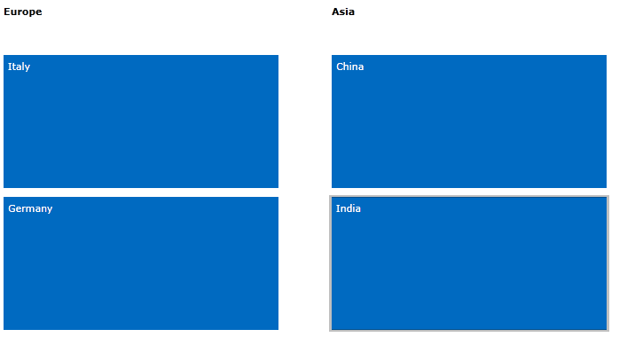

# Grouping

__RadTileList__ can arrange tiles into separate sections depending on each user's requirements. Those groups can be modified through its __GroupTemplate__ property as follows: 

#### __XAML__

{{region radtilelist-grouping-0}}

		<Grid.Resources>
			<DataTemplate x:Key="GroupTemplate">
				<TextBlock Text="{Binding}" FontWeight="Bold"/>
			</DataTemplate>
		</Grid.Resources>
	
		<telerik:RadTileList GroupTemplate="{StaticResource GroupTemplate}">
	
{{endregion}}

You can get all generated sections through TileList's __Groups__ property of type __ObservableCollection &lt;TileGroup&gt;__.

## Manually generated tiles

When working with manually generated tiles, you need to declare each group separately and place the tiles in its Items collection. Each one can have custom __Header__ and __DisplayIndex__.

The definition of __RadTileList__ in such scenario will look like:  

#### __XAML__

{{region radtilelist-grouping-1}}

	<telerik:RadTileList x:Name="RadTileList"
                     GroupTemplate="{StaticResource GroupTemplate}">
		<telerik:RadTileList.Groups>
			<telerik:TileGroup Header="Europe" DisplayIndex="0">
				<telerik:TileGroup.Items>
					<telerik:Tile Background="#FF006AC1" Content="Italy" />
					<telerik:Tile Background="#FF006AC1" Content="Germany" />
				</telerik:TileGroup.Items>
			</telerik:TileGroup>
			<telerik:TileGroup Header="Asia" DisplayIndex="1">
				<telerik:TileGroup.Items>
					<telerik:Tile Background="#FF006AC1" Content="China" />
					<telerik:Tile Background="#FF006AC1" Content="India" />
				</telerik:TileGroup.Items>
			</telerik:TileGroup>
		</telerik:RadTileList.Groups>
	</telerik:RadTileList>
{{endregion}}



#### __XAML__

{{region radtilelist-grouping-2}}

	<telerik:RadTileList x:Name="RadTileList"
                     GroupTemplate="{StaticResource GroupTemplate}">
		<telerik:RadTileList.Groups>
			<telerik:TileGroup Header="Europe" DisplayIndex="0">
				<telerik:TileGroup.Items>
					<telerik:Tile Background="#FFA300AB" Content="Italy" />
					<telerik:Tile Background="#FFA300AB" Content="Germany" />
				</telerik:TileGroup.Items>
			</telerik:TileGroup>
			<telerik:TileGroup Header="Asia" DisplayIndex="1">
				<telerik:TileGroup.Items>
					<telerik:Tile Background="#FFA300AB" Content="China" />
					<telerik:Tile Background="#FFA300AB" Content="India" />
				</telerik:TileGroup.Items>
			</telerik:TileGroup>
		</telerik:RadTileList.Groups>
	</telerik:RadTileList>
{{endregion}}



And the result will be:







## Autogenerated tiles

__RadTileList__ gives the user an option to bind it directly to particular data source and display each item in a tile. In this case if you want to group them by a particular property, you can simply set __GroupMember__ property of __TileList__ and have all groups generated for you automatically.

For example, if we use the source available in [Autogenerated tiles]() article, we can define __RadTileList__ as:
        

#### __XAML__

{{region radtilelist-grouping-3}}

	<telerik:RadTileList x:Name="RadTileList" 
	                     GroupMember="Occupation"
	                     ItemTemplate="{StaticResource ItemTemplate}"/>
{{endregion}}







## CollectionViewSource with GroupDescriptions

__RadTileList__ accepts __CollectionViewSource__ as data source, it will evaluate its __GroupDescriptions__ and generate corresponding groups based on that. 

For example:
        

#### __XAML__

{{region radtilelist-grouping-4}}

	<Grid.Resources>
		<CollectionViewSource x:Key="GroupedItems" Source="{Binding Employees}" >
			<CollectionViewSource.GroupDescriptions>
				<PropertyGroupDescription PropertyName="Occupation" />
			</CollectionViewSource.GroupDescriptions>
		</CollectionViewSource>
	</Grid.Resources>
	<telerik:RadTileList x:Name="RadTileList" 
                     ItemsSource="{Binding Source={StaticResource GroupedItems}}"
                     ItemTemplate="{StaticResource ItemTemplate}"/>
	
{{endregion}}

The result will be again:







>note __RadTileList__ supports grouping at one level only. If you want to modify the group, you need to clear the __GroupDescriptions__ collection of the source and add new __PropertyGroupDescription__ after that. 
      
