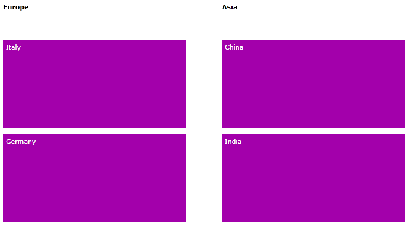

# Grouping

__RadTileList__ can arrange tiles into separate sections depending on each user's requirements. Those groups can be modified through its __GroupTemplate__ property as follows: 

__Example 1: Defining GroupTemplate__

<snippet id='radtilelist-features-grouping-block_1-xaml' />

You can get all generated sections through TileList's __Groups__ property of type __ObservableCollection &lt;TileGroup&gt;__.

## Manually Generated Tiles

When working with manually generated tiles, you need to declare each group separately and place the tiles in its Items collection. Each one can have custom __Header__ and __DisplayIndex__.

The definition of __RadTileList__ in such scenario will look like:  

__Example 2: Manually generated tiles__

<snippet id='radtilelist-features-grouping-block_2-xaml' />

And the result will be:

## Autogenerated Tiles

__RadTileList__ gives the user an option to bind it directly to particular data source and display each item in a tile. In this case if you want to group them by a particular property, you can simply set __GroupMember__ property of __TileList__ and have all groups generated for you automatically.

For example, if we use the source available in [Autogenerated tiles]() article, we can define __RadTileList__ as:
        

__Example 3: Using GroupMember property__

<snippet id='radtilelist-features-grouping-block_3-xaml' />







## CollectionViewSource with GroupDescriptions

__RadTileList__ accepts __CollectionViewSource__ as data source, it will evaluate its __GroupDescriptions__ and generate corresponding groups based on that. 

For example:
        

__Example 4: Defining CollectionViewSource with GroupDescriptors__

<snippet id='radtilelist-features-grouping-block_4-xaml' />

The result will be again:







## Custom Offset Between Groups

As of __Q1 2016 RadTileList__ exposes a new dependency property - __GroupOffset__. Through it, the offset between the groups of __RadTileList__ can be controlled. It accepts value of type __double__ and by default it is set to __50.0__.

__Example 5: Setting the GroupOffset property__

<snippet id='radtilelist-features-grouping-block_5-xaml' />

> __RadTileList__ supports grouping at one level only. If you want to modify the group, you need to clear the __GroupDescriptions__ collection of the source and add new __PropertyGroupDescription__ after that. 

## See Also

* [Reordering Tiles]()
      