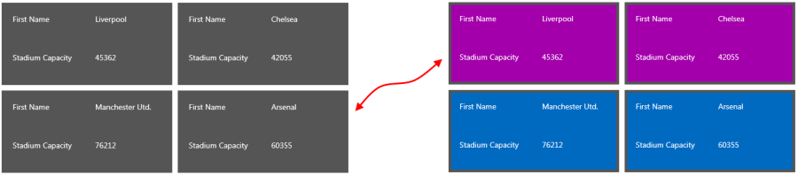

# ItemTemplateSelector

This article will show you how to conditionally apply a different data template to __RadTileList__ tiles using the __ItemTemplateSelector__ property.

>For the purposes of this article we will assume the RadGridView is bound to a collection of **Club** objects which expose a **Name** and **StadiumCapacity** property.

Assume we have a __RadGridView__ bound to a collection of clubs. Each club has a property __StadiumCapacity__.  What we want to achieve is to apply one data template if the capacity is greater than 50 000 and another otherwise. In this example we only change the background color of the enclosing Grid, but you can provide two totally different templates if your scenario demands this.



To do so follow these steps:

**1.** Create a new class which inherits the __DataTemplateSelector__ class (which resides in the System.Windows.Controls assembly).

**2.** Override its __SelectTemplate method__. Based on your conditions - you return the proper __DataTemplate__ that will be applied to the framework element (a tile in our case).

__Example 1: Defining the ItemTemplateSelector__

```C#
	public class MyTileTemplateSelector : DataTemplateSelector
	{
	    public override System.Windows.DataTemplate SelectTemplate(object item, System.Windows.DependencyObject container)
	    {
	        if (item is Club)
	        {
	            Club club = item as Club;
	            if (club.StadiumCapacity > 50000)
	            {
	                return BigStadium;
	            }
	            else
	            {
	                return SmallStadium;
	            }
	        }
	        return null;
	    }
	    public DataTemplate BigStadium { get; set; }
	    public DataTemplate SmallStadium { get; set; }
	}
```

In this case we have two different __DataTemplates__ that could be applied - __BigStadium__ and __SmallStadium__. Depending on the underlying data we select which template to apply.

**3.** In the XAML file define the template selector as a resource and set the properties of the __BigStadium__ and __SmallStadium__:

__Example 2: Defining the ItemTemplateSelector as a Resource in XAML__

```XAML
	<Grid.Resources>
	  <my:MyTileTemplateSelector x:Key="myTileTemplateSelector">
	    <my:MyTileTemplateSelector.BigStadium>
	      <DataTemplate>
	        <Grid Background="Purple">
	          <Grid.RowDefinitions>
	            <RowDefinition />
	            <RowDefinition />
	          </Grid.RowDefinitions>
	          <Grid.ColumnDefinitions>
	            <ColumnDefinition/>
	            <ColumnDefinition/>
	          </Grid.ColumnDefinitions>
	          <TextBlock Grid.Row="0" Grid.Column="0" Text="First Name"/>
	          <TextBlock Grid.Row="0" Grid.Column="1" Text="{Binding Name}" />
	          <TextBlock Grid.Row="1" Grid.Column="0" Text="Stadium Capacity"/>
	          <TextBlock Grid.Row="1" Grid.Column="1" Text="{Binding StadiumCapacity}" />
	        </Grid>
	      </DataTemplate>
	    </my:MyTileTemplateSelector.BigStadium>
	    <my:MyTileTemplateSelector.SmallStadium>
	      <DataTemplate>
	        <Grid Background="Blue">
	          <Grid.RowDefinitions>
	            <RowDefinition />
	            <RowDefinition />
	          </Grid.RowDefinitions>
	          <Grid.ColumnDefinitions>
	            <ColumnDefinition/>
	            <ColumnDefinition/>
	          </Grid.ColumnDefinitions>
	          <TextBlock Grid.Row="0" Grid.Column="0" Text="First Name"/>
	          <TextBlock Grid.Row="0" Grid.Column="1" Text="{Binding Name}" />
	          <TextBlock Grid.Row="1" Grid.Column="0" Text="Stadium Capacity"/>
	          <TextBlock Grid.Row="1" Grid.Column="1" Text="{Binding StadiumCapacity}" />
	        </Grid>
	      </DataTemplate>
	    </my:MyTileTemplateSelector.SmallStadium>
	  </my:MyTileTemplateSelector>
	</Grid.Resources>
```

**4.** Finally, set the __ItemTemplateSelector__ property of __RadTileList__:

__Example 3: Applying the ItemTemplateSelector__

```XAML
	<telerik:RadTileList  x:Name="RadTileList"
	                      ItemTemplateSelector="{StaticResource myTileTemplateSelector}"
	                      ItemsSource="{Binding Clubs}"/>
```

## See Also
* [Styling TileList]()