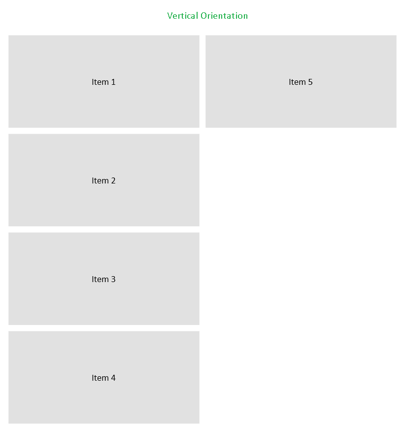
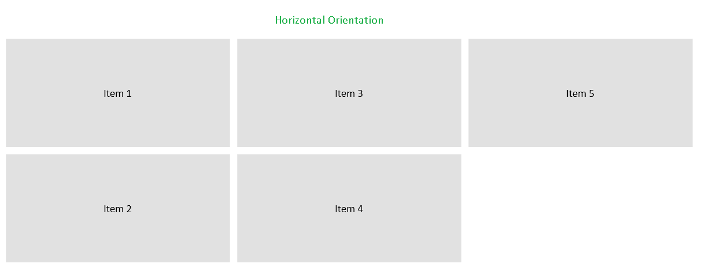

# Tiles Arranegment

RadTileList allows you to control the order and alignment of the tiles in each group.

The tiles in a group can be arranged horizontally or vertically. This is controlled using the __Orientation__ property of RadTileList.

* __Horizontal arrangement__: Tiles are arranged left to right and if a scrollbar is needed it is vertical.

* __Vertical arrangement__: Tiles are arranged top to bottom and if a scrollbar is needed it is horizontal. This is the __default value__.

#### __[XAML]Example 1: Setting tiles arrangement orientation__
{{region radtilelist-tiles-arrangement-0}}
	<telerik:RadTileList Orientation="Horizontal" />
{{endregion}}

#### Figure 1: Vertically arranged tiles

#### Figure 2: Horizontally arranged tiles

To control the alignment of the tiles in the different orientations, use the __VerticalTilesAlignment__ and __HorizontalTilesAlignment__ properties. The properties are applicable only for the currently applied orientation. When the Orientation property is set to Horizontal, the VerticalTilesAlignment won't work. When the Orientation is set to Vertical, the HorizontalTilesAlignment won't work. The available alignments are __Stretch, Top, Bottom, Left, Right, Center__.

#### __[XAML]Example 2: Setting tiles horizontal alignment__
{{region radtilelist-tiles-arrangement-1}}
	<telerik:RadTileList Orientation="Horizontal" HorizontalTilesAlignment="Center" />
{{endregion}}

#### __[XAML]Example 3: Setting tiles vertical alignment__
{{region radtilelist-tiles-arrangement-2}}
	<telerik:RadTileList Orientation="Vertical" VerticalTilesAlignment="Center" />
{{endregion}}

## See Also
* [Getting Started]()
* [Reordering Tiles]()
* [Grouping]()
      
