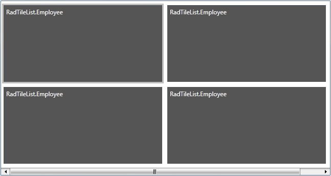
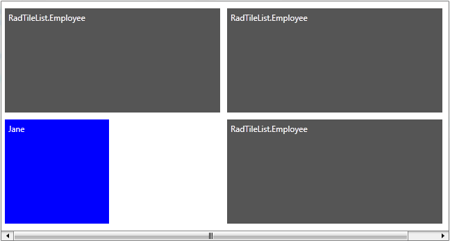

# Autogenerated Tiles


When you want the tiles of __RadTileList__ to be automatically generated on the basis of a collection, use the __ItemsSource__ property.  

* Create a new class named __Employee__. The class' structure is shown on the next code-snippet.
          

__Example 1: Defining the Employee class__
```C#
	public class Employee
	{
	    public string FirstName
	    {
	        get;
	        set;
	    }
	    public string LastName
	    {
	        get;
	        set;
	    }
	    public string Occupation
	    {
	        get;
	        set;
	    }
	    public int Salary
	    {
	        get;
	        set;
	    }
	}
```
```VB.NET
	Public Class Employee
	    Public Property FirstName() As String
	        Get
	            Return m_FirstName
	        End Get
	        Set(value As String)
	            m_FirstName = value
	        End Set
	    End Property
	    Private m_FirstName As String
	    Public Property LastName() As String
	        Get
	            Return m_LastName
	        End Get
	        Set(value As String)
	            m_LastName = value
	        End Set
	    End Property
	    Private m_LastName As String
	    Public Property Occupation() As String
	        Get
	            Return m_Occupation
	        End Get
	        Set(value As String)
	            m_Occupation = value
	        End Set
	    End Property
	    Private m_Occupation As String
	    Public Property Salary() As Integer
	        Get
	            Return m_Salary
	        End Get
	        Set(value As Integer)
	            m_Salary = value
	        End Set
	    End Property
	    Private m_Salary As Integer
	End Class
```


* Once the class __Employee__ is defined, we will define an __EmployeeService__ class that will return an ObservableCollection, containing several hard-coded employees:
          

__Example 2: Defining the EmployeeService class__

```C#
	public class EmployeeService
	{
	    public EmployeeService()
	    { }
	   
	    public static ObservableCollection<Employee> GetEmployees()
	    {
	        ObservableCollection<Employee> employees = new ObservableCollection<Employee>();
	        employees.Add(new Employee() { FirstName = "Sarah", LastName = "Blake", Occupation = "Suppliess Manager", Salary = 3500 });
	        employees.Add(new Employee() { FirstName = "Jane", LastName = "Simpson", Occupation = "Security", Salary = 2000 });
	        employees.Add(new Employee() { FirstName = "John", LastName = "Peterson", Occupation = "Consultant", Salary = 2600 });
	        employees.Add(new Employee() { FirstName = "Peter", LastName = "Bush", Occupation = "Cashier", Salary = 2300 });
	        return employees;
	    }
	}
```
```VB.NET
	Public Class EmployeeService
	    Public Sub New()
	    End Sub
	    Public Shared Function GetEmployees() As ObservableCollection(Of Employee)
	        Dim employees As New ObservableCollection(Of Employee)()
	        employees.Add(New Employee() With { _
	         .FirstName = "Sarah", _
	         .LastName = "Blake", _
	         .Occupation = "Supplies Manager", _
	         .Salary = 3500 _
	        })
	        employees.Add(New Employee() With { _
	         .FirstName = "Jane", _
	         .LastName = "Simpson", _
	         .Occupation = "Security", _
	         .Salary = 2000 _
	        })
	        employees.Add(New Employee() With { _
	         .FirstName = "John", _
	         .LastName = "Peterson", _
	         .Occupation = "Consultant", _
	         .Salary = 2600 _
	        })
	        employees.Add(New Employee() With { _
	        .FirstName = "Peter", _
	        .LastName = "Bush", _
	        .Occupation = "Cashier", _
	        .Salary = 2300 _
	        })
	        Return employees
	    End Function
        End Class
```


* Set the __ItemsSource__ property of __RadTileList__.

__Example 3: Setting the ItemsSource property__

```C#
	public MainPage()
	{
	    InitializeComponent();
	    this.RadTileList.ItemsSource = EmployeeService.GetEmployees();
	}
```
```VB.NET
	Public Sub New()
	    InitializeComponent()
	    Me.RadTileList.ItemsSource = EmployeeService.GetEmployees()
	End Sub
```


Run your demo. The result should be similar to the next image:
          



The reason for this result is that the __RadTileList__ "still doesn't know" how to display these business objects. You need to "say" explicitly what to be displayed. You can set a ItemTemplate.
          

* Create a DataTemplate and set it as a ItemTemplate.

__Example 4: Setting the ItemTemplate__

```XAML
	 <Grid>
	        <Grid.Resources>
	            <DataTemplate x:Key="ItemTemplate">
	                <TextBlock Text="{Binding FirstName}"/>
	            </DataTemplate>
	        </Grid.Resources>
	        <telerik:RadTileList x:Name="RadTileList"
	                             ItemTemplate="{StaticResource ItemTemplate}"/>
	</Grid>
```

The result is shown on the next image:


When the __ItemsSource__ is specified, Tiles containers are generated for each item in the collection. By using the __AutoGeneratingTile__ event of __RadTileList__ you can control the appearance and the look of the items in the collection.

>As __AutoGeneratingTile__ event is cancelable, you may reject the creation of a particular tile.
      

__Example 5: Handling the AutoGeneratingTile event__

```C#
	private void RadTileList_AutoGeneratingTile(object sender, AutoGeneratingTileEventArgs e)
	{
	    Employee employee = e.Tile.Content as Employee;
	    if (employee.FirstName == "Jane")
	    {
	        e.Tile.Content = new TextBlock { Text = employee.FirstName };
	        e.Tile.Background = new SolidColorBrush(Colors.Blue);
	        e.Tile.TileType = TileType.Single;
	    }
	}
```


The final result is shown on the next image:
      


