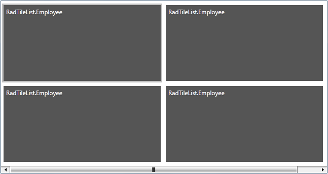
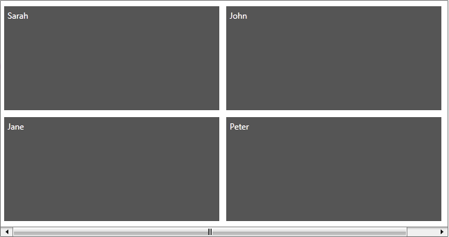
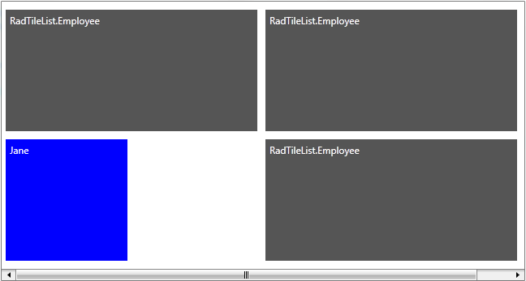

# Autogenerated Tiles

When you want the tiles of __RadTileList__ to be automatically generated on the basis of a collection, use the __ItemsSource__ property.  

* Create a new class named __Employee__. The class' structure is shown on the next code-snippet.
          

__Example 1: Defining the Employee class__
<snippet id='radtilelist-getting-started-autogenerated-tiles-block_1-cs' />
<snippet id='radtilelist-getting-started-autogenerated-tiles-block_2-vb' />

* Once the class __Employee__ is defined, we will define an __EmployeeService__ class that will return an ObservableCollection, containing several hard-coded employees:
          

__Example 2: Defining the EmployeeService class__

<snippet id='radtilelist-getting-started-autogenerated-tiles-block_3-cs' />
<snippet id='radtilelist-getting-started-autogenerated-tiles-block_4-vb' />

* Set the __ItemsSource__ property of __RadTileList__.

__Example 3: Setting the ItemsSource property__

<snippet id='radtilelist-getting-started-autogenerated-tiles-block_5-cs' />
<snippet id='radtilelist-getting-started-autogenerated-tiles-block_6-vb' />

Run your demo. The result should be similar to the next image:
          

The reason for this result is that the __RadTileList__ "still doesn't know" how to display these business objects. You need to "say" explicitly what to be displayed. You can set a ItemTemplate.
          

* Create a DataTemplate and set it as a ItemTemplate.

__Example 4: Setting the ItemTemplate__

<snippet id='radtilelist-getting-started-autogenerated-tiles-block_7-xaml' />

The result is shown on the next image:

When the __ItemsSource__ is specified, Tiles containers are generated for each item in the collection. By using the __AutoGeneratingTile__ event of __RadTileList__ you can control the appearance and the look of the items in the collection.

>As __AutoGeneratingTile__ event is cancelable, you may reject the creation of a particular tile.
      

__Example 5: Handling the AutoGeneratingTile event__

<snippet id='radtilelist-getting-started-autogenerated-tiles-block_8-cs' />

The final result is shown on the next image:
      

