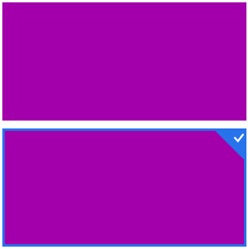
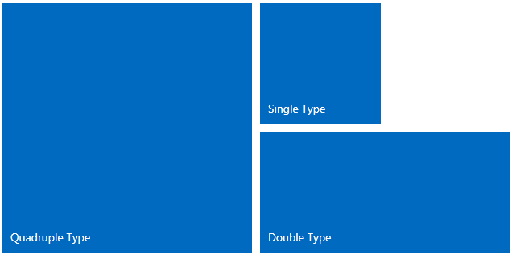
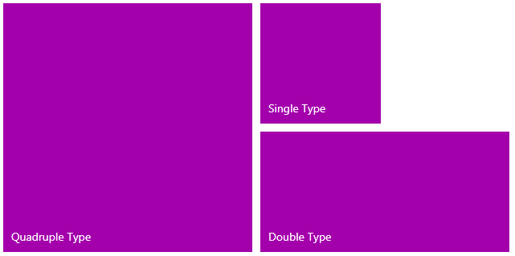

# Getting Started with {{ site.framework_name }} TileList

This tutorial will walk your through the creation of a sample application that contains __RadTileList__ and will show you how:

* Add RadTileList to your project

* Select RadTileList's Tile

* Reorder RadTileList's Tile

## Assembly References

To use the __RadTileList__ in your projects you have to add references to the following assemblies:

* __Telerik.Licensing.Runtime__
* __Telerik.Windows.Controls__
* __Telerik.Windows.Data__

You can find the required assemblies for each control from the suite in the [Controls Dependencies]()[Controls Dependencies]() help article.

>tip With the 2025 Q1 release, the Telerik UI for WPF has a new licensing mechanism. You can learn more about it [here]().

### Adding Telerik Assemblies Using NuGet

To use __RadTileList__ when working with NuGet packages, install the `Telerik.Windows.Controls.for.Wpf.Xaml` package. The [package name may vary]() slightly based on the Telerik dlls set - [Xaml or NoXaml]()

Read more about NuGet installation in the [Installing UI for WPF from NuGet Package]() article.      

## Creating RadTileList

* Create a new SilverlightWPF project

* Add RadTileList as demonstrated below:


#### __[XAML] Example 1: Defining RadTileList__

{{region xaml-radtilelist-getting-started_0}}
	<telerik:RadTileList x:Name="TileList1">
	  <telerik:Tile/>
	</telerik:RadTileList>
{{endregion}}



#### __[XAML] Example 1: Defining RadTileList__

{{region xaml-radtilelist-getting-started_1}}
	<telerik:RadTileList>
	  <telerik:Tile/>
	</telerik:RadTileList>
{{endregion}}



Two lines of code are important here:

* The import of the __Telerik schema__:

#### __[XAML] Example 2: Importing the Telerik schema__

{{region xaml-radtilelist-getting-started_2}}
	<!--xmlns:telerik="http://schemas.telerik.com/2008/xaml/presentation"-->
{{endregion}}

* The declaration of the __RadTileList__ control inside the Grid:

#### __[XAML] Example 3: Declaring RadTileList inside a Grid container__

{{region xaml-radtilelist-getting-started_3}}
	<Grid Background="White">
	  <telerik:RadTileList >
	    <telerik:Tile/>
	  </telerik:RadTileList>
	</Grid>
{{endregion}}

Now if you run the application, you have an empty __Tile__ 





## Select a Tile

You can select a __Tile__ by clicking or tapping on it. The selected __Tile__ will look like:





## RadTileList's Tile Types

You can specify the __Tile__ type through its property - __TileType__. 
        

There are three types of Tiles:

* __Single__

* __Double__

* __Quadruple__ 





>The default Tile's type is - __Double__.
        

## Setting a Theme

The controls from our suite support different themes. You can see how to apply a theme different than the default one in the [Setting a Theme]() help article.

>important Changing the theme using implicit styles will affect all controls that have styles defined in the merged resource dictionaries. This is applicable only for the controls in the scope in which the resources are merged. 

To change the theme, you can follow the steps below:

* Choose between the themes and add reference to the corresponding theme assembly (ex: **Telerik.Windows.Themes.Windows8.dll**). You can see the different themes applied in the **Theming** examples from our [WPF Controls Examples](https://demos.telerik.com/wpf/)[Silverlight Controls Examples](https://demos.telerik.com/silverlight/#TileList/Theming) application.

* Merge the ResourceDictionaries with the namespace required for the controls that you are using from the theme assembly. For the RadTileList, you will need to merge the following resources:

	* __Telerik.Windows.Controls__

__Example 4__ demonstrates how to merge the ResourceDictionaries so that they are applied globally for the entire application.

#### __[XAML] Example 4: Merge the ResourceDictionaries__  
{{region radtilelist-getting-started_7}}
	<Application.Resources>
		<ResourceDictionary>
			<ResourceDictionary.MergedDictionaries>
				<ResourceDictionary Source="/Telerik.Windows.Themes.Windows8;component/Themes/System.Windows.xaml"/>
				<ResourceDictionary Source="/Telerik.Windows.Themes.Windows8;component/Themes/Telerik.Windows.Controls.xaml"/>
			</ResourceDictionary.MergedDictionaries>
		</ResourceDictionary>
	</Application.Resources>
{{endregion}}

>Alternatively, you can use the theme of the control via the [StyleManager](https://docs.telerik.com/devtools/wpf/styling-and-appearance/stylemanager/common-styling-apperance-setting-theme-wpf)[StyleManager](https://docs.telerik.com/devtools/silverlight/styling-and-appearance/stylemanager/common-styling-apperance-setting-theme).

__Figure 1__ shows a RadTileList with the **Windows8** theme applied.

#### __Figure 1: RadTileList with the Windows8 theme__

        


## Telerik UI for WPF Learning Resources

* [Telerik UI for WPF TileList Component](https://www.telerik.com/products/wpf/tilelist.aspx)
* [Getting Started with Telerik UI for WPF Components]()
* [Telerik UI for WPF Installation]()
* [Telerik UI for WPF and WinForms Integration]()
* [Telerik UI for WPF Visual Studio Templates]()
* [Setting a Theme with Telerik UI for WPF]()
* [Telerik UI for WPF Virtual Classroom (Training Courses for Registered Users)](https://learn.telerik.com/learn/course/external/view/elearning/16/telerik-ui-for-wpf) 
* [Telerik UI for WPF License Agreement](https://www.telerik.com/purchase/license-agreement/wpf-dlw-s)


