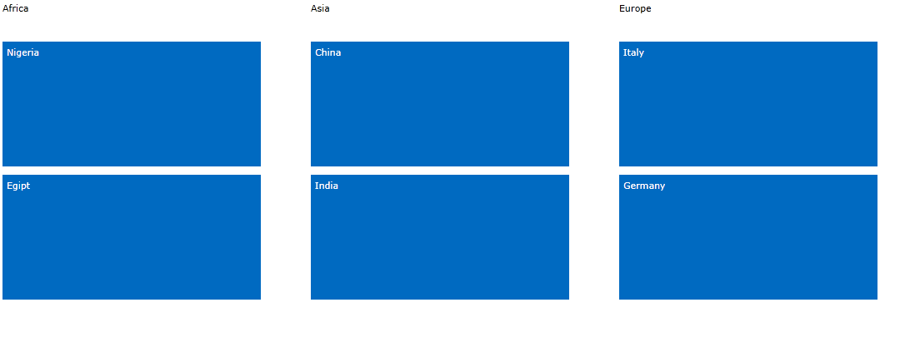
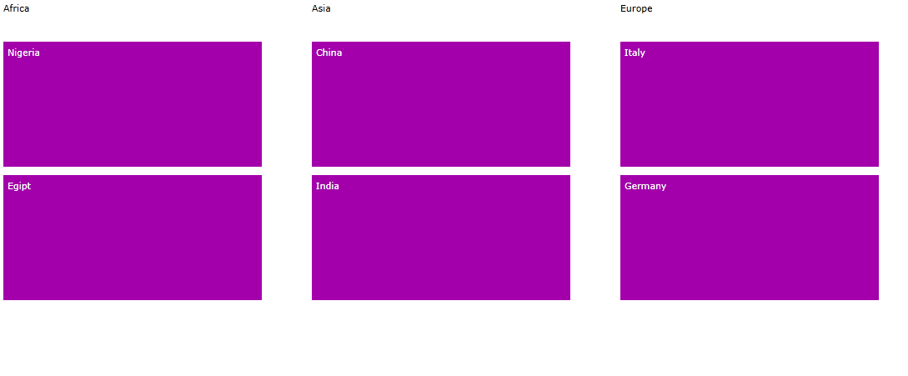
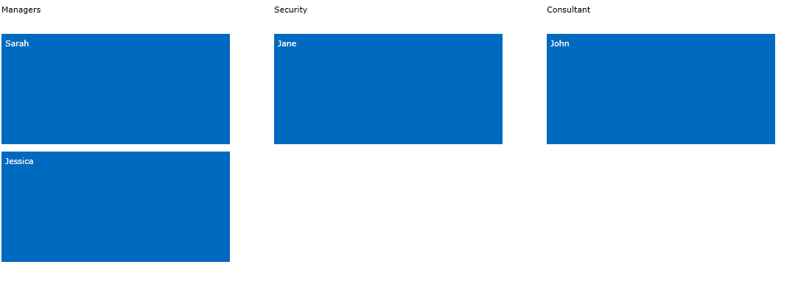
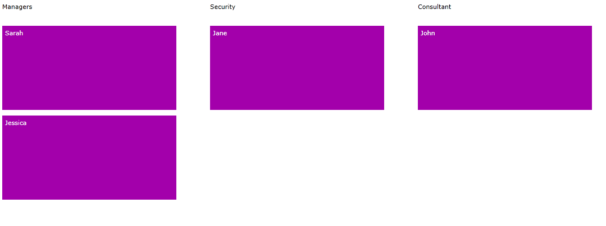

# Set Group's Display Indices

__RadTileList__ gives the opportunity to modify the order the groups will be displayed. Depending on the way you define your tiles, you can either set it directly in xaml or in __AutogeneratingTile__ event handler. 

## Manually Generated Tiles

Once you create the groups in the definition of the tiles, you can set directly the properties of the group there. For example: 

#### __[XAML] Example 1: Setting the DisplayIndex property of the TileGroups__

{{region xaml-radtilelist-howto-set-groups-display-indices-0}}
	<telerik:RadTileList x:Name="RadTileList">
	  <telerik:RadTileList.Groups>
	    <telerik:TileGroup Header="Europe" DisplayIndex="2">
	      <telerik:TileGroup.Items>
	        <telerik:Tile Background="#FF006AC1" Content="Italy" />
	        <telerik:Tile Background="#FF006AC1" Content="Germany" />
	      </telerik:TileGroup.Items>
	    </telerik:TileGroup>
	    <telerik:TileGroup Header="Asia" DisplayIndex="1">
	      <telerik:TileGroup.Items>
	        <telerik:Tile Background="#FF006AC1" Content="China" />
	        <telerik:Tile Background="#FF006AC1" Content="India" />
	      </telerik:TileGroup.Items>
	    </telerik:TileGroup>
	    <telerik:TileGroup Header="Africa" DisplayIndex="0">
	      <telerik:TileGroup.Items>
	        <telerik:Tile Background="#FF006AC1" Content="Nigeria" />
	        <telerik:Tile Background="#FF006AC1" Content="Egipt" />
	      </telerik:TileGroup.Items>
	    </telerik:TileGroup>
	  </telerik:RadTileList.Groups>
	</telerik:RadTileList>
	<telerik:RadTileList GroupTemplate="{StaticResource GroupTemplate}"/>
{{endregion}}



#### __[XAML] Example 1: Setting the DisplayIndex property of the TileGroups__

{{region xaml-radtilelist-howto-set-groups-display-indices-1}}
	<telerik:RadTileList x:Name="RadTileList1">
	  <telerik:RadTileList.Groups>
	    <telerik:TileGroup Header="Europe" DisplayIndex="2">
	      <telerik:TileGroup.Items>
	        <telerik:Tile Background="#FFA300AB" Content="Italy" />
	        <telerik:Tile Background="#FFA300AB" Content="Germany" />
	      </telerik:TileGroup.Items>
	    </telerik:TileGroup>
	    <telerik:TileGroup Header="Asia" DisplayIndex="1">
	      <telerik:TileGroup.Items>
	        <telerik:Tile Background="#FFA300AB" Content="China" />
	        <telerik:Tile Background="#FFA300AB" Content="India" />
	      </telerik:TileGroup.Items>
	    </telerik:TileGroup>
	    <telerik:TileGroup Header="Africa" DisplayIndex="0">
	      <telerik:TileGroup.Items>
	        <telerik:Tile Background="#FFA300AB" Content="Nigeria" />
	        <telerik:Tile Background="#FFA300AB" Content="Egipt" />
	      </telerik:TileGroup.Items>
	    </telerik:TileGroup>
	  </telerik:RadTileList.Groups>
	</telerik:RadTileList>
{{endregion}}



## Autogenerated Tiles

When you set __ItemsSource__ of __RadTileList__ and you need to control the order of the groups, you need to handle __AutoGeneratingTile__ event and set the __DisplayIndex__ of a group there. For example, if we work with the source defined in [Autogenerated tiles]() article:
        

#### __[XAML] Example 2: Subscribing to the AutoGeneratingTile event__

{{region xaml-radtilelist-howto-set-groups-display-indices-2}}
	<telerik:RadTileList x:Name="RadTileList2"
	           GroupMember="Occupation"
	                   AutoGeneratingTile="OnAutoGeneratingTile"
	                   ItemTemplate="{StaticResource ItemTemplate}"/>
{{endregion}}

#### __[C#] Example 3: Handling the AutoGeneratingTile event__

{{region cs-radtilelist-howto-set-groups-display-indices_3}}
	private void OnAutoGeneratingTile(object sender, AutoGeneratingTileEventArgs e)
	{
	    var item = e.Tile.DataContext as Employee;
	    if (item.Occupation.Contains("Manager"))
	    {
	        e.Tile.Group.DisplayIndex = 0;
	        e.Tile.Group.Header = "Managers";
	    }
	}
{{endregion}}

And the result will be:



