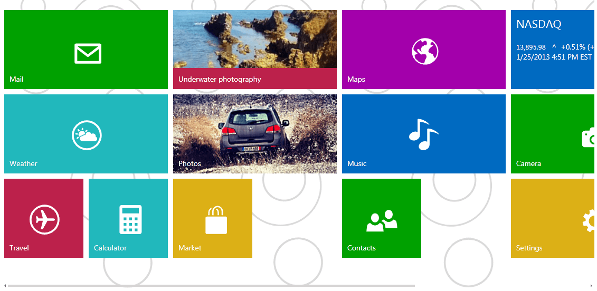

# Overview



               
            

               
            

Thank you for choosing Telerik RadTileList!

__RadTileList__ displays tiles in a mosaic manner.
        It allows you to represent a small amount of data in the form of tiles that the end-user is able to smoothly scroll left or right with a gesture, just like in Windows 8.
        The tiles can be reordered by drag and drop.
        __RadTileList__ is the right choice if you need to achieve fast and easy the Modern Style UI for your XAML applications, similar to the Start Menu screen of Windows 8.
      

           
        
