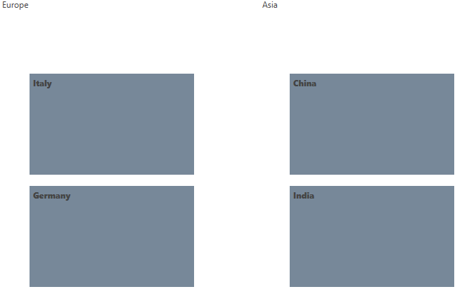

# Styling TileList

This topic will go through the process of styling the common elements of __RadTileList__.

* [Styling the Tiles](#styling-the-tiles)
* [Styling the TileGroupContainer](#styling-the-tilegroupcontainer)

## Styling the Tiles

For the purpose of this example, the following definition of __RadTileList__ will be used.

#### __[XAML] Example 1: Defining RadTileList in XAML__
{{region xaml-radtilelist-styling-0}}
	<telerik:RadTileList >
            <telerik:RadTileList.Groups>
                <telerik:TileGroup Header="Europe" DisplayIndex="0">
                    <telerik:TileGroup.Items>
                        <telerik:Tile Content="Italy" />
                        <telerik:Tile  Content="Germany" />
                    </telerik:TileGroup.Items>
                </telerik:TileGroup>
                <telerik:TileGroup Header="Asia" DisplayIndex="1">
                    <telerik:TileGroup.Items>
                        <telerik:Tile Content="China" />
                        <telerik:Tile Content="India" />
                    </telerik:TileGroup.Items>
                </telerik:TileGroup>
            </telerik:RadTileList.Groups>
        </telerik:RadTileList>
{{endregion}}

Then, defining a __Style__ for the __Tile__ can achieved as follows.

#### __[XAML] Example 2: Defining Style for the Tiles__
{{region xaml-radtilelist-styling-1}}
	
{{endregion}}

This setup will result in the following output.

#### __Figure 1: Styling the Tiles__

## Styling the Group Container

The default look of the group container can be altered by defining a style targeting __TileGroupContainer__.

#### __[XAML] Example 3: Defining Style targeting TileGroupContainer__
{{region xaml-radtilelist-styling-2}}
	
{{endregion}}

The visual appearance of the __TileGroupContainer__ will be as shown in the image below.

#### __Figure 2: Styling the TileGroupContainer__

## See Also

* [Templates Structure]()
* [Grouping]()