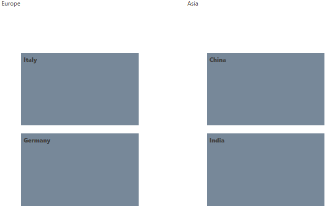
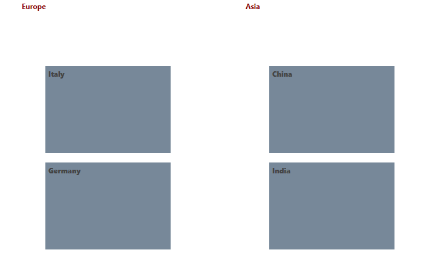

# Styling TileList

This topic will go through the process of styling the common elements of __RadTileList__.

## Styling the Tiles

For the purpose of this example, the following definition of __RadTileList__ will be used.

__Example 1: Defining RadTileList in XAML__
<snippet id='radtilelist-styles-and-templates-styling-tilelist-block_1-xaml' />

Then, defining a __Style__ for the __Tile__ can achieved as follows. This example demonstrates how an implicit style targeting the __Tile__ can be defined. Thus, it will be applied to all __Tile__ instances.

__Example 2: Defining Style for the Tiles__
<snippet id='radtilelist-styles-and-templates-styling-tilelist-block_2-xaml' />

This setup will result in the following output.

#### __Figure 1: Styling the Tiles__

## Styling the Group Container

The default look of the group container can be altered by defining a style targeting __TileGroupContainer__.

__Example 3: Defining Style targeting TileGroupContainer__
<snippet id='radtilelist-styles-and-templates-styling-tilelist-block_3-xaml' />

The visual appearance of the __TileGroupContainer__ will be as shown in the image below.

#### __Figure 2: Styling the TileGroupContainer__

## See Also

* [Templates Structure]()
* [Grouping]()