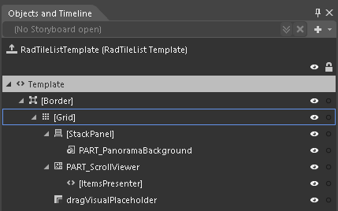
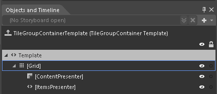
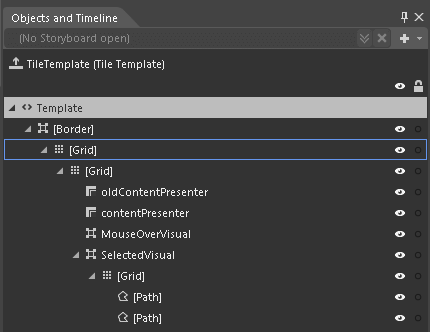

# Templates Structure #

Using [Implicit styles]() gives you the ability to easily extract and edit the default __ControlTemplates__ of the controls. You can follow [this]() article on how to extract the __ControlTemplates__.

Like most WPF controls, __RadTileList__ also allows you to template it in order to change the control from the inside. Except for templating the whole control, you can also template particular parts of it. This topic will make you familiar with the template structures of:

*	[RadTileList Template Structure](#radtilelist)
	
*	[TileGroupContainer Template Structure](#tilegroupcontainer)
	
*	[Tile Template Structure](#tile)

## RadTileList ##

*	__Border__ - represents the border and the background of __RadTileList__ and is of type __Border__.
	
*	__Grid__ - hosts the elements of the template and is of type __Grid__.

*	__StackPanel__ - hosts the panorama background of __RadTileList__ and is of type __Border__.

*	__PART_PanoramaBackground__ - represents the panorama background and is of type __ContentControl__.

*	__PART_ScrollViewer__ - represents the control that handles the tiles and is of type __ScrollViewer__.

*   __[ItemsPresenter]__ – generic container for tiles and is of type __ItemsPresenter__.

*	__dragVisualPlaceholder__ – represents the placeholder used in __DragAndDrop__ operations and is of type __ContentPresenter__.

## TileGroupContainer  ##

*	__Grid__ - hosts the elements of the template and is of type __Grid__.
	
*	__[ContentPresenter]__ - displays the header of a tile group and is of type __ContentPresenter__.
	
*	__[ItemsPresenter]__ - generic container for grouped tiles and is of type __ItemsPresenter__.

## Tile ##

*	__Border__ - represents the border and the background of a Tile and is of type __Border__.

*	__Grid__ - hosts the elements of the template and is of type __Grid__.
	
*	__Grid__ – inner container that hosts the elements of the template and is of type __Grid__.
	
*	__oldContentPresenter__ - displays the content of a tile in order to simulate live tiles and is of type __ContentPresenter__.

*	__contentPresenter__ - displays the content of a tile and is of type __ContentPresenter__. 
	
*	__MouseOverVisual__ - represents the border of the tile, when the mouse is over it, and is of type __Border__.

*	__SelectedVisual__ - represents the border of the tile, when it is selected, and is of type __Border__.
	
*	__[Grid]__ - hosts the Paths for the indicator, when the tile is selected. It is of type __Grid__.

*   __[Path]__
   
*   __[Path]__

## See Also

* [Styling TileList]()
* [Grouping]()

