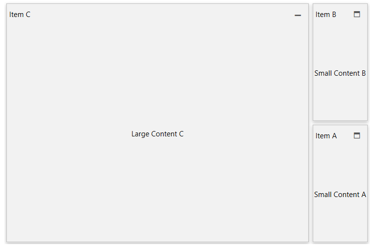
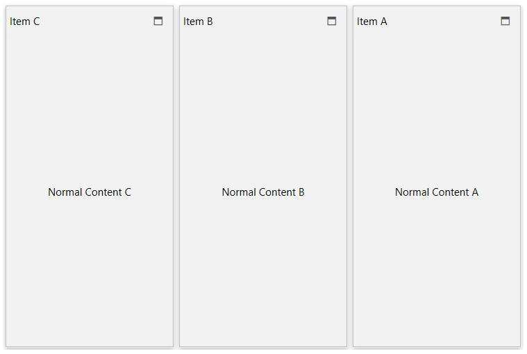

# Fluid Content Control

__RadFluidContentControl__ is a flexible content control used to build responsive layouts. 

This article shows how to integrate the RadFluidContentControl in RadTileView.

RadFluidContentControl exposes three content properties - `Content`, `SmallContent` and `LargeContent`. Only the content of one of these three properties is visible at any given time. The currently visible content can be changed manually by setting the `ContentChangeMode` property to `Manual` and selecting the current state using the `State` property. Or it can be changed automatically using the `NormalToLargeThreshold` and `NormalToSmallThreshold` properties. 

## Automatic Content Changing

By default the currently visible content of RadFluidContentControl is automatically changed based on the current size of the control. To manually define the sizes, set the `NormalToLargeThreshold` and `NormalToSmallThreshold` properties. The `NormalToSmallThreshold` is used to determine when the small content will be shown, in the cases when the normal `Content` is currently visible and vice versa. The `NormalToLargeThreshold` property controls when the normal content will be hidden and the `LargeContent` shown.

The next example works with the following content sizes - SmallContent (200px X 200px), NormalContent (400px X 400px) and LargeContent (600px X 600px).

__Example 1: Automatic Content Changing__  
<snippet id='radtileview-features-fluid-content-control-block_1-xaml' />

The following list describes how to threshold properties work.

* __NormalToSmallThreshold__: Setting it to the size of the normal content means that as soon as enough space (400px X 400px from the example) is available, the normal content will be shown. Alternatively, the control will hide the normal content (and show the small content) as soon as the available size is not enough to properly render the normal content.                        

* __NormalToLargeThreshold__: Setting it to the size of the large content means that as soon as enough space (600px X 600px from the example) is available, the large content will be shown. Alternatively, the control will hide the large content (and show the normal content) as soon as the available size is not enough to properly render the large content.

In case you need to specify only the width or height of a threshold, you can set the other value to 0 - this way it will be disregarded.

## Manual Content Changing

To change the currently visible content manually, set the `ContentChangeMode` property of RadFluidContentControl to `Manual` and select the current state using the `State` property. The `State` property can be synced with the `TileState` property of the RadTileView items.

The following example shows how to use the `TileStateChanged` event of RadTileView in order to  update the `State` property of RadFluidContentControl.

__Example 2 (part 1): Manual Content Changing__
<snippet id='radtileview-features-fluid-content-control-block_2-xaml' />

__Example 2 (part 2): Handling the TileStateChanged event__  
<snippet id='radtileview-features-fluid-content-control-block_3-cs' />
<snippet id='radtileview-features-fluid-content-control-block_4-vb' />

  

>tip See how to use the Manual ContentChangeMode in a data binding scenario in the [Use RadFluidContentControl in RadTileView]() article.