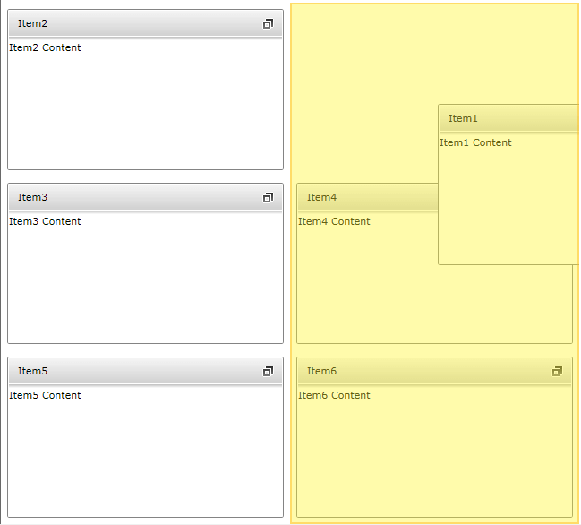
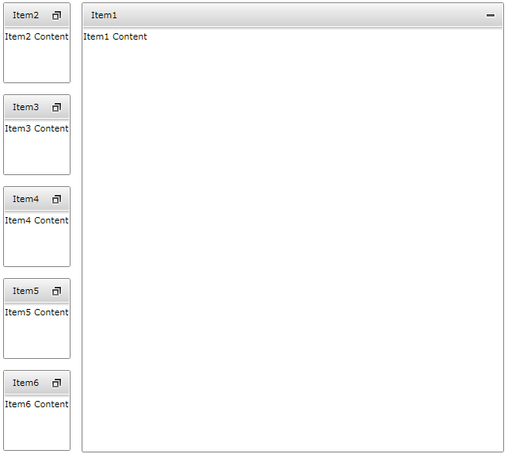
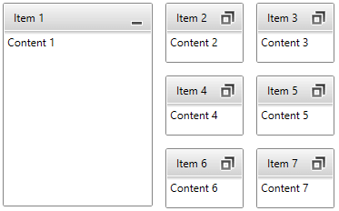
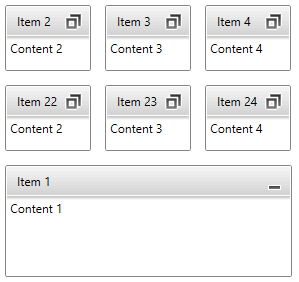

# Minimizing And Maximizing

Each __RadTileViewItem__ can be in __Restored__, __Minimized__ or __Maximized__ state. The state is controlled by the __TileState__ property. It is an enumeration and contains the following values:

* __Restored__
* __Minimized__
* __Maximized__

When one of the items is __Maximized__, the rest of the items are in __Minimized__ state. When there is no __Maximized__ item all items are in __Restored__ state.            

Minimized area can be placed on any side of the __RadTileView__ by using the __MinimizedItemsPosition__ property. It is an enumeration containing the following values:            

* __Left__
* __Top__
* __Bottom__
* __Right__ (the default value)

The size of the minimized area is controlled by the __MinimizedColumnWidth__ and __MinimizedRowHeight__ properties of the __TileView__.            

##  MaximizedItem

The __RadTileView.MaximizedItem__ property holds a reference to the currently maximized tile, if there is any. It can be used to either check if there is a maximized item, get a reference to it, or set the property in order to maximize an item that is currently not maximized. Note, however, that if the __RadTileView__ is data bound, the __MaximizedItem__ will point to a business object from the original items source and not to the dynamically generated __RadTileViewItem__ that wraps it. If you need to get a reference to the container of that item, you should use the __RadTileView.ItemContainerGenerator.ContainerFromItem()__ method.                

## MaximizedItem Docking

The __RadTileView__ control allows you to drag a __RadTileViewItem__ and dock it thus maximizing it in the desired position. In order to take advantage of the functionality, you need to set the __RadTileView IsDockingEnabled__ property to __True:__

__Example 1: Enabling docking__
```XAML
	<telerik:RadTileView Grid.Row="1" ColumnsCount="2" IsDockingEnabled="True" >
	    <telerik:RadTileViewItem Header="Item1">
	        <TextBlock Text="Item1 Content" />
	    </telerik:RadTileViewItem>
	    <telerik:RadTileViewItem Header="Item2">
	        <TextBlock Text="Item2 Content" />
	    </telerik:RadTileViewItem>
	    <telerik:RadTileViewItem Header="Item3">
	        <TextBlock Text="Item3 Content" />
	    </telerik:RadTileViewItem>
	    <telerik:RadTileViewItem Header="Item4">
	        <TextBlock Text="Item4 Content" />
	    </telerik:RadTileViewItem>
	    <telerik:RadTileViewItem Header="Item5">
	        <TextBlock Text="Item5 Content" />
	    </telerik:RadTileViewItem>
	    <telerik:RadTileViewItem Header="Item6">
	        <TextBlock Text="Item6 Content" />
	    </telerik:RadTileViewItem>
	</telerik:RadTileView>
```

#### __Figure 1: Item docking started__  


You can see the result after you drop the item on that position in __Figure 2__.

#### __Figure 2: Item docking complete__  


##  Maximize Mode

You can control the maximize behavior by using the __MaximizeMode__ property. It is an enumeration that has the following properties:
* __One__: There will be always one item maximized. In this mode the items can't go into restored state.
* __ZeroOrOne__: This is the default mode. There can be zero or one item maximized
* __Zero__: In this mode there can't be a maximized item. Items are always in __Restored__ state.
                        

__Example 2: Setting maximize mode__  
```XAML
	<telerik:RadTileView x:Name="RadTileView1" MaximizeMode="One">
		<telerik:RadTileViewItem Header="Item1">
			<TextBlock Text="Item1 Content"/>
		</telerik:RadTileViewItem>
		<telerik:RadTileViewItem Header="Item2">
			<TextBlock Text="Item2 Content"/>
		</telerik:RadTileViewItem>
		<telerik:RadTileViewItem Header="Item3" >
			<TextBlock Text="Item3 Content"/>
		</telerik:RadTileViewItem>
		<telerik:RadTileViewItem Header="Item4" >
			<TextBlock Text="Item4 Content"/>
		</telerik:RadTileViewItem>
		<telerik:RadTileViewItem Header="Item5" >
			<TextBlock Text="Item5 Content"/>
		</telerik:RadTileViewItem>
		<telerik:RadTileViewItem Header="Item6" >
			<TextBlock Text="Item6 Content"/>
		</telerik:RadTileViewItem>
	</telerik:RadTileView>
```

## Minimized Columns and Rows Count

You can control the number of rows or columns in the minimized area of the tileview by using the __MinimizedColumnsCount__ and __MinimizedRowsCount__ properties of __RadTileView__. 

The __MinimizedColumnsCount__ will affect the columns count only if the __MinimizedItemsPosition__ is set to __Left__ or __Right__.

The __MinimizedRowsCount__ will affect the rows count only if the __MinimizedItemsPosition__ is set to __Top__ or __Bottom__.

__Example 3: Setting minimized area with 2 columns__  
```XAML
	<telerik:RadTileView MinimizedColumnsCount="2" MinimizedItemsPosition="Right" />
```

#### __Figure 3: Minimized area with 2 columns__


__Example 4: Setting minimized area with 2 rows__  
```XAML
	<telerik:RadTileView MinimizedRowsCount="2" MinimizedItemsPosition="Top" />
```

#### __Figure 4: Minimized area with 2 rows__


## Preserve MaximizedItem Position

Each __RadTileViewItem__ is associated with a position within the __RadTileView__. However by default as soon as you start maximizing items, their positions are changing. This means that you can maximize Tile1 that was on position 1 and as soon as you maximize Tile3 on position 3, Tile1 will be minimized and placed on position 3.

If you need to ensure that tiles keep their original positions in the __RadTileView Items__ collection, then you need to set the __PreservePositionWhenMaximized__ property to __True__ as the default value of this property is __False__.

## See Also
 * [Getting Started]()
 * [Fluid Content Control]()
 * [Events]()
