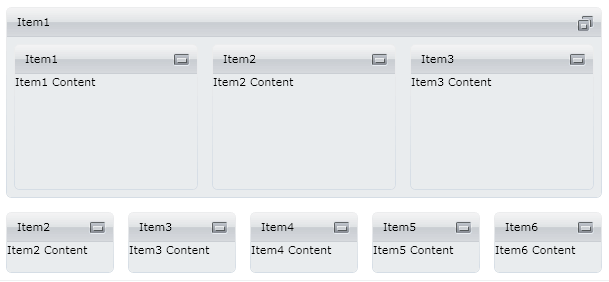

# Nesting TileViews

__RadTileView__ support nesting. You can nest different __TileViews__ in order to achieve complex layouts. Check the example below:

#### __XAML__

```XAML
	<telerik:RadTileView x:Name="RadTileView1" MinimizedItemsPosition="Bottom">
	    <telerik:RadTileViewItem Header="Item1" TileState="Maximized">
	        <telerik:RadTileView>
	            <telerik:RadTileViewItem Header="Item1">
	                <TextBlock Text="Item1 Content"/>
	            </telerik:RadTileViewItem>
	            <telerik:RadTileViewItem Header="Item2">
	                <TextBlock Text="Item2 Content"/>
	            </telerik:RadTileViewItem>
	            <telerik:RadTileViewItem Header="Item3" >
	                <TextBlock Text="Item3 Content"/>
	            </telerik:RadTileViewItem>
	        </telerik:RadTileView>
	    </telerik:RadTileViewItem>
	    <telerik:RadTileViewItem Header="Item2">
	        <TextBlock Text="Item2 Content"/>
	    </telerik:RadTileViewItem>
	    <telerik:RadTileViewItem Header="Item3" >
	        <TextBlock Text="Item3 Content"/>
	    </telerik:RadTileViewItem>
	    <telerik:RadTileViewItem Header="Item4" >
	        <TextBlock Text="Item4 Content"/>
	    </telerik:RadTileViewItem>
	    <telerik:RadTileViewItem Header="Item5" >
	        <TextBlock Text="Item5 Content"/>
	    </telerik:RadTileViewItem>
	    <telerik:RadTileViewItem Header="Item6" >
	        <TextBlock Text="Item6 Content"/>
	    </telerik:RadTileViewItem>
	</telerik:RadTileView>
```



## See Also
 * [Getting Started]()
 * [Minimizing And Maximizing]()
 * [Visual Structure]()