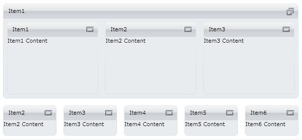

# Nesting TileViews

__RadTileView__ support nesting. You can nest different __TileViews__ in order to achieve complex layouts. Check the example below:

<snippet id='radtileview-features-nesting-tile-views-block_1-xaml' />

## See Also
 * [Getting Started]()
 * [Minimizing And Maximizing]()
 * [Visual Structure]()