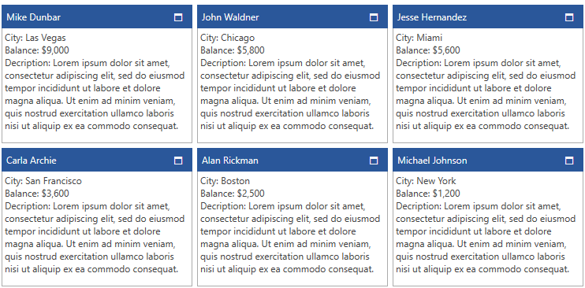

# Customize Position

The __Position__ property of the __RadTileViewItems__ controls the positions of the __Restored__ and/or __Minimized__ items. This article will demonstrate how this property can be bound to a property in the model in an MVVM scenario.

## Creating the Model and ViewModel

For the purposes of this article we will create a class that holds data for customer accounts in a bank and a viewmodel that holds a collection of customer accounts. The ItemsSource of the RadTileView will be the collection of customer accounts. We will order the positions the accounts by their balance in a descending order. 

__Example 1: Creating the model and viewmodel__
```C#
	public class CustomerAccount : ViewModelBase
    {
        public string Name { get; set; }
        public string City { get; set; }
        public decimal Balance { get; set; }
        public string Description { get; set; }

        private int position;

        public int Position
        {
            get { return position; }
            set {
                if(this.position != value)
                {
                    this.position = value;
                    this.OnPropertyChanged("Position");
                }
            }
        }
    }

	public class BankViewModel
    {
        private string LoremIpsumText = "Lorem ipsum dolor sit amet, consectetur adipiscing elit, sed do eiusmod tempor incididunt ut labore et dolore magna aliqua. Ut enim ad minim veniam, quis nostrud exercitation ullamco laboris nisi ut aliquip ex ea commodo consequat. ";
        public ObservableCollection<CustomerAccount> Customers { get; set; }

        public BankViewModel()
        {
            this.Customers = new ObservableCollection<CustomerAccount>();
            this.AddCustomers();
            this.SetPositionAccordingToBalance();
        }

        public void AddCustomers()
        {
            this.Customers.Add(new CustomerAccount()
            {
                Name = "Michael Johnson",
                City = "New York",
                Balance = 1200,
                Description = LoremIpsumText,
            });
            this.Customers.Add(new CustomerAccount()
            {
                Name = "Alan Rickman",
                City = "Boston",
                Balance = 2500,
                Description = LoremIpsumText,
            });
            this.Customers.Add(new CustomerAccount()
            {
                Name = "Jesse Hernandez",
                City = "Miami",
                Balance = 5600,
                Description = LoremIpsumText,
            });
            this.Customers.Add(new CustomerAccount()
            {
                Name = "Mike Dunbar",
                City = "Las Vegas",
                Balance = 9000,
                Description = LoremIpsumText,
            });
            this.Customers.Add(new CustomerAccount()
            {
                Name = "John Waldner",
                City = "Chicago",
                Balance = 5800,
                Description = LoremIpsumText,
            });
            this.Customers.Add(new CustomerAccount()
            {
                Name = "Carla Archie",
                City = "San Francisco",
                Balance = 3600,
                Description = LoremIpsumText,
            });
        }

        private void SetPositionAccordingToBalance()
        {
            var count = 0;
            var orderedCustomersByBalance = this.Customers.OrderByDescending(c => c.Balance);

            foreach (var customer in orderedCustomersByBalance)
            {
                customer.Position = count++;
            }
        }
    }
```
```VB.NET
	Public Class CustomerAccount
	Inherits ViewModelBase

		Public Property Name() As String
		Public Property City() As String
		Public Property Balance() As Decimal
		Public Property Description() As String


		Private _position As Integer

		Public Property Position() As Integer
			Get
				Return _position
			End Get
			Set(ByVal value As Integer)
				If Me._position <> value Then
					Me._position = value
					Me.OnPropertyChanged("Position")
				End If
			End Set
		End Property
	End Class

	Public Class BankViewModel
		Private LoremIpsumText As String = "Lorem ipsum dolor sit amet, consectetur adipiscing elit, sed do eiusmod tempor incididunt ut labore et dolore magna aliqua. Ut enim ad minim veniam, quis nostrud exercitation ullamco laboris nisi ut aliquip ex ea commodo consequat. "
		Public Property Customers() As ObservableCollection(Of CustomerAccount)

		Public Sub New()
			Me.Customers = New ObservableCollection(Of CustomerAccount)()
			Me.AddCustomers()
			Me.SetPositionAccordingToBalance()
		End Sub

		Public Sub AddCustomers()
			Me.Customers.Add(New CustomerAccount() With {
				.Name = "Michael Johnson",
				.City = "New York",
				.Balance = 1200,
				.Description = LoremIpsumText
			})
			Me.Customers.Add(New CustomerAccount() With {
				.Name = "Alan Rickman",
				.City = "Boston",
				.Balance = 2500,
				.Description = LoremIpsumText
			})
			Me.Customers.Add(New CustomerAccount() With {
				.Name = "Jesse Hernandez",
				.City = "Miami",
				.Balance = 5600,
				.Description = LoremIpsumText
			})
			Me.Customers.Add(New CustomerAccount() With {
				.Name = "Mike Dunbar",
				.City = "Las Vegas",
				.Balance = 9000,
				.Description = LoremIpsumText
			})
			Me.Customers.Add(New CustomerAccount() With {
				.Name = "John Waldner",
				.City = "Chicago",
				.Balance = 5800,
				.Description = LoremIpsumText
			})
			Me.Customers.Add(New CustomerAccount() With {
				.Name = "Carla Archie",
				.City = "San Francisco",
				.Balance = 3600,
				.Description = LoremIpsumText
			})
		End Sub

		Private Sub SetPositionAccordingToBalance()
			Dim count = 0
			Dim orderedCustomersByBalance = Me.Customers.OrderByDescending(Function(c) c.Balance)

			For Each customer In orderedCustomersByBalance
				customer.Position = count
				count += 1
			Next customer
		End Sub
	End Class
```

## Creating the View

Next, we will setup the RadTileView in xaml. We will create an __ItemTemplate__ and __ContentTemplate__ to configure how the RadTileViewItems will visualize the customer accounts. We will also bind the Position property of the RadTileViewItems to the Position property of the model through a Style.

__Example 2: Creating the model and viewmodel__
```XAML
	<UserControl.Resources>
        <local:BankViewModel x:Key="ViewModel" />
    </UserControl.Resources>

    <Grid DataContext="{StaticResource ViewModel}">
        <Grid.Resources>
            <DataTemplate x:Key="ItemTemplate">
                <TextBlock Text="{Binding Name}" />
            </DataTemplate>

            <DataTemplate x:Key="ContentTemplate">
                <StackPanel >
                    <TextBlock Text="{Binding City,StringFormat='City: {0}'}"/>
                    <TextBlock Text="{Binding Balance,StringFormat='Balance: {0:C0}'}"/>
                    <TextBlock Text="{Binding Description,StringFormat='Decription: {0}'}" TextWrapping="Wrap"/>
                </StackPanel>
            </DataTemplate>

			<!-- If you are using the NoXaml binaries, you have to base your style on the default one like so-->
            <!--<Style TargetType="telerik:RadTileViewItem" BasedOn="{StaticResource RadTileViewItemStyle}">-->

            <Style TargetType="telerik:RadTileViewItem">
                <Setter Property="Position" Value="{Binding Position, Mode=TwoWay}" />
            </Style>
        </Grid.Resources>
        <telerik:RadTileView x:Name="xTileView" 
                             ItemTemplate="{StaticResource ItemTemplate}"
                             ContentTemplate="{StaticResource ContentTemplate}"
                             ItemsSource="{Binding Customers}"
                             MinimizedColumnWidth="200"/>
    </Grid>
```

#### __Figure 1: RadTileViewItems with customized position in the Office2016 theme__


> Note, that if there is a __Maximized__ item, by default it will be on __Position__ 0. Therefore setting another __RadTileViewItem Position__ to 0, will maximize this item instead.

## See Also

* [Reordering Tiles]()