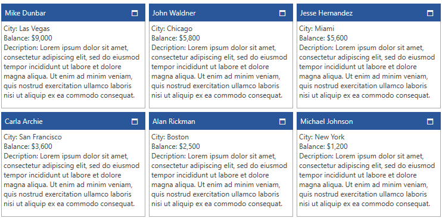

# Customize Position

The __Position__ property of the __RadTileViewItems__ controls the positions of the __Restored__ and/or __Minimized__ items. This article will demonstrate how this property can be bound to a property in the model in an MVVM scenario.

## Creating the Model and ViewModel

For the purposes of this article we will create a class that holds data for customer accounts in a bank and a viewmodel that holds a collection of customer accounts. The ItemsSource of the RadTileView will be the collection of customer accounts. We will order the positions the accounts by their balance in a descending order. 

__Example 1: Creating the model and viewmodel__
<snippet id='radtileview-features-positioning-block_1-cs' />
<snippet id='radtileview-features-positioning-block_2-vb' />

## Creating the View

Next, we will setup the RadTileView in xaml. We will create an __ItemTemplate__ and __ContentTemplate__ to configure how the RadTileViewItems will visualize the customer accounts. We will also bind the Position property of the RadTileViewItems to the Position property of the model through a Style.

__Example 2: Creating the model and viewmodel__
<snippet id='radtileview-features-positioning-block_3-xaml' />

#### __Figure 1: RadTileViewItems with customized position in the Office2016 theme__

> Note, that if there is a __Maximized__ item, by default it will be on __Position__ 0. Therefore setting another __RadTileViewItem Position__ to 0, will maximize this item instead.

## See Also

* [Reordering Tiles]()