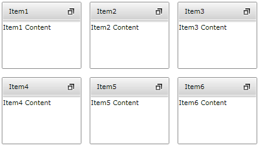
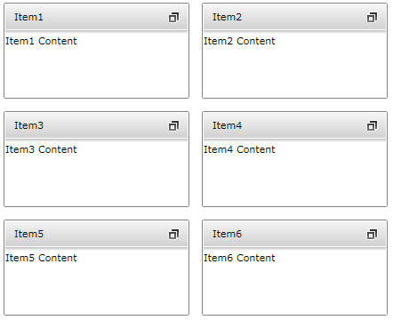
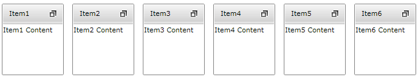

# Rows and Columns

By default all __TileViewItems__ are ordered automatically like in the screenshot below:


```XAML
	<telerik:RadTileView>
		<telerik:RadTileViewItem Header="Item1">
			<TextBlock Text="Item1 Content" />
		</telerik:RadTileViewItem>
		<telerik:RadTileViewItem Header="Item2">
			<TextBlock Text="Item2 Content" />
		</telerik:RadTileViewItem>
		<telerik:RadTileViewItem Header="Item3">
			<TextBlock Text="Item3 Content" />
		</telerik:RadTileViewItem>
		<telerik:RadTileViewItem Header="Item4">
			<TextBlock Text="Item4 Content" />
		</telerik:RadTileViewItem>
		<telerik:RadTileViewItem Header="Item5">
			<TextBlock Text="Item5 Content" />
		</telerik:RadTileViewItem>
		<telerik:RadTileViewItem Header="Item6">
			<TextBlock Text="Item6 Content" />
		</telerik:RadTileViewItem>
	</telerik:RadTileView>
```



## Setting the number of Columns

To set the number of columns you can use the __ColumnsCount__ property:		


```XAML
	<telerik:RadTileView ColumnsCount="2">
		<telerik:RadTileViewItem Header="Item1">
			<TextBlock Text="Item1 Content" />
		</telerik:RadTileViewItem>
		<telerik:RadTileViewItem Header="Item2">
			<TextBlock Text="Item2 Content" />
		</telerik:RadTileViewItem>
		<telerik:RadTileViewItem Header="Item3">
			<TextBlock Text="Item3 Content" />
		</telerik:RadTileViewItem>
		<telerik:RadTileViewItem Header="Item4">
			<TextBlock Text="Item4 Content" />
		</telerik:RadTileViewItem>
		<telerik:RadTileViewItem Header="Item5">
			<TextBlock Text="Item5 Content" />
		</telerik:RadTileViewItem>
		<telerik:RadTileViewItem Header="Item6">
			<TextBlock Text="Item6 Content" />
		</telerik:RadTileViewItem>
	</telerik:RadTileView>
```



To set the maximum number of columns you can use the __MaxColumns__ property:		


```XAML
	<telerik:RadTileView MaxColumns="2">
		<telerik:RadTileViewItem Header="Item1">
			<TextBlock Text="Item1 Content" />
		</telerik:RadTileViewItem>
		<telerik:RadTileViewItem Header="Item2">
			<TextBlock Text="Item2 Content" />
		</telerik:RadTileViewItem>
		<telerik:RadTileViewItem Header="Item3">
			<TextBlock Text="Item3 Content" />
		</telerik:RadTileViewItem>
		<telerik:RadTileViewItem Header="Item4">
			<TextBlock Text="Item4 Content" />
		</telerik:RadTileViewItem>
		<telerik:RadTileViewItem Header="Item5">
			<TextBlock Text="Item5 Content" />
		</telerik:RadTileViewItem>
		<telerik:RadTileViewItem Header="Item6">
			<TextBlock Text="Item6 Content" />
		</telerik:RadTileViewItem>
	</telerik:RadTileView>
```

The result from the above code is displayed below. As you can see now the items are ordered in two columns:


##  Setting the number of Rows

To set the number of rows you can use the __RowsCount__ property.


```XAML
	<telerik:RadTileView RowsCount="1">
		<telerik:RadTileViewItem Header="Item1">
			<TextBlock Text="Item1 Content" />
		</telerik:RadTileViewItem>
		<telerik:RadTileViewItem Header="Item2">
			<TextBlock Text="Item2 Content" />
		</telerik:RadTileViewItem>
		<telerik:RadTileViewItem Header="Item3">
			<TextBlock Text="Item3 Content" />
		</telerik:RadTileViewItem>
		<telerik:RadTileViewItem Header="Item4">
			<TextBlock Text="Item4 Content" />
		</telerik:RadTileViewItem>
		<telerik:RadTileViewItem Header="Item5">
			<TextBlock Text="Item5 Content" />
		</telerik:RadTileViewItem>
		<telerik:RadTileViewItem Header="Item6">
			<TextBlock Text="Item6 Content" />
		</telerik:RadTileViewItem>
	</telerik:RadTileView>
```



To set the maximum number of rows you can use the __MaxRows__ property:


```XAML
	<telerik:RadTileView MaxRows="1">
		<telerik:RadTileViewItem Header="Item1">
			<TextBlock Text="Item1 Content" />
		</telerik:RadTileViewItem>
		<telerik:RadTileViewItem Header="Item2">
			<TextBlock Text="Item2 Content" />
		</telerik:RadTileViewItem>
		<telerik:RadTileViewItem Header="Item3">
			<TextBlock Text="Item3 Content" />
		</telerik:RadTileViewItem>
		<telerik:RadTileViewItem Header="Item4">
			<TextBlock Text="Item4 Content" />
		</telerik:RadTileViewItem>
		<telerik:RadTileViewItem Header="Item5">
			<TextBlock Text="Item5 Content" />
		</telerik:RadTileViewItem>
		<telerik:RadTileViewItem Header="Item6">
			<TextBlock Text="Item6 Content" />
		</telerik:RadTileViewItem>
	</telerik:RadTileView>
```

As you can see now the items are ordered in one row only:


When both __ColumnsCount/MaxColumns__ and __RowsCount/MaxRows__ properties are set, the value of __ColumnsCount/MaxColumns__ will have a priority.


```XAML
	<telerik:RadTileView ColumnsCount="2" RowsCount="1">
		<telerik:RadTileViewItem Header="Item1">
			<TextBlock Text="Item1 Content" />
		</telerik:RadTileViewItem>
		<telerik:RadTileViewItem Header="Item2">
			<TextBlock Text="Item2 Content" />
		</telerik:RadTileViewItem>
		<telerik:RadTileViewItem Header="Item3">
			<TextBlock Text="Item3 Content" />
		</telerik:RadTileViewItem>
		<telerik:RadTileViewItem Header="Item4">
			<TextBlock Text="Item4 Content" />
		</telerik:RadTileViewItem>
		<telerik:RadTileViewItem Header="Item5">
			<TextBlock Text="Item5 Content" />
		</telerik:RadTileViewItem>
		<telerik:RadTileViewItem Header="Item6">
			<TextBlock Text="Item6 Content" />
		</telerik:RadTileViewItem>
	</telerik:RadTileView>
```

As you can see from the image below only the __ColumnsCount__ property is respected:


##  Setting Rows and Columns Size

You can control the height of the __restored__ tiles using the __RadTileView RowHeight__ property. The __RowHeight__ property is of type __GridLength__ and support the following values:		

* __Absolute sizing__ - sets exact height to the restored tiles

* __Star sizing (*)__ - the available height will be distributed equally among the restored tiles			  

* __Auto sizing__ - each restored tile will take as much space as it needs.			  

In order to set the width of the __restored__ tiles, you need to set the __RadTileView ColumnWidth__ property. The __ColumnWidth__ property is of type __GridLength__ and support the following values:		

* __Absolute sizing__ - sets exact width to the restored tiles			  

* __Star sizing (*)__ - the available width will be distributed equally among the restored tiles			  

* __Auto sizing__ - each restored tile will take as much space as it needs.			  

The __RadTileView__ exposes two properties that allow you to define the size of the __minimized__ items:		

* __MinimizedRowHeight__ - specifies the height of the minimized items. It is of type GridLength and therefore it allows defining absolute, start and auto sizing.			  

* __MinimizedColumnWidth__ - specifies the width of the minimized tiles. It is of type GridLength and therefore it allows defining absolute, start and auto sizing.			  

> Please note that the __RadTileViewItem__ also allows you to specify each item's size using the following properties:		  
>	- __RestoredHeight/RestoredWidth__ - specifies the size of the tile in a Restored state
>	- __MinimizedHeight/MinimizedWidth__ - specifies the size of the tile in a Minimized state				

## See Also
 * [Getting Started]()
 * [Minimizing And Maximizing]()