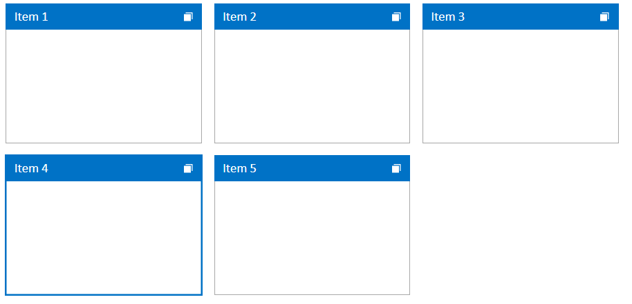
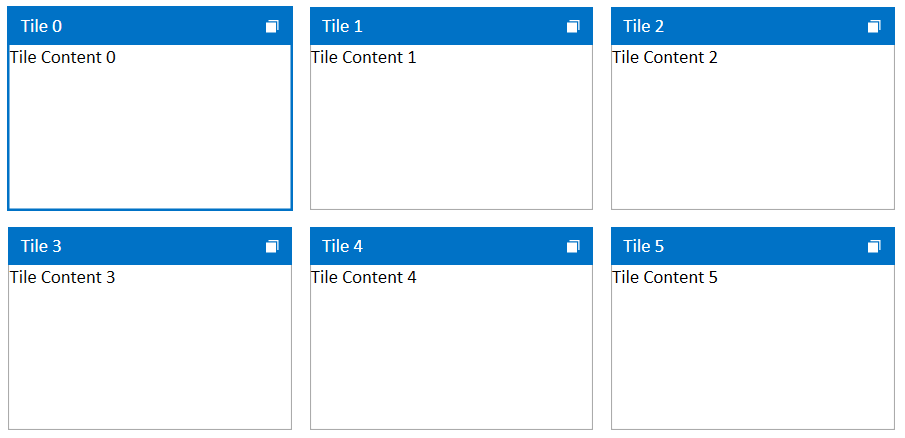

# Selection

This article demonstrates the selection feature of the RadTileView control.

## Enabling Selection

The selection feature is disabled by default. To enable it set the __IsSelectionEnabled__ property of RadTileView to __True__. To select a RadTileViewItem, click on it in the UI, or set the SelectedItem property of the control.

__Example 1: Enabling selection__
```XAML
	<telerik:RadTileView IsSelectionEnabled="True">
		<telerik:RadTileViewItem Header="Item 1"/>
		<telerik:RadTileViewItem Header="Item 2"/>
		<telerik:RadTileViewItem Header="Item 3"/>
		<telerik:RadTileViewItem Header="Item 4"/>
		<telerik:RadTileViewItem Header="Item 5"/>   
	</telerik:RadTileView>
```

#### Figure 1: Selected tile


## Selection Mode

The control supports three selection modes. They can be set via the __SelectionMode__ property of RadTileView.

* __Single__: In this mode the user will be able to select only one item at once. This is the __default__ mode.

* __Multiple__: This mode allows selection of multiple items. Clicking an item selects or deselects it depending on its current state. Also, the previously selected items will preserve their selection state.

* __Extended__: This mode allows the user to select multiple items at once by holding down the Ctrl or Shift keys and clicking multiple items with the mouse or by using the keyboard. A second click on a selected item will unselect that item.

__Example 2: Setting selection mode__
```XAML
	<telerik:RadTileView IsSelectionEnabled="True"
						 SelectionMode="Multiple">
		<telerik:RadTileViewItem Header="Item 1"/>
		<telerik:RadTileViewItem Header="Item 2"/>
		<telerik:RadTileViewItem Header="Item 3"/>
		<telerik:RadTileViewItem Header="Item 4"/>
		<telerik:RadTileViewItem Header="Item 5"/>   
	</telerik:RadTileView>
```

## Setting and Getting Selected Items Manually

The selected tile is stored in the __SelectedItem__ property of RadTileView and also in its __SelectedItems__ collection. You can use both to access or update the selected tiles.

Depending on the setup the SelectedItem property can contain different values. If the control is populated directly using RadTileViewItem instances, the property will contain a value of type RadTileViewItem. If the control is populated via its ItemsSource property, the SelectedItem will contain an object from the ItemsSource (the model of the selected RadTileViewItem).

__Example 3: Getting and setting selection manually via the SelectedItem property__
```C#
	// Getting the selection
	object selectedItem = this.radTileView.SelectedItem;
	
	// Setting the selection. Selecting the first item in the Items collection of the control
	this.radTileView.SelectedItem = this.radTileView.Items[0]	
```
```VB.NET
	' Getting the selection
	Dim selectedItem As Object = Me.radTileView.SelectedItem

	' Setting the selection. Selecting the first item in the Items collection of the control
	Me.radTileView.SelectedItem = Me.radTileView.Items(0)
```

__Example 4: Setting selection via the SelectedItems collection property__
```C#
	// Getting the selection
	object selectedItem = this.radTileView.SelectedItems[0];

	// Setting the selection. Selecting the first item in the Items collection of the control
	this.radTileView.SelectedItems.Add(this.radTileView.Items[0]);
```
```VB.NET
	' Getting the selection
	Dim selectedItem As Object = Me.radTileView.SelectedItems(0)

	' Setting the selection. Selecting the first item in the Items collection of the control
	Me.radTileView.SelectedItems.Add(Me.radTileView.Items(0))
```

## Events

The RadTileView control exposes several selection events. Please note that these events should be used instead of the standard **SelectionChanged** event.

* __PreviewTileSelectionChanged__: This event fires just before the selection state of the tile gets changed. You can use the event to cancel the selection of the tile by setting the __Handled__ property of the event arguments to __True__.

* __TileSelectionChanged__: This event fires just after the selection state of the tile is changed.

* __PreviewTilesSelectionChanged__: This event fires just before the selection operation completes. For example, if you select multiple items using the Shift key + Mouse click (in Extended selection mode), the event will get fired only once. You can use the event to cancel the selection of the tile by setting the __Handled__ property of the event arguments to __True__.

* __TilesSelectionChanged__: This event fires just after the selection operation completes. For example, if you select multiple items using the Shift key + Mouse click (in Extended selection mode), the event will get fired only once.

## Binding SelectedItem

This section demonstrates how to data bind the SelectedItem property of the control.

__Example 5: Defining the model and populating it with data__
```C#
	public class MainViewModel : ViewModelBase
    {
        private TileInfo selectedItem;
        public TileInfo SelectedItem
        {
            get { return selectedItem; }
            set
            {
                if (this.selectedItem != value)
                {
                    this.selectedItem = value;
                    this.OnPropertyChanged("SelectedItem");
                }
            }
        }

        public ObservableCollection<TileInfo> Tiles { get; set; }

        public MainViewModel()
        {
            this.Tiles = new ObservableCollection<TileInfo>();
            for (int i = 0; i < 6; i++)
            {
                this.Tiles.Add(new TileInfo() { Header = "Tile " + i, Content = "Tile Content " + i });
            }

            this.SelectedItem = this.Tiles[0];
        }
    }

    public class TileInfo
    {
        public string Header { get; set; }
        public string Content { get; set; }
    }
```
```VB.NET
	Public Class MainViewModel
		Inherits ViewModelBase

		Private _selectedItem As TileInfo
		Public Property SelectedItem() As TileInfo
			Get
				Return _selectedItem
			End Get
			Set(ByVal value As TileInfo)
				If Me._selectedItem IsNot value Then
					Me._selectedItem = value
					Me.OnPropertyChanged("SelectedItem")
				End If
			End Set
		End Property

		Public Property Tiles() As ObservableCollection(Of TileInfo)

		Public Sub New()
			Me.Tiles = New ObservableCollection(Of TileInfo)()
			For i As Integer = 0 To 5
				Me.Tiles.Add(New TileInfo() With {
					.Header = "Tile " & i,
					.Content = "Tile Content " & i
				})
			Next i

			Me.SelectedItem = Me.Tiles(0)
		End Sub
	End Class

	Public Class TileInfo
		Public Property Header() As String
		Public Property Content() As String
	End Class
```

__Example 6: Setting the DataContext__
```XAML
	public partial class TileViewUserControl : UserControl
    {
        public TileViewUserControl()
        {
            InitializeComponent();
            this.DataContext = new MainViewModel();
        }
    }
```

__Example 7: Setting up the view and binding the SelectedItem property__
```XAML
	<telerik:RadTileView IsSelectionEnabled="True" 
						 DisplayMemberPath="Header"
						 ItemsSource="{Binding Tiles}"
						 SelectedItem="{Binding SelectedItem, Mode=TwoWay}">
		<telerik:RadTileView.ContentTemplate>
			<DataTemplate>
				<TextBlock Text="{Binding Content}" />
			</DataTemplate>                
		</telerik:RadTileView.ContentTemplate>
	</telerik:RadTileView>
```

#### Figure 2: Data binding example


> You can find more information about the __ViewModeBase__ class used in Example 5 in the [ViewModelBase Class]() article.

## See Also
 * [Getting Started]()
 * [Events]()
 * [Reordering Tiles]()
