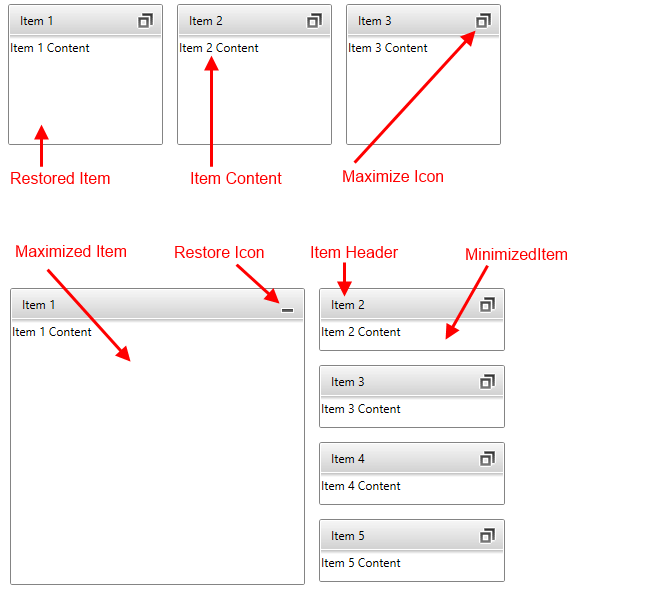

# Visual Structure

## 

This section defines terms and concepts used in the scope of __RadTileView__ you have to get familiar 
        with prior to continue reading this help.

Below you can see a snapshot and explanation of the main visual elements of the __RadTileView__ control.

__RadTileView__ is an __ItemsControl__. It is populated with 
          __RadTileViewItems__. __RadTileViewItem__ is a 
          __HeaderedContentControl__. Each __TileViewItem__ can be any of the three possible 
          states:

* Maximized

* Minimized

* Restored

__RadTileView__ supports different placement for the minimized area. The minimize area can be placed in 
          the __Top__, __Left__, __Bottom__, or __Right__
          side of the TileView. Read more info on the minimize area [here]().

The developer can also modify the number of rows and columns in which the __TileView__ items are rendered. Read more info 
        [here]().

When all items are restored they can be dragged and to change their position with a customizable 
        [animation]().

# See Also

 * [Getting Started]()

 * [Minimizing And Maximizing]()
