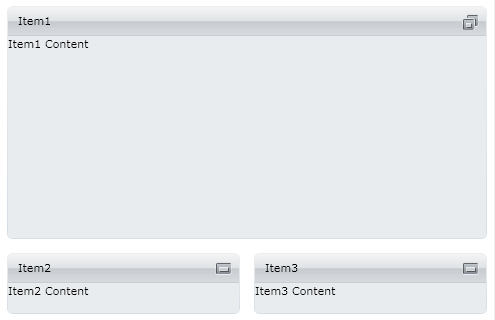

# Getting Started with {{ site.framework_name }} TileView

## Assembly References

To use the __RadTileView__ in your projects you have to add references to the following assemblies:

* __Telerik.Licensing.Runtime__
* __Telerik.Windows.Controls__
* __Telerik.Windows.Controls.Navigation__
* __Telerik.Windows.Data__

You can find the required assemblies for each control from the suite in the [Controls Dependencies]()[Controls Dependencies]() help article.

>tip With the 2025 Q1 release, the Telerik UI for WPF has a new licensing mechanism. You can learn more about it [here]().

### Adding Telerik Assemblies Using NuGet

To use __RadTileView__ when working with NuGet packages, install the `Telerik.Windows.Controls.Navigation.for.Wpf.Xaml` package. The [package name may vary]() slightly based on the Telerik dlls set - [Xaml or NoXaml]()

Read more about NuGet installation in the [Installing UI for WPF from NuGet Package]() article.

## Adding the RadTileView to the page

#### __[XAML] Example 1__
{{region radtileview-getting-started_0}}
	<UserControl x:Class="RadTileViewHelpExamples.MainPage"
	    xmlns="http://schemas.microsoft.com/winfx/2006/xaml/presentation" 
	    xmlns:x="http://schemas.microsoft.com/winfx/2006/xaml"
	    xmlns:telerik="http://schemas.telerik.com/2008/xaml/presentation">
	    <Grid x:Name="LayoutRoot">
	        <telerik:RadTileView>
	            <telerik:RadTileViewItem Header="Item1">
	                <TextBlock Text="Item1 Content"/>
	            </telerik:RadTileViewItem>
	            <telerik:RadTileViewItem Header="Item2">
	                <TextBlock Text="Item2 Content"/>
	            </telerik:RadTileViewItem>
	            <telerik:RadTileViewItem Header="Item3" >
	                <TextBlock Text="Item3 Content"/>
	            </telerik:RadTileViewItem>
	        </telerik:RadTileView>
	    </Grid>
	</UserControl>
{{endregion}}

As you can see from the image below the items are in restored state by default.

## Setting maximized item

To set an item in maximized state you can use the __TileState__ property and set its value to __Maximized__.				

#### __[XAML] Example 2__

{{region radtileview-getting-started_1}}
	<telerik:RadTileView>
	    <telerik:RadTileViewItem TileState="Maximized" Header="Item1">
	        <TextBlock Text="Item1 Content"/>
	    </telerik:RadTileViewItem>
	    <telerik:RadTileViewItem Header="Item2">
	        <TextBlock Text="Item2 Content"/>
	    </telerik:RadTileViewItem>
	    <telerik:RadTileViewItem Header="Item3" >
	        <TextBlock Text="Item3 Content"/>
	    </telerik:RadTileViewItem>
	</telerik:RadTileView>
{{endregion}}

As you can see from the image below Item1 is now in maximized state.

## Setting minimized position

To set the minimized area positions use the __MinimizedItemsPosition__ property. It is an enumeration with the following values:				
* __Left__
* __Top__
* __Right__
* __Bottom__

#### __[XAML] Example 3__

{{region radtileview-getting-started_2}}
	<telerik:RadTileView MinimizedItemsPosition="Bottom">
	    <telerik:RadTileViewItem TileState="Maximized" Header="Item1">
	        <TextBlock Text="Item1 Content"/>
	    </telerik:RadTileViewItem>
	    <telerik:RadTileViewItem Header="Item2">
	        <TextBlock Text="Item2 Content"/>
	    </telerik:RadTileViewItem>
	    <telerik:RadTileViewItem Header="Item3" >
	        <TextBlock Text="Item3 Content"/>
	    </telerik:RadTileViewItem>
	</telerik:RadTileView>
{{endregion}}

#### __Figure 1__

## Setting a Theme

The controls from our suite support different themes. You can see how to apply a theme different than the default one in the [Setting a Theme]() help article.

>important Changing the theme using implicit styles will affect all controls that have styles defined in the merged resource dictionaries. This is applicable only for the controls in the scope in which the resources are merged. 

To change the theme, you can follow the steps below:

* Choose between the themes and add reference to the corresponding theme assembly (ex: **Telerik.Windows.Themes.Windows8.dll**). You can see the different themes applied in the **Theming** examples from our [WPF Controls Examples](https://demos.telerik.com/wpf/)[Silverlight Controls Examples](https://demos.telerik.com/silverlight/#TileView/Theming) application.

* Merge the ResourceDictionaries with the namespace required for the controls that you are using from the theme assembly. For the RadTileView, you will need to merge the following resources:

	* __Telerik.Windows.Controls__
	* __Telerik.Windows.Controls.Navigation__

__Example 4__ demonstrates how to merge the ResourceDictionaries so that they are applied globally for the entire application.

#### __[XAML] Example 4: Merge the ResourceDictionaries__  
{{region radtileview-getting-started_7}}
	<Application.Resources>
		<ResourceDictionary>
			<ResourceDictionary.MergedDictionaries>
				<ResourceDictionary Source="/Telerik.Windows.Themes.Windows8;component/Themes/System.Windows.xaml"/>
				<ResourceDictionary Source="/Telerik.Windows.Themes.Windows8;component/Themes/Telerik.Windows.Controls.xaml"/>
				<ResourceDictionary Source="/Telerik.Windows.Themes.Windows8;component/Themes/Telerik.Windows.Controls.Navigation.xaml"/>
			</ResourceDictionary.MergedDictionaries>
		</ResourceDictionary>
	</Application.Resources>
{{endregion}}

>Alternatively, you can use the theme of the control via the [StyleManager](https://docs.telerik.com/devtools/wpf/styling-and-appearance/stylemanager/common-styling-apperance-setting-theme-wpf)[StyleManager](https://docs.telerik.com/devtools/silverlight/styling-and-appearance/stylemanager/common-styling-apperance-setting-theme).

__Figure 2__ shows a RadTileView with the **Windows8** theme applied.

#### __Figure 2: RadTileView with the Windows8 theme__


## Telerik UI for WPF Learning Resources

* [Telerik UI for WPF TileView Component](https://www.telerik.com/products/wpf/tileview.aspx)
* [Getting Started with Telerik UI for WPF Components]()
* [Telerik UI for WPF Installation]()
* [Telerik UI for WPF and WinForms Integration]()
* [Telerik UI for WPF Visual Studio Templates]()
* [Setting a Theme with Telerik UI for WPF]()
* [Telerik UI for WPF Virtual Classroom (Training Courses for Registered Users)](https://learn.telerik.com/learn/course/external/view/elearning/16/telerik-ui-for-wpf) 
* [Telerik UI for WPF License Agreement](https://www.telerik.com/purchase/license-agreement/wpf-dlw-s)


## See Also
 * [Visual Structure]()
 * [Minimizing And Maximizing]()
 * [Rows and Columns]()
 * [Fluid Content Control]()