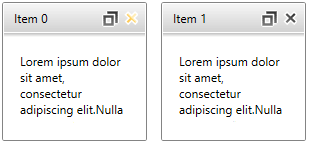

# Add a Close Button to a RadTileViewItem

This article demonstrates how to add a close button next to the tile state change (minimize/maximize) button of the __RadTileViewItems__. The __Command__ property of the close button will be bound to an [ICommand](http://msdn.microsoft.com/en-us/library/system.windows.input.icommand(v=vs.110).aspx) that removes the item from the __RadTileView's ItemsSource__.        

You can see the final result on the picture bellow:


## Define the RadTileView in XAML and create the view model

The __RadTileView__ in this scenario will be data bound to a collection of business objects.

```C#
	public class DataItem
	{
		public string Header { get; set; }
		public string Content { get; set; }
	}
```
```VB.NET
	Public Class DataItem
		Public Property Header() As String
			Get
				Return m_Header
			End Get
			Set(value As String)
				m_Header = Value
			End Set
		End Property
		Private m_Header As String
		Public Property Content() As String
			Get
				Return m_Content
			End Get
			Set(value As String)
				m_Content = Value
			End Set
		End Property
		Private m_Content As String
	End Class
```

The collection passed to the __RadTileView's ItemsSource__ can be wrapped in a View Model class

```C#
	public class MainViewModel
	{
		public ObservableCollection<DataItem> Items { get; set; }

		public MainViewModel()
		{
			this.Items = new ObservableCollection<DataItem>();

			for (int i = 0; i < 2; i++)
			{
				var dataItem = new DataItem()
				{
					Header = "Item " + i,
					Content = "Lorem ipsum dolor sit amet, consectetur adipiscing elit."
				};

				this.Items.Add(dataItem);
			}
		}
	}
```
```VB.NET
	Public Class MainViewModel
		Public Property Items() As ObservableCollection(Of DataItem)
			Get
				Return m_Items
			End Get
			Set(value As ObservableCollection(Of DataItem))
				m_Items = Value
			End Set
		End Property
		Private m_Items As ObservableCollection(Of DataItem)

		Public Sub New()
			Me.Items = New ObservableCollection(Of DataItem)()

			For i As Integer = 0 To 4
				Dim dataItem = New DataItem() With { _
					.Header = "Item " + i, _
					.Content = "Lorem ipsum dolor sit amet, consectetur adipiscing elit." _
				}

				Me.Items.Add(dataItem)
			Next
		End Sub
	End Class
```

After creating the view models you can add the __RadTileView__ definition in xaml.

```XAML
	<telerik:RadTileView ItemsSource="{Binding Items}" 					 
						 MinimizedRowHeight="150" 
						 MinimizedColumnWidth="200" 
						 HeaderStyle="{StaticResource TileViewItemHeaderStyle1}">
	    <telerik:RadTileView.DataContext>
		   	<local:MainViewModel />
		</telerik:RadTileView.DataContext>
		<telerik:RadTileView.ItemTemplate>
			<DataTemplate>
				<TextBlock Text="{Binding Header}" HorizontalAlignment="Right"/>
			</DataTemplate>
		</telerik:RadTileView.ItemTemplate>
		<telerik:RadTileView.ContentTemplate>
			<DataTemplate>
				<TextBlock Margin="16" Text="{Binding Content}" TextWrapping="Wrap" />
			</DataTemplate>
		</telerik:RadTileView.ContentTemplate>
	</telerik:RadTileView>
```

## Extract and Edit the RadTileViewItem HeaderStyle

The __RadTileViewItem’s__ header is represented by __TileViewItemHeader__ control. To add close button you can extract the __Style__ of the __TileViewItemHeader__ and slightly modify its __ControlTemplate__. Basically, you can find the __RadToggleButton__ that represents the Minimize/Maximize button and wrap it in a __Grid__ (or another panel) along with the new close button.

>tip You can see the [Editing Control Templates](http://www.telerik.com/help/wpf/styling-apperance-editing-control-templates.html) help article that demonstrates how to extract the __Style__ with the __ControlTemplate__ of a control.

```XAML
	................
	<Border BorderBrush="White" BorderThickness="0,0,0,1" Background="{TemplateBinding Background}" CornerRadius="1" Padding="10,0,7,0">
	<Grid MinHeight="28">
		<Border x:Name="GripBarElement" Background="Transparent">
			<ContentPresenter x:Name="HeaderElement" ContentTemplate="{TemplateBinding ContentTemplate}" Content="{TemplateBinding Content}" HorizontalAlignment="{TemplateBinding HorizontalContentAlignment}" Margin="0,0,10,0" VerticalAlignment="{TemplateBinding VerticalContentAlignment}"/>
		</Border>
	
		<Grid HorizontalAlignment="Right" VerticalAlignment="Center">
			<Grid.ColumnDefinitions>
				<ColumnDefinition />
				<ColumnDefinition />
			</Grid.ColumnDefinitions>
		   
			<telerik:RadButton Margin="2 0 0 0" Command="local:TileViewCommandsExtension.Delete" Grid.Column="1" x:Name="CloseButton" InnerCornerRadius="0">
				<telerik:RadButton.Style>
					<Style TargetType="{x:Type telerik:RadButton}">
						<Setter Property="VerticalAlignment" Value="Center"/>
						<Setter Property="HorizontalAlignment" Value="Right"/>
						<Setter Property="Width" Value="17"/>
						<Setter Property="Height" Value="17"/>
						<Setter Property="Template">
							<Setter.Value>
								<ControlTemplate TargetType="{x:Type telerik:RadButton}">
									<Grid Background="Transparent" SnapsToDevicePixels="True">
										<VisualStateManager.VisualStateGroups>
											<VisualStateGroup x:Name="CommonStates">
												<VisualState x:Name="Disabled"/>
												<VisualState x:Name="Normal"/>
												<VisualState x:Name="MouseOver">
													<Storyboard>
														<ObjectAnimationUsingKeyFrames Storyboard.TargetProperty="Stroke" Storyboard.TargetName="closeButtonPath">
															<DiscreteObjectKeyFrame KeyTime="0">
																<DiscreteObjectKeyFrame.Value>
																	<SolidColorBrush Color="White" />
																</DiscreteObjectKeyFrame.Value>
															</DiscreteObjectKeyFrame>
														</ObjectAnimationUsingKeyFrames>
														<ObjectAnimationUsingKeyFrames Storyboard.TargetProperty="Fill" Storyboard.TargetName="closeButtonPath">
															<DiscreteObjectKeyFrame KeyTime="0">
																<DiscreteObjectKeyFrame.Value>
																	<LinearGradientBrush EndPoint="0.5,1" StartPoint="0.5,0">
																		<GradientStop Color="#FFFEEDB7" Offset="0"/>
																		<GradientStop Color="#FFFACA6A" Offset="1"/>
																		<GradientStop Color="#FFFFC94A" Offset="0.526"/>
																		<GradientStop Color="#FFFEEDB7" Offset="0.509"/>
																	</LinearGradientBrush>
																	
																</DiscreteObjectKeyFrame.Value>
															</DiscreteObjectKeyFrame>
														</ObjectAnimationUsingKeyFrames>
													</Storyboard>
												</VisualState>
											</VisualStateGroup>
										</VisualStateManager.VisualStateGroups>
										
										<Grid x:Name="closeButtonContent">										
											<Path x:Name="closeButtonPath" Stretch="Uniform"
												  Stroke="White"
												  StrokeThickness="1.5"
												  VerticalAlignment="Center" 
												  Height="15" Width="15"
												  Data="M41.191966,0.5 L71.431967,0.5 71.431967,41.207996 112.12394,42.350311 111.27536,72.578407 71.431967,71.459915 71.431967,111.319 41.191966,111.319 41.191966,70.611007 0.5,69.468688 1.3485718,39.240596 41.191966,40.359092 z">
												<Path.LayoutTransform>
													<TransformGroup>
														<ScaleTransform ScaleX="-1"/>
														<SkewTransform/>
														<RotateTransform Angle="45.01"/>
														<TranslateTransform/>
													</TransformGroup>
												</Path.LayoutTransform>
	
												<Path.Fill>
													<LinearGradientBrush EndPoint="0.5,1" StartPoint="0.5,0">
														<GradientStop Color="#FF282828"/>
														<GradientStop Color="#FF7C7C7C" Offset="1"/>
													</LinearGradientBrush>
												</Path.Fill>
											</Path>
										</Grid>
									</Grid>
								</ControlTemplate>
							</Setter.Value>
						</Setter>
					</Style>
				</telerik:RadButton.Style>
			</telerik:RadButton>
	
			<telerik:RadToggleButton x:Name="MaximizeToggleButton" Command="TileView:TileViewCommands.ToggleTileState" InnerCornerRadius="0">
				.................
			</telerik:RadToggleButton>
		</Grid>	
	</Grid>
	</Border>
	...........
```

> The code snippet above doesn't contain the complete definition of the __TileViewItemHeader.ControlTemplate__, but only the part of it that is changed. You can see the complete template in our [GitHub SDK repository](https://github.com/telerik/xaml-sdk/tree/master/TileView/AddCloseButton).          

## Implement the Close button’s command

The final stage of this tutorial is to implement the Close button’s command. We will use a static class holding an [RoutedUICommand](http://msdn.microsoft.com/en-us/library/system.windows.input.routeduicommand(v=vs.110).aspx) and then we will implement its behavior by adding command binding for it. To do so, you can follow the next steps:

1. Create a static class that holds the command.

	```C#
		public static class TileViewCommandsExtension
		{
			static TileViewCommandsExtension()
			{
				TileViewCommandsExtension.Delete = new RoutedUICommand("Deletes a tile view item", "Delete", typeof(TileViewCommandsExtension));
			}

			public static RoutedUICommand Delete { get; private set; }
		}
	```
	```VB.NET
		Public NotInheritable Class TileViewCommandsExtension
			Private Sub New()
			End Sub
			Shared Sub New()
				TileViewCommandsExtension.Delete = New RoutedUICommand("Deletes a tile view item", "Delete", GetType(TileViewCommandsExtension))
			End Sub

			Public Shared Property Delete() As RoutedUICommand
				Get
					Return m_Delete
				End Get
				Private Set(value As RoutedUICommand)
					m_Delete = Value
				End Set
			End Property
			Private Shared m_Delete As RoutedUICommand
		End Class
	```

2. Set the __Command__ property of the close __RadButton__ in the __ControlTemplate__ of the __TileViewItemHeader__ to the command.

	```XAML
		<telerik:RadButton Margin="2 0 0 0" Command="local:TileViewCommandsExtension.Delete" Grid.Column="1" x:Name="CloseButton" InnerCornerRadius="0">
	```

3. Register command binding for the command in the static constructor of the __UserControl__ where the __RadTileView__ is used.           

	```C#
		public partial class Example : UserControl
		{
			static Example()
			{
				var deleteBinding = new CommandBinding(TileViewCommandsExtension.Delete, OnDeleteCommandExecute, OnCanDeleteCommandExecute);
				CommandManager.RegisterClassCommandBinding(typeof(RadTileViewItem), deleteBinding);
			}

			private static void OnCanDeleteCommandExecute(object sender, CanExecuteRoutedEventArgs e)
			{            
			}

			private static void OnDeleteCommandExecute(object sender, ExecutedRoutedEventArgs e)
			{
			}

			public Example()
			{
				InitializeComponent();
			}
		}
	```
	```VB.NET
		Partial Public Class Example
			Inherits UserControl
			Shared Sub New()
				Dim deleteBinding = New CommandBinding(TileViewCommandsExtension.Delete, AddressOf OnDeleteCommandExecute, AddressOf OnCanDeleteCommandExecute)
				CommandManager.RegisterClassCommandBinding(GetType(RadTileViewItem), deleteBinding)
			End Sub

			Private Shared Sub OnCanDeleteCommandExecute(sender As Object, e As CanExecuteRoutedEventArgs)
			End Sub

			Private Shared Sub OnDeleteCommandExecute(sender As Object, e As ExecutedRoutedEventArgs)
			End Sub

			Public Sub New()
				InitializeComponent()
			End Sub
		End Class
	```

4. Define behavior for the command by implementing the Execute and CanExecute event handlers.

	```C#
		public partial class Example : UserControl
		{
			static Example()
			{
				var deleteBinding = new CommandBinding(TileViewCommandsExtension.Delete, OnDeleteCommandExecute, OnCanDeleteCommandExecute);
				CommandManager.RegisterClassCommandBinding(typeof(RadTileViewItem), deleteBinding);
			}

			private static void OnCanDeleteCommandExecute(object sender, CanExecuteRoutedEventArgs e)
			{
				e.CanExecute = true;
			}

			private static void OnDeleteCommandExecute(object sender, ExecutedRoutedEventArgs e)
			{
				var tileViewItem = sender as RadTileViewItem;
				var tileView = tileViewItem.ParentTileView as RadTileView;
				if (tileViewItem == null || tileView == null) return;

				if (tileView.ItemsSource != null)
				{
					var dataItem = tileView.ItemContainerGenerator.ItemFromContainer(tileViewItem) as DataItem;

					// Note: This will change the DataContext's Items collection.
					var source = tileView.ItemsSource as IList;
					if (dataItem != null && source != null)
						source.Remove(dataItem);
				}
				else
				{
					tileView.Items.Remove(tileViewItem);
				}
			}

			public Example()
			{
				InitializeComponent();
			}
		}
	```
	```VB.NET
		Partial Public Class Example
			Inherits UserControl
			Shared Sub New()
				Dim deleteBinding = New CommandBinding(TileViewCommandsExtension.Delete, AddressOf OnDeleteCommandExecute, AddressOf OnCanDeleteCommandExecute)
				CommandManager.RegisterClassCommandBinding(GetType(RadTileViewItem), deleteBinding)
			End Sub

			Private Shared Sub OnCanDeleteCommandExecute(sender As Object, e As CanExecuteRoutedEventArgs)
				e.CanExecute = True
			End Sub

			Private Shared Sub OnDeleteCommandExecute(sender As Object, e As ExecutedRoutedEventArgs)
				Dim tileViewItem = TryCast(sender, RadTileViewItem)
				Dim tileView = TryCast(tileViewItem.ParentTileView, RadTileView)
				If tileViewItem Is Nothing OrElse tileView Is Nothing Then
					Return
				End If

				If tileView.ItemsSource IsNot Nothing Then
					Dim dataItem = TryCast(tileView.ItemContainerGenerator.ItemFromContainer(tileViewItem), DataItem)

					' Note: This will change the DataContext's Items collection.
					Dim source = TryCast(tileView.ItemsSource, IList)
					If dataItem IsNot Nothing AndAlso source IsNot Nothing Then
						source.Remove(dataItem)
					End If
				Else
					tileView.Items.Remove(tileViewItem)
				End If
			End Sub

			Public Sub New()
				InitializeComponent()
			End Sub
		End Class
	```
	
>tip Find a runnable project of the previous example in the [WPF Samples GitHub repository](https://github.com/telerik/xaml-sdk/tree/master/TileView/AddCloseButton).       

## See Also
 * [Getting Started]()
 * [Minimizing And Maximizing]()
 * [Visual Structure]()