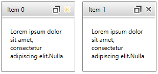

# Add a Close Button to a RadTileViewItem

This article demonstrates how to add a close button next to the tile state change (minimize/maximize) button of the __RadTileViewItems__. The __Command__ property of the close button will be bound to an [ICommand](http://msdn.microsoft.com/en-us/library/system.windows.input.icommand(v=vs.110).aspx) that removes the item from the __RadTileView's ItemsSource__.        

You can see the final result on the picture bellow:

## Define the RadTileView in XAML and create the view model

The __RadTileView__ in this scenario will be data bound to a collection of business objects.

<snippet id='radtileview-howto-add-close-button-to-radtileiewitem-block_1-cs' />
<snippet id='radtileview-howto-add-close-button-to-radtileiewitem-block_2-vb' />

The collection passed to the __RadTileView's ItemsSource__ can be wrapped in a View Model class

<snippet id='radtileview-howto-add-close-button-to-radtileiewitem-block_3-cs' />
<snippet id='radtileview-howto-add-close-button-to-radtileiewitem-block_4-vb' />

After creating the view models you can add the __RadTileView__ definition in xaml.

<snippet id='radtileview-howto-add-close-button-to-radtileiewitem-block_5-xaml' />

## Extract and Edit the RadTileViewItem HeaderStyle

The __RadTileViewItem’s__ header is represented by __TileViewItemHeader__ control. To add close button you can extract the __Style__ of the __TileViewItemHeader__ and slightly modify its __ControlTemplate__. Basically, you can find the __RadToggleButton__ that represents the Minimize/Maximize button and wrap it in a __Grid__ (or another panel) along with the new close button.

>tip You can see the [Editing Control Templates](http://www.telerik.com/help/wpf/styling-apperance-editing-control-templates.html) help article that demonstrates how to extract the __Style__ with the __ControlTemplate__ of a control.

<snippet id='radtileview-howto-add-close-button-to-radtileiewitem-block_6-xaml' />

> The code snippet above doesn't contain the complete definition of the __TileViewItemHeader.ControlTemplate__, but only the part of it that is changed. You can see the complete template in our [GitHub SDK repository](https://github.com/telerik/xaml-sdk/tree/master/TileView/AddCloseButton).          

## Implement the Close button’s command

The final stage of this tutorial is to implement the Close button’s command. We will use a static class holding an [RoutedUICommand](http://msdn.microsoft.com/en-us/library/system.windows.input.routeduicommand(v=vs.110).aspx) and then we will implement its behavior by adding command binding for it. To do so, you can follow the next steps:

1. Create a static class that holds the command.

	<snippet id='radtileview-howto-add-close-button-to-radtileiewitem-block_7-cs' />
	<snippet id='radtileview-howto-add-close-button-to-radtileiewitem-block_8-vb' />

2. Set the __Command__ property of the close __RadButton__ in the __ControlTemplate__ of the __TileViewItemHeader__ to the command.

	<snippet id='radtileview-howto-add-close-button-to-radtileiewitem-block_9-xaml' />

3. Register command binding for the command in the static constructor of the __UserControl__ where the __RadTileView__ is used.           

	<snippet id='radtileview-howto-add-close-button-to-radtileiewitem-block_10-cs' />
	<snippet id='radtileview-howto-add-close-button-to-radtileiewitem-block_11-vb' />

4. Define behavior for the command by implementing the Execute and CanExecute event handlers.

	<snippet id='radtileview-howto-add-close-button-to-radtileiewitem-block_12-cs' />
	<snippet id='radtileview-howto-add-close-button-to-radtileiewitem-block_13-vb' />
	
>tip Find a runnable project of the previous example in the [WPF Samples GitHub repository](https://github.com/telerik/xaml-sdk/tree/master/TileView/AddCloseButton).       

## See Also
 * [Getting Started]()
 * [Minimizing And Maximizing]()
 * [Visual Structure]()