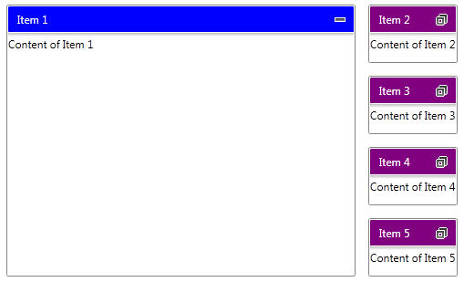

# Change the RadTileViewItem Header Background

This article will show you how to change the __Background__ of the __RadTileViewItems' Header__ corresponding to the state of the item in an MVVM scenario.	  

The final result should look like this:


The __Header__ of the __RadTileViewItem__ is designed as a separate __ContentControl__ and you can apply a custom style to it. In order to do this you have to add the following namespace into your application:


```XAML
	xmlns:tileView="clr-namespace:Telerik.Windows.Controls.TileView;assembly=Telerik.Windows.Controls.Navigation"
```

Next, you can define a custom style targeting the __TileViewItemHeader__ control and bind its __Background__ property to a property defined in your business model like this:


```XAML
	<Style x:Key="TileViewItemHeaderStyle" TargetType="tileView:TileViewItemHeader">
		<Setter Property="Foreground" Value="White"/>
		<Setter Property="Background" Value="{Binding RelativeSource={RelativeSource AncestorType=telerik:RadTileViewItem}, Path=DataContext.HeaderColor, Mode=TwoWay}" />
	</Style>
```

>tip The __Foreground__ is changed just to make the text in the header easy to read.

Also, in order to visualize your items you can create one more __Style__ targeting the __RadTileViewItem__. In that style you can bind the __Header__ property to a property defined in your business model. By doing so you will be able to set the text of the header. You can use the following code:


```XAML
	<Style x:Key="TileViewItemCustomStyle" TargetType="telerik:RadTileViewItem">
		<Setter Property="Header" Value="{Binding Header}" />
	</Style>
```

In order to track the state of each __RadTileViewItem__ you can define a property in your business model and bind it to the __TileState__ property of the item. This can be done by adding one more __Setter__ to the last Style and it will look like this:


```XAML
	<Style x:Key="TileViewItemCustomStyle" TargetType="telerik:RadTileViewItem">
		<Setter Property="TileState" Value="{Binding CurrentState, Mode=TwoWay}" />
		<Setter Property="Header" Value="{Binding Header}" />
	</Style>
```

To finalize the XAML code you can define the following __RadTileView__ control:		


```XAML
	<telerik:RadTileView HeaderStyle="{StaticResource TileViewItemHeaderStyle}"
						 ItemContainerStyle="{StaticResource TileViewItemCustomStyle}"
						 ItemsSource="{Binding Items}" />
```

Next step is to set up your business model. First you can create an __ItemViewModel__ class which derives from Telerik's __ViewModelBase__. This class can expose properties that will hold the text of the __Header__, the color of the __Background__ and the __CurrentState__ of the item. Furthermore, the item has to know which color to apply to its header in each state. This is why the constructor of the item can receive three colors - one for each state. Also, this class can expose a private method which changes the color of the header and it will be called whenever the state of the corresponding item is changed. Below is the implementation of that class.


```C#
	public class ItemViewModel : ViewModelBase
	{
		private readonly SolidColorBrush maximizedHeaderBackground;
		private readonly SolidColorBrush minimizedHeaderBackground;
		private readonly SolidColorBrush restoredHeaderBackground;
		private SolidColorBrush headerColor;
		private TileViewItemState currentState = TileViewItemState.Minimized;

		public ItemViewModel(SolidColorBrush maximizedHeaderBackground, SolidColorBrush restoredHeaderBackground, SolidColorBrush minimizedHeaderBackground)
		{
			this.maximizedHeaderBackground = maximizedHeaderBackground;
			this.restoredHeaderBackground = restoredHeaderBackground;
			this.minimizedHeaderBackground = minimizedHeaderBackground;

			this.SetColor();
		}

		public string Header { get; set; }

		public SolidColorBrush HeaderColor
		{
			get
			{
				return this.headerColor;
			}
			set
			{
				if (this.headerColor != value)
				{
					this.headerColor = value;
					this.OnPropertyChanged("HeaderColor");
				}
			}
		}

		public TileViewItemState CurrentState
		{
			get
			{
				return this.currentState;
			}
			set
			{
				if (this.currentState != value)
				{
					this.currentState = value;
					this.OnPropertyChanged("CurrentState");
					this.SetColor();
				}
			}
		}

		private void SetColor()
		{
			if (this.CurrentState == TileViewItemState.Maximized)
			{
				this.HeaderColor = this.maximizedHeaderBackground;
			}
			else if (this.CurrentState == TileViewItemState.Minimized)
			{
				this.HeaderColor = this.minimizedHeaderBackground;
			}
			else if (this.CurrentState == TileViewItemState.Restored)
			{
				this.HeaderColor = this.restoredHeaderBackground;
			}
		}
	}
```


```VB.NET
	Public Class ItemViewModel
		Inherits ViewModelBase
		Private ReadOnly maximizedHeaderBackground As SolidColorBrush
		Private ReadOnly minimizedHeaderBackground As SolidColorBrush
		Private ReadOnly restoredHeaderBackground As SolidColorBrush
		Private m_headerColor As SolidColorBrush
		Private m_currentState As TileViewItemState = TileViewItemState.Minimized

		Public Sub New(maximizedHeaderBackground As SolidColorBrush, restoredHeaderBackground As SolidColorBrush, minimizedHeaderBackground As SolidColorBrush)
			Me.maximizedHeaderBackground = maximizedHeaderBackground
			Me.restoredHeaderBackground = restoredHeaderBackground
			Me.minimizedHeaderBackground = minimizedHeaderBackground

			Me.SetColor()
		End Sub

		Public Property Header() As String
			Get
				Return m_Header
			End Get
			Set(value As String)
				m_Header = Value
			End Set
		End Property
		Private m_Header As String

		Public Property HeaderColor() As SolidColorBrush
			Get
				Return Me.m_headerColor
			End Get
			Set(value As SolidColorBrush)
				If Me.m_headerColor <> value Then
					Me.m_headerColor = value
					Me.OnPropertyChanged("HeaderColor")
				End If
			End Set
		End Property

		Public Property CurrentState() As TileViewItemState
			Get
				Return Me.m_currentState
			End Get
			Set(value As TileViewItemState)
				If Me.m_currentState <> value Then
					Me.m_currentState = value
					Me.OnPropertyChanged("CurrentState")
					Me.SetColor()
				End If
			End Set
		End Property

		Private Sub SetColor()
			If Me.CurrentState = TileViewItemState.Maximized Then
				Me.HeaderColor = Me.maximizedHeaderBackground
			ElseIf Me.CurrentState = TileViewItemState.Minimized Then
				Me.HeaderColor = Me.minimizedHeaderBackground
			ElseIf Me.CurrentState = TileViewItemState.Restored Then
				Me.HeaderColor = Me.restoredHeaderBackground
			End If
		End Sub
	End Class
```

After your __ItemViewModel__ is ready, you can define a collection of items. Create a __MainViewModel__ class which exposes one property of type __ObservableCollection<ItemViewModel>__ and a private method which populates the collection. This can be done like this:		


```C#
	public class MainViewModel
	{
		public MainViewModel()
		{
			this.Items = new ObservableCollection<ItemViewModel>();
			this.GenerateItems();
		}

		public ObservableCollection<ItemViewModel> Items { get; set; }

		private void GenerateItems()
		{
			var blue = new SolidColorBrush(Colors.Blue);
			var green = new SolidColorBrush(Colors.Green);
			var purple = new SolidColorBrush(Colors.Purple);

			this.Items.Add(new ItemViewModel(blue, green, purple)
			{
				Header = "Item 1",
				CurrentState = TileViewItemState.Maximized,
			});
			this.Items.Add(new ItemViewModel(blue, green, purple)
			{
				Header = "Item 2",
			});
			this.Items.Add(new ItemViewModel(blue, green, purple)
			{
				Header = "Item 3",
			});
			this.Items.Add(new ItemViewModel(blue, green, purple)
			{
				Header = "Item 4",
			});
			this.Items.Add(new ItemViewModel(blue, green, purple)
			{
				Header = "Item 5",
			});
		}
	}
```


```VB.NET
	Public Class MainViewModel
		Public Sub New()
			Me.Items = New ObservableCollection(Of ItemViewModel)()
			Me.GenerateItems()
		End Sub

		Public Property Items() As ObservableCollection(Of ItemViewModel)
			Get
				Return m_Items
			End Get
			Set(value As ObservableCollection(Of ItemViewModel))
				m_Items = Value
			End Set
		End Property
		Private m_Items As ObservableCollection(Of ItemViewModel)

		Private Sub GenerateItems()
			Dim blue = New SolidColorBrush(Colors.Blue)
			Dim green = New SolidColorBrush(Colors.Green)
			Dim purple = New SolidColorBrush(Colors.Purple)

			Me.Items.Add(New ItemViewModel(blue, green, purple) With {
				.Header = "Item 1",
				.CurrentState = TileViewItemState.Maximized
			})
			Me.Items.Add(New ItemViewModel(blue, green, purple) With {
				.Header = "Item 2"
			})
			Me.Items.Add(New ItemViewModel(blue, green, purple) With {
				.Header = "Item 3"
			})
			Me.Items.Add(New ItemViewModel(blue, green, purple) With {
				.Header = "Item 4"
			})
			Me.Items.Add(New ItemViewModel(blue, green, purple) With {
				.Header = "Item 5"
			})
		End Sub
	End Class
```

Finally, you can set the __MainViewModel__ as __DataContext__ of your application. This can be done just after the __InitializeComponent()__ method like this:


```C#
	this.DataContext = new MainViewModel();
```


```VB.NET
	Me.DataContext = New MainViewModel()
```