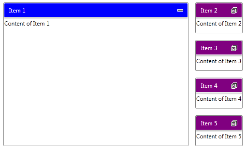

# Change the RadTileViewItem Header Background

This article will show you how to change the __Background__ of the __RadTileViewItems' Header__ corresponding to the state of the item in an MVVM scenario.	  

The final result should look like this:

The __Header__ of the __RadTileViewItem__ is designed as a separate __ContentControl__ and you can apply a custom style to it. In order to do this you have to add the following namespace into your application:

<snippet id='radtileview-howto-change-the-headers-background-block_1-xaml' />

Next, you can define a custom style targeting the __TileViewItemHeader__ control and bind its __Background__ property to a property defined in your business model like this:

<snippet id='radtileview-howto-change-the-headers-background-block_2-xaml' />

>tip The __Foreground__ is changed just to make the text in the header easy to read.

Also, in order to visualize your items you can create one more __Style__ targeting the __RadTileViewItem__. In that style you can bind the __Header__ property to a property defined in your business model. By doing so you will be able to set the text of the header. You can use the following code:

<snippet id='radtileview-howto-change-the-headers-background-block_3-xaml' />

In order to track the state of each __RadTileViewItem__ you can define a property in your business model and bind it to the __TileState__ property of the item. This can be done by adding one more __Setter__ to the last Style and it will look like this:

<snippet id='radtileview-howto-change-the-headers-background-block_4-xaml' />

To finalize the XAML code you can define the following __RadTileView__ control:		

<snippet id='radtileview-howto-change-the-headers-background-block_5-xaml' />

Next step is to set up your business model. First you can create an __ItemViewModel__ class which derives from Telerik's __ViewModelBase__. This class can expose properties that will hold the text of the __Header__, the color of the __Background__ and the __CurrentState__ of the item. Furthermore, the item has to know which color to apply to its header in each state. This is why the constructor of the item can receive three colors - one for each state. Also, this class can expose a private method which changes the color of the header and it will be called whenever the state of the corresponding item is changed. Below is the implementation of that class.

<snippet id='radtileview-howto-change-the-headers-background-block_6-cs' />
<snippet id='radtileview-howto-change-the-headers-background-block_7-vb' />

After your __ItemViewModel__ is ready, you can define a collection of items. Create a __MainViewModel__ class which exposes one property of type __ObservableCollection<ItemViewModel>__ and a private method which populates the collection. This can be done like this:		

<snippet id='radtileview-howto-change-the-headers-background-block_8-cs' />
<snippet id='radtileview-howto-change-the-headers-background-block_9-vb' />

Finally, you can set the __MainViewModel__ as __DataContext__ of your application. This can be done just after the __InitializeComponent()__ method like this:

<snippet id='radtileview-howto-change-the-headers-background-block_10-cs' />
<snippet id='radtileview-howto-change-the-headers-background-block_11-vb' />