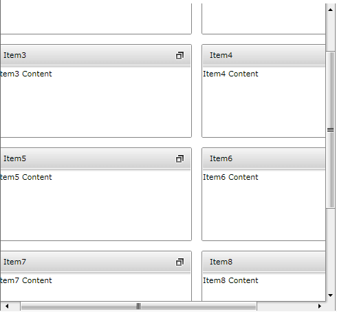
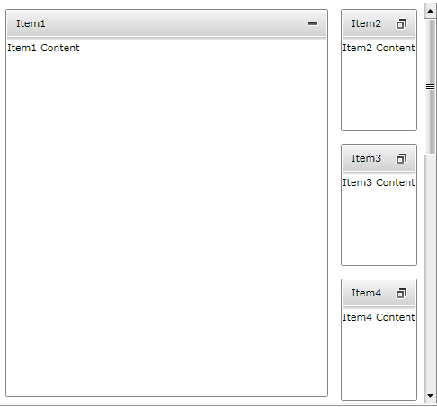

# Enable the Horizontal and Vertical ScrollBars

For example, you may have the following __RadTileView__ declaration:

#### __XAML__

```XAML
	<telerik:RadTileView ColumnsCount="2">
	    <telerik:RadTileViewItem Header="Item1">
	        <TextBlock Text="Item1 Content" />
	    </telerik:RadTileViewItem>
	    <telerik:RadTileViewItem Header="Item2">
	        <TextBlock Text="Item2 Content" />
	    </telerik:RadTileViewItem>
	    <telerik:RadTileViewItem Header="Item3">
	        <TextBlock Text="Item3 Content" />
	    </telerik:RadTileViewItem>
	    <telerik:RadTileViewItem Header="Item4">
	        <TextBlock Text="Item4 Content" />
	    </telerik:RadTileViewItem>
	    <telerik:RadTileViewItem Header="Item5">
	        <TextBlock Text="Item5 Content" />
	    </telerik:RadTileViewItem>
	    <telerik:RadTileViewItem Header="Item6">
	        <TextBlock Text="Item6 Content" />
	    </telerik:RadTileViewItem>
	    <telerik:RadTileViewItem Header="Item7">
	        <TextBlock Text="Item7 Content" />
	    </telerik:RadTileViewItem>
	    <telerik:RadTileViewItem Header="Item8">
	        <TextBlock Text="Item8 Content" />
	    </telerik:RadTileViewItem>
	    <telerik:RadTileViewItem Header="Item9">
	        <TextBlock Text="Item9 Content" />
	    </telerik:RadTileViewItem>
	</telerik:RadTileView>
```

## Enable Restored Items ScrollBars

In order to enable the horizontal and/or vertical scrollbar for the restored tiles you need to set the rows and columns size large enough to exceed the viewport of the __RadTileView__ control.

#### __XAML__

```XAML
	<telerik:RadTileView ColumnsCount="2" RowHeight="150" ColumnWidth="150">
	    <telerik:RadTileViewItem Header="Item1">
	        <TextBlock Text="Item1 Content" />
	    </telerik:RadTileViewItem>
	    <telerik:RadTileViewItem Header="Item2">
	        <TextBlock Text="Item2 Content" />
	    </telerik:RadTileViewItem>
	    <telerik:RadTileViewItem Header="Item3">
	        <TextBlock Text="Item3 Content" />
	    </telerik:RadTileViewItem>
	    <telerik:RadTileViewItem Header="Item4">
	        <TextBlock Text="Item4 Content" />
	    </telerik:RadTileViewItem>
	    <telerik:RadTileViewItem Header="Item5">
	        <TextBlock Text="Item5 Content" />
	    </telerik:RadTileViewItem>
	    <telerik:RadTileViewItem Header="Item6">
	        <TextBlock Text="Item6 Content" />
	    </telerik:RadTileViewItem>
	    <telerik:RadTileViewItem Header="Item7">
	        <TextBlock Text="Item7 Content" />
	    </telerik:RadTileViewItem>
	    <telerik:RadTileViewItem Header="Item8">
	        <TextBlock Text="Item8 Content" />
	    </telerik:RadTileViewItem>
	    <telerik:RadTileViewItem Header="Item9">
	        <TextBlock Text="Item9 Content" />
	    </telerik:RadTileViewItem>
	</telerik:RadTileView>
```



## Enable Minimized Items ScrollBar

In order to enable the minimized items __ScrollBar__, you need to set the __MinimizedRowHeight__ or __MinimizedColumnWidth__ properties thus limiting the size of the minimized tiles:

#### __XAML__

```XAML
	<telerik:RadTileView ColumnsCount="2" MinimizedRowHeight="150">
	    <telerik:RadTileViewItem Header="Item1">
	        <TextBlock Text="Item1 Content" />
	    </telerik:RadTileViewItem>
	    <telerik:RadTileViewItem Header="Item2">
	        <TextBlock Text="Item2 Content" />
	    </telerik:RadTileViewItem>
	    <telerik:RadTileViewItem Header="Item3">
	        <TextBlock Text="Item3 Content" />
	    </telerik:RadTileViewItem>
	    <telerik:RadTileViewItem Header="Item4">
	        <TextBlock Text="Item4 Content" />
	    </telerik:RadTileViewItem>
	    <telerik:RadTileViewItem Header="Item5">
	        <TextBlock Text="Item5 Content" />
	    </telerik:RadTileViewItem>
	    <telerik:RadTileViewItem Header="Item6">
	        <TextBlock Text="Item6 Content" />
	    </telerik:RadTileViewItem>
	    <telerik:RadTileViewItem Header="Item7">
	        <TextBlock Text="Item7 Content" />
	    </telerik:RadTileViewItem>
	    <telerik:RadTileViewItem Header="Item8">
	        <TextBlock Text="Item8 Content" />
	    </telerik:RadTileViewItem>
	    <telerik:RadTileViewItem Header="Item9">
	        <TextBlock Text="Item9 Content" />
	    </telerik:RadTileViewItem>
	</telerik:RadTileView>
```



## Enable AutoScrolling

In order to allow automatic scrolling while dragging a __RadTileViewItem__, you need to set the __RadTileView IsAutoScrollingEnabled__ property to __True.__

#### __XAML__

```XAML
	<telerik:RadTileView ColumnsCount="2" RowHeight="150" IsAutoScrollingEnabled="True">
	    <telerik:RadTileViewItem Header="Item1">
	        <TextBlock Text="Item1 Content" />
	    </telerik:RadTileViewItem>
	    <telerik:RadTileViewItem Header="Item2">
	        <TextBlock Text="Item2 Content" />
	    </telerik:RadTileViewItem>
	    <telerik:RadTileViewItem Header="Item3">
	        <TextBlock Text="Item3 Content" />
	    </telerik:RadTileViewItem>
	    <telerik:RadTileViewItem Header="Item4">
	        <TextBlock Text="Item4 Content" />
	    </telerik:RadTileViewItem>
	    <telerik:RadTileViewItem Header="Item5">
	        <TextBlock Text="Item5 Content" />
	    </telerik:RadTileViewItem>
	    <telerik:RadTileViewItem Header="Item6">
	        <TextBlock Text="Item6 Content" />
	    </telerik:RadTileViewItem>
	    <telerik:RadTileViewItem Header="Item7">
	        <TextBlock Text="Item7 Content" />
	    </telerik:RadTileViewItem>
	    <telerik:RadTileViewItem Header="Item8">
	        <TextBlock Text="Item8 Content" />
	    </telerik:RadTileViewItem>
	    <telerik:RadTileViewItem Header="Item9">
	        <TextBlock Text="Item9 Content" />
	    </telerik:RadTileViewItem>
	</telerik:RadTileView>
```

Once this property is set, you will be able to drag an item near the end of the viewable area and keep it there for a moment thus starting the automatic scrolling.