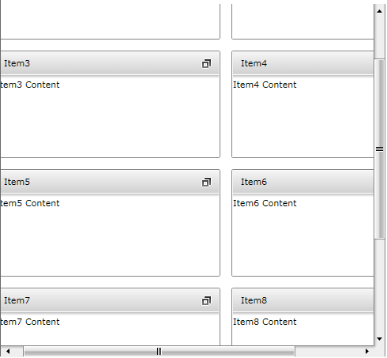
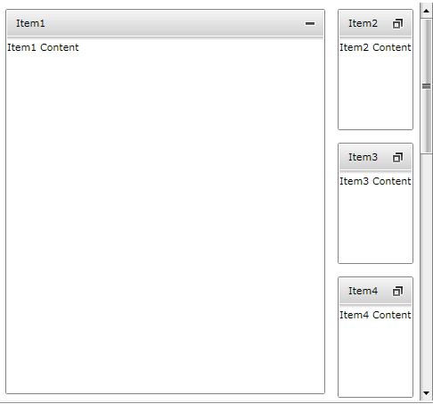

# Enable the Horizontal and Vertical ScrollBars

For example, you may have the following __RadTileView__ declaration:

<snippet id='radtileview-howto-enable-scrollbars-block_1-xaml' />

## Enable Restored Items ScrollBars

In order to enable the horizontal and/or vertical scrollbar for the restored tiles you need to set the rows and columns size large enough to exceed the viewport of the __RadTileView__ control.

<snippet id='radtileview-howto-enable-scrollbars-block_2-xaml' />

## Enable Minimized Items ScrollBar

In order to enable the minimized items __ScrollBar__, you need to set the __MinimizedRowHeight__ or __MinimizedColumnWidth__ properties thus limiting the size of the minimized tiles:

<snippet id='radtileview-howto-enable-scrollbars-block_3-xaml' />

## Enable AutoScrolling

In order to allow automatic scrolling while dragging a __RadTileViewItem__, you need to set the __RadTileView IsAutoScrollingEnabled__ property to __True.__

<snippet id='radtileview-howto-enable-scrollbars-block_4-xaml' />

Once this property is set, you will be able to drag an item near the end of the viewable area and keep it there for a moment thus starting the automatic scrolling.