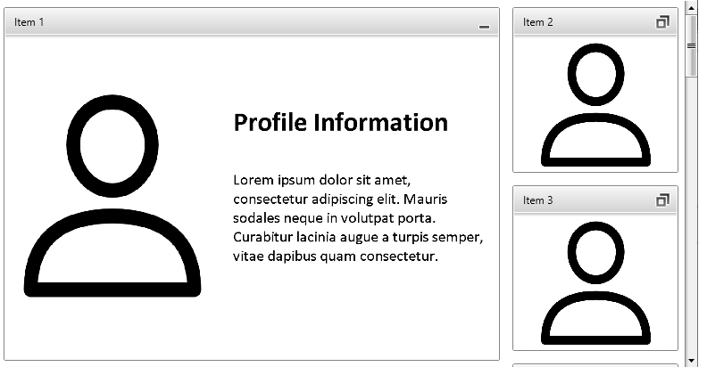

# Use RadFluidContentControl with MVVM

This article will show you a step-by-step tutorial on how to use `RadFluidContentControl` in `RadTileView` in a data binding scenario. 

1. Create the model that will be used to describe each separate TileViewItem.

	#### __C#__  
	```C#
		public class TileInfo : ViewModelBase
		{	
			private ContentState _contentState;
			
			public string Header { get; set; }
			public Uri SmallImage { get; set; }
			public Uri Image { get; set; }
			public Uri LargeImage { get; set; }	

			public ContentState ContentState
			{
				get { return this._contentState; }
				set 
				{
					this._contentState= value;
					OnPropertyChanged("ContentState");
				}
			}
			
			public TileInfo()
			{
				this.SmallImage = new Uri("Images/SmallImage.png", UriKind.Relative);
				this.Image = new Uri("Images/Image.png", UriKind.Relative);
				this.LargeImage = new Uri("Images/LargeImage.png", UriKind.Relative);
			}
			
			public static IList<object> GenerateItems()
			{
				var result = new ObservableCollection<object>();
				foreach (var num in Enumerable.Range(1, 12))
				{
					result.Add(new TileInfo() { Header = String.Format("Item {0}", num) });
				}
				return result;
			}
		}
		
		public enum ContentState
		{
			SmallContent = 1,
			NormalContent = 0,
			LargeContent = 2
		}
	```
	
2. The `RadTileView` and `RadFluidContentControl` use different enum types to describe the current state (small, normal, large). To sync these with the `ContentState` defined in the custom model, you can use `IValueConverters` and data bind the corresponding properties.
	
	__A converter that converts from ContentState to TileViewItemState and back__
	```C#
		public class TileStateConverter : IValueConverter
		{
			public object Convert(object value, Type targetType, object parameter, System.Globalization.CultureInfo culture)
			{
				var contentState = (ContentState)value;
				switch (contentState)
				{
					case ContentState.SmallContent:
						return TileViewItemState.Minimized;
					case ContentState.NormalContent:
						return TileViewItemState.Restored;
					case ContentState.LargeContent:
						return TileViewItemState.Maximized;
					default:
						return TileViewItemState.Restored;
				}
			}
	
			public object ConvertBack(object value, Type targetType, object parameter, System.Globalization.CultureInfo culture)
			{
				var tileState = (TileViewItemState)value;
				switch (tileState)
				{
					case TileViewItemState.Minimized:
						return ContentState.SmallContent;
					case TileViewItemState.Restored:
						return ContentState.NormalContent;
					case TileViewItemState.Maximized:
						return ContentState.LargeContent;
					default:
						return ContentState.NormalContent;
				}
			}
		}
	```
	
	__A converter that converts from ContentState to FluidContentControlState and back__
	```C#
		public class FluidContentStateConverter : IValueConverter
		{	
			public object Convert(object value, Type targetType, object parameter, System.Globalization.CultureInfo culture)
			{
				var contentState = (ContentState)value;
				switch (contentState)
				{
					case ContentState.SmallContent:
						return FluidContentControlState.Small;
					case ContentState.NormalContent:
						return FluidContentControlState.Normal;
					case ContentState.LargeContent:
						return FluidContentControlState.Large;
					default:
						return FluidContentControlState.Normal;
				}
			}	
			
			public object ConvertBack(object value, Type targetType, object parameter, System.Globalization.CultureInfo culture)
			{
				var fluidState = (FluidContentControlState)value;
				switch (fluidState)
				{
					case FluidContentControlState.Small:
						return ContentState.SmallContent;
					case FluidContentControlState.Normal:
						return ContentState.NormalContent;
					case FluidContentControlState.Large:
						return ContentState.LargeContent;
					default:
						return ContentState.NormalContent;
				}
			}
		}
	```
	
3. To display the information based on the custom model, define `ItemTemplate` (for the headers of the items) and `ContentTemplate` (for the content). The state of the model can be bound to the state of the TileViewItems, by using the `ItemContainerStyle` property. The following code shows how to define the templates, the style and the converters, along with the RadTileView setup.

	
	```XAML
		<UserControl.Resources>
			<local:FluidContentStateConverter x:Key="fluidContentStateConverter" />
			<local:TileStateConverter x:Key="tileStateConverter" />
			<DataTemplate x:Key="ItemTemplate">
				<TextBlock Text="{Binding Header}" />
			</DataTemplate>
			<DataTemplate x:Key="ContentTemplate">
				<telerik:RadFluidContentControl ContentChangeMode="Manual"
						State="{Binding ContentState, Converter={StaticResource fluidContentStateConverter}}">
					<telerik:RadFluidContentControl.SmallContent>
						<Image Source="{Binding SmallImage}" />
					</telerik:RadFluidContentControl.SmallContent>
					<telerik:RadFluidContentControl.Content>
						<Image Source="{Binding Image}" />
					</telerik:RadFluidContentControl.Content>
					<telerik:RadFluidContentControl.LargeContent>
						<Image Source="{Binding LargeImage}" />
					</telerik:RadFluidContentControl.LargeContent>
				</telerik:RadFluidContentControl>
			</DataTemplate>
			<Style TargetType="telerik:RadTileViewItem" x:Key="ItemContainerStyle">
				<Setter Property="TileState" Value="{Binding ContentState, Mode=TwoWay, Converter={StaticResource tileStateConverter}}" />
			</Style>
		</UserControl.Resources>
		<Grid>
			<telerik:RadTileView x:Name="radTileView" 
								 ContentTemplate="{StaticResource ContentTemplate}"
								 ItemContainerStyle="{StaticResource ItemContainerStyle}" 
								 ItemTemplate="{StaticResource ItemTemplate}"	            
								 MinimizedColumnWidth="200" 
								 MinimizedItemsPosition="Right" 
								 MinimizedRowHeight="200" />
		</Grid>
	```
	
4. To populate the TileView with data, set its `ItemsSource` property.

	#### __C#__  
	```C#
		public partial class TileViewContainer : UserControl
		{
			public TileViewContainer()
			{
				InitializeComponent();
				this.radTileView.ItemsSource = TileInfo.GenerateItems();
			}
		}
	```
	

