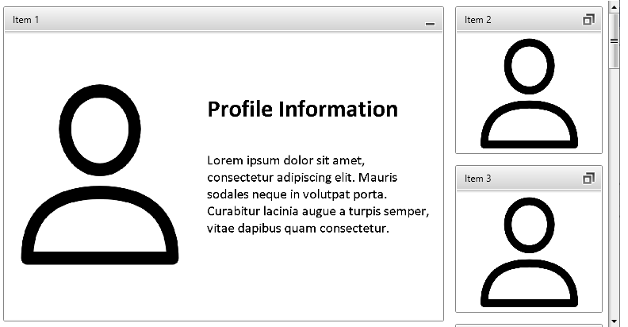

# Use RadFluidContentControl with MVVM

This article will show you a step-by-step tutorial on how to use `RadFluidContentControl` in `RadTileView` in a data binding scenario. 

1. Create the model that will be used to describe each separate TileViewItem.

	<snippet id='radtileview-howto-use-fluidcontentcontrol-in-tileview-block_1-cs' />
	
2. The `RadTileView` and `RadFluidContentControl` use different enum types to describe the current state (small, normal, large). To sync these with the `ContentState` defined in the custom model, you can use `IValueConverters` and data bind the corresponding properties.
	
	__A converter that converts from ContentState to TileViewItemState and back__
	<snippet id='radtileview-howto-use-fluidcontentcontrol-in-tileview-block_2-cs' />
	
	__A converter that converts from ContentState to FluidContentControlState and back__
	<snippet id='radtileview-howto-use-fluidcontentcontrol-in-tileview-block_3-cs' />
	
3. To display the information based on the custom model, define `ItemTemplate` (for the headers of the items) and `ContentTemplate` (for the content). The state of the model can be bound to the state of the TileViewItems, by using the `ItemContainerStyle` property. The following code shows how to define the templates, the style and the converters, along with the RadTileView setup.

	
	<snippet id='radtileview-howto-use-fluidcontentcontrol-in-tileview-block_4-xaml' />
	
4. To populate the TileView with data, set its `ItemsSource` property.

	<snippet id='radtileview-howto-use-fluidcontentcontrol-in-tileview-block_5-cs' />
	
