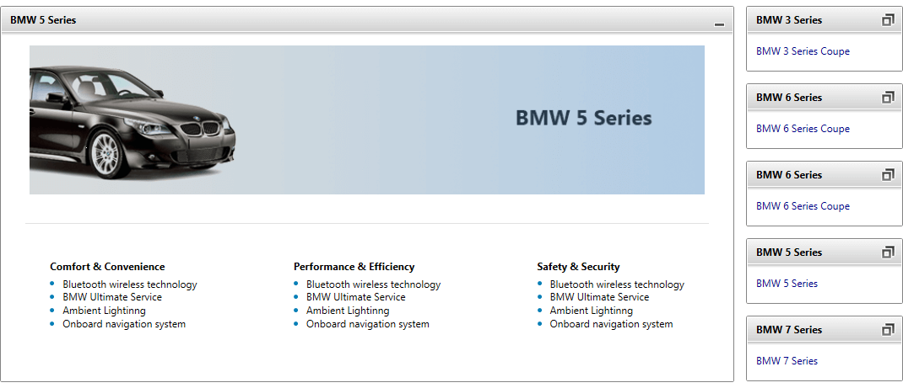

# Overview



Thank you for choosing Telerik __RadTileView__!			

Create flexible and interactive layouts for your rich webdesktop applications with __RadTileView__. The control enables you to architect immersive user experiences with its configurable content "tiles", support for drag-and-drop rearrangement, and adjustable position of the minimized items. __RadTileView__ comes with built-in item animations, which are also fully customize able to suit various scenarios.

## See Also
 * [GettingStarted with RadTileView - Video Tutorial](http://tv.telerik.com/silverlight/video/introduction-radtileview-silverlight)
 * [Getting Started]()
