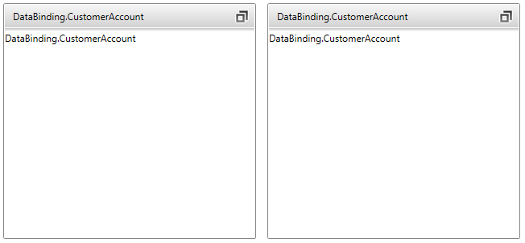

# Data Binding

__RadTileView__ can be bound to a collection of objects through its __ItemsSource__ property.

>Note that for every business object from the data bound collection, __RadTileView__ will generate a __RadTileViewItem__ container representing this object.

This article describes how to data bind business objects to __RadTileView__. 

* Create a new class named __CustomerAccount__. The structure of the class is shown in Example 2.

	__Example 1: The business class that will be used as a model of the tileview items__
	```C#
		public class CustomerAccount
		{
			public string Name { get; set; }
			public string City { get; set; }
			public string Description { get; set; }
		}
	```
```VB.NET
		Public Class CustomerAccount
			Private _Name As String
				Public Property Name() As String
					Get
						Return _Name
					End Get
					Set(ByVal value As String)
						_Name = value
					End Set
				End Property

			Private _City As String
				Public Property City() As Integer
					Get
						Return _City
					End Get
					Set(ByVal value As Integer)
						_City = value
					End Set
				End Property
				
			Private _Description As String
				Public Property Balance() As String
					Get
						Return _Description
					End Get
					Set(ByVal value As String)
						_Description = value
					End Set
				End Property	
		End Class
	```	

* Create a class that defines a collection of business objects.

	__Example 2: The class that holds a collection of the business objects.__
	```C#
		public class BankViewModel
		{
			public ObservableCollection<CustomerAccount> Customers { get; set; }

			public BankViewModel()
			{
				this.Customers = new ObservableCollection<CustomerAccount>();
				this.AddCustomers();
			}        

			public void AddCustomers()
			{
				this.Customers.Add(new CustomerAccount()
				{
					Name = "Michael Johnson",
					City = "New York",
					Description = "Lorem ipsum dolor sit amet ..."
				});
				this.Customers.Add(new CustomerAccount()
				{
					Name = "Alan Rickman",
					City = "Boston",
					Description = "Lorem ipsum dolor sit amet ..."
				});            
			}
		}
	```
```VB.NET
		Public Class BankViewModel
			Public Property Customers() As ObservableCollection(Of CustomerAccount)
				Get
					Return m_Customers
				End Get
				Set
					m_Customers = Value
				End Set
			End Property
			Private m_Customers As ObservableCollection(Of CustomerAccount)

			Public Sub New()
				Me.Customers = New ObservableCollection(Of CustomerAccount)()
				Me.AddCustomers()
			End Sub

			Public Sub AddCustomers()
				Me.Customers.Add(New CustomerAccount() With { 
					.Name = "Michael Johnson", 
					.City = "New York", 
					.Description = "Lorem ipsum dolor sit amet ..." 
				})
				Me.Customers.Add(New CustomerAccount() With { 
					.Name = "Alan Rickman", 
					.City = "Boston",
					.Description = "Lorem ipsum dolor sit amet ..." 
				})
			End Sub
		End Class
	```

	As you can see, the __BankViewModel__ class has a reference to an ObservableCollection of __CustomerAccount__ objects. This collection is populated in the AddCustomers() method and it will be bound to the __ItemsSource__ property of __RadTileView__.

* Set the DataContext of your application to a new instance of the created view model.

	__Example 3: Setting the DataContext of the application.__
	```C#
		public UserControl()
		{
			InitializeComponent();
			this.DataContext = new BankViewModel();
		}
	```
```VB.NET
		Public Sub New()
			InitializeComponent()
			Me.DataContext = New BankViewModel()
		End Sub
	```

* Then bind the __ItemsSource__ property to the collection of the view model.

	__Example 4: Setting the ItemsSource of the RadTileView control.__
	```XAML
		<telerik:RadTileView x:Name="xTileView" 
						   ItemsSource="{Binding Customers}" />
	```

* The result should be similar to Figure 1.
			
	#### __Figure 1: RadTileView after binding its ItemSource property__	
	

Notice that the __RadTileViewitems__ displays the name of the view model. This is because by default, the RadTileView will display the result returned from the ToString() method of the model. To change the appearance of the items you can explicitly define what to display in the header and the content of the items. You can see how to do that in the next section.

## Using custom templates
 
This section describes how to define the appearance of the header and content of a RadTileViewItems.

You can modify the visual appearance of the item's header using either the __ItemTemplate__ property or the __DisplayMemberPath__ property.
	
* Using the __ItemTemplate__ property

	Create a __DataTemplate__ and set it to the __RadTileView__'s __ItemTemplate__ property. 
 
	__Example 5: Declaring the DataTemplate__
	```XAML
		<DataTemplate x:Key="ItemTemplate">
				<TextBlock Text="{Binding Name}" />
		</DataTemplate>
	```

	Update the __RadTileView__'s declaration and set its __ItemTemplate__ property like in the example below:

	__Example 6: Declaring the DataTemplate__
	```XAML
		<telerik:RadTileView x:Name="xTileView" 
						   ItemsSource="{Binding Customers}"
						   ItemTemplate="{Binding ItemTemplate}"/>
	```
	  
* Using the __DisplayMemberPath__ property	
	
	Instead of creating a custom __ItemTemplate__, you can use the __DisplayMemberPath__ property, which you can use to get or set a path to a value on the source object to serve as the visual representation of the object.

	__Example 7__ demonstrates how to set the __DisplayMemberPath__ property.		
	  
	__Example 7: Setting the DisplayMemberPath__
	```XAML
		<telerik:RadTileView x:Name="xTileView" 
							 DisplayMemberPath="Name"
							 ItemsSource="{Binding Customers}"/>
	```	
  
Figure 2 shows the end result.

#### __Figure 2: RadTileView after using DisplayMemberPath property.__


You can modify the visual appearance of the item's content using the __ContentTemplate__ property of RadTileView.

__Example 8: Declaring the content DataTemplate__
```XAML
	<DataTemplate x:Key="ContentTemplate">
		<StackPanel>
			<TextBlock Text="{Binding City,StringFormat='City: {0}'}"/>
			<TextBlock Text="{Binding Description,StringFormat='Decription: {0}'}" TextWrapping="Wrap"/>
		</StackPanel>
	</DataTemplate>
```

Update your __RadTileView__'s declaration and set its __ContentTemplate__ property.

__Example 9: Declaring the content DataTemplate__
```XAML
	<telerik:RadTileView ItemsSource="{Binding Customers}"
                         DisplayMemberPath="Name"
                         ContentTemplate="{StaticResource ContentTemplate}"/>
```

The final result is shown on the next image:

#### __Figure 3: Final result__


>tip Find a runnable project of the previous example in the [WPF Samples GitHub repository](https://github.com/telerik/xaml-sdk/tree/master/TileView/DataBinding).

## See Also
 * [Getting Started]()
 * [Visual Structure]()