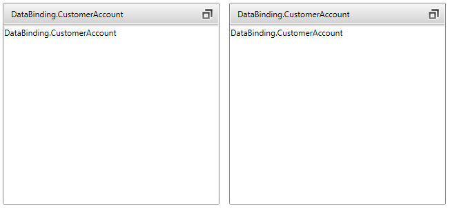

# Data Binding

__RadTileView__ can be bound to a collection of objects through its __ItemsSource__ property.

>Note that for every business object from the data bound collection, __RadTileView__ will generate a __RadTileViewItem__ container representing this object.

This article describes how to data bind business objects to __RadTileView__. 

* Create a new class named __CustomerAccount__. The structure of the class is shown in Example 2.

	__Example 1: The business class that will be used as a model of the tileview items__
	<snippet id='radtileview-populating-with-data-populating-binding-to-collection-block_1-cs' />
	<snippet id='radtileview-populating-with-data-populating-binding-to-collection-block_2-vb' />

* Create a class that defines a collection of business objects.

	__Example 2: The class that holds a collection of the business objects.__
	<snippet id='radtileview-populating-with-data-populating-binding-to-collection-block_3-cs' />
	<snippet id='radtileview-populating-with-data-populating-binding-to-collection-block_4-vb' />

	As you can see, the __BankViewModel__ class has a reference to an ObservableCollection of __CustomerAccount__ objects. This collection is populated in the AddCustomers() method and it will be bound to the __ItemsSource__ property of __RadTileView__.

* Set the DataContext of your application to a new instance of the created view model.

	__Example 3: Setting the DataContext of the application.__
	<snippet id='radtileview-populating-with-data-populating-binding-to-collection-block_5-cs' />
	<snippet id='radtileview-populating-with-data-populating-binding-to-collection-block_6-vb' />

* Then bind the __ItemsSource__ property to the collection of the view model.

	__Example 4: Setting the ItemsSource of the RadTileView control.__
	<snippet id='radtileview-populating-with-data-populating-binding-to-collection-block_7-xaml' />

* The result should be similar to Figure 1.
			
	#### __Figure 1: RadTileView after binding its ItemSource property__	
	

Notice that the __RadTileViewitems__ displays the name of the view model. This is because by default, the RadTileView will display the result returned from the ToString() method of the model. To change the appearance of the items you can explicitly define what to display in the header and the content of the items. You can see how to do that in the next section.

## Using custom templates
 
This section describes how to define the appearance of the header and content of a RadTileViewItems.

You can modify the visual appearance of the item's header using either the __ItemTemplate__ property or the __DisplayMemberPath__ property.
	
* Using the __ItemTemplate__ property

	Create a __DataTemplate__ and set it to the __RadTileView__'s __ItemTemplate__ property. 
 
	__Example 5: Declaring the DataTemplate__
	<snippet id='radtileview-populating-with-data-populating-binding-to-collection-block_8-xaml' />

	Update the __RadTileView__'s declaration and set its __ItemTemplate__ property like in the example below:

	__Example 6: Declaring the DataTemplate__
	<snippet id='radtileview-populating-with-data-populating-binding-to-collection-block_9-xaml' />
	  
* Using the __DisplayMemberPath__ property	
	
	Instead of creating a custom __ItemTemplate__, you can use the __DisplayMemberPath__ property, which you can use to get or set a path to a value on the source object to serve as the visual representation of the object.

	__Example 7__ demonstrates how to set the __DisplayMemberPath__ property.		
	  
	__Example 7: Setting the DisplayMemberPath__
	<snippet id='radtileview-populating-with-data-populating-binding-to-collection-block_10-xaml' />
  
Figure 2 shows the end result.

#### __Figure 2: RadTileView after using DisplayMemberPath property.__

You can modify the visual appearance of the item's content using the __ContentTemplate__ property of RadTileView.

__Example 8: Declaring the content DataTemplate__
<snippet id='radtileview-populating-with-data-populating-binding-to-collection-block_11-xaml' />

Update your __RadTileView__'s declaration and set its __ContentTemplate__ property.

__Example 9: Declaring the content DataTemplate__
<snippet id='radtileview-populating-with-data-populating-binding-to-collection-block_12-xaml' />

The final result is shown on the next image:

#### __Figure 3: Final result__

>tip Find a runnable project of the previous example in the [WPF Samples GitHub repository](https://github.com/telerik/xaml-sdk/tree/master/TileView/DataBinding).

## See Also
 * [Getting Started]()
 * [Visual Structure]()